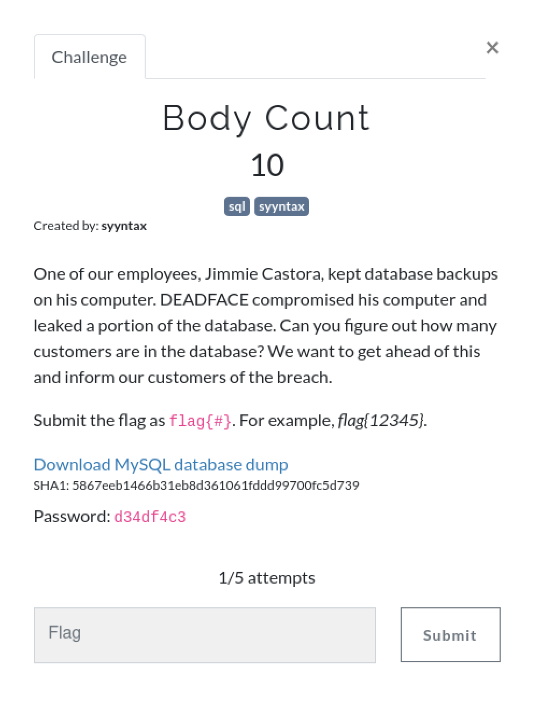
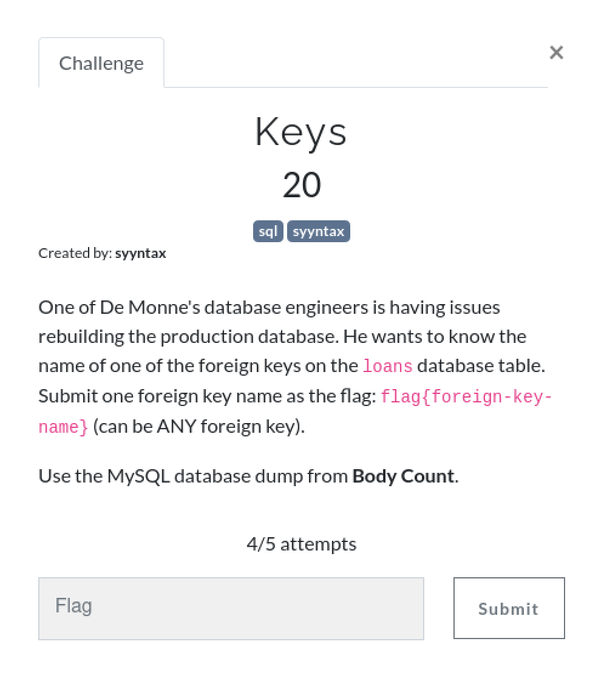
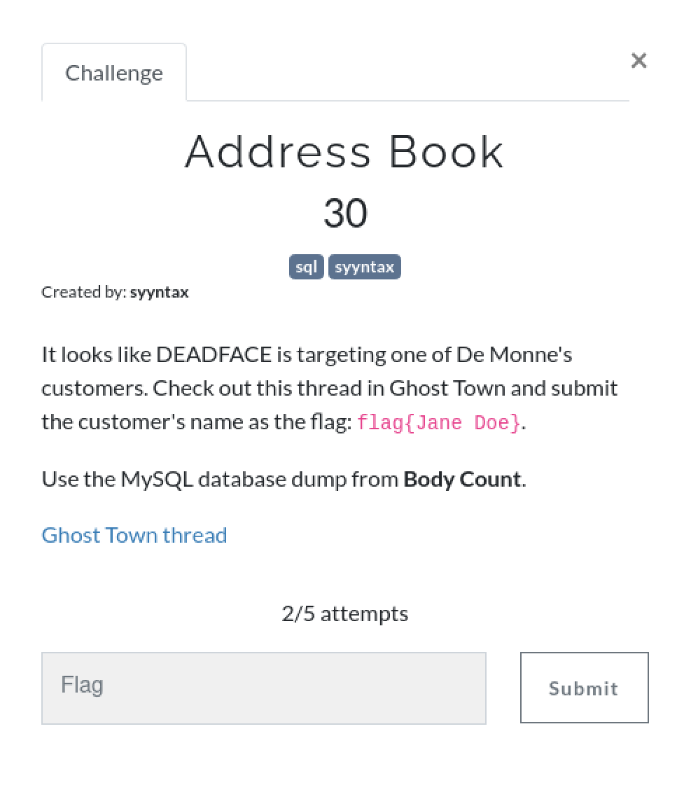
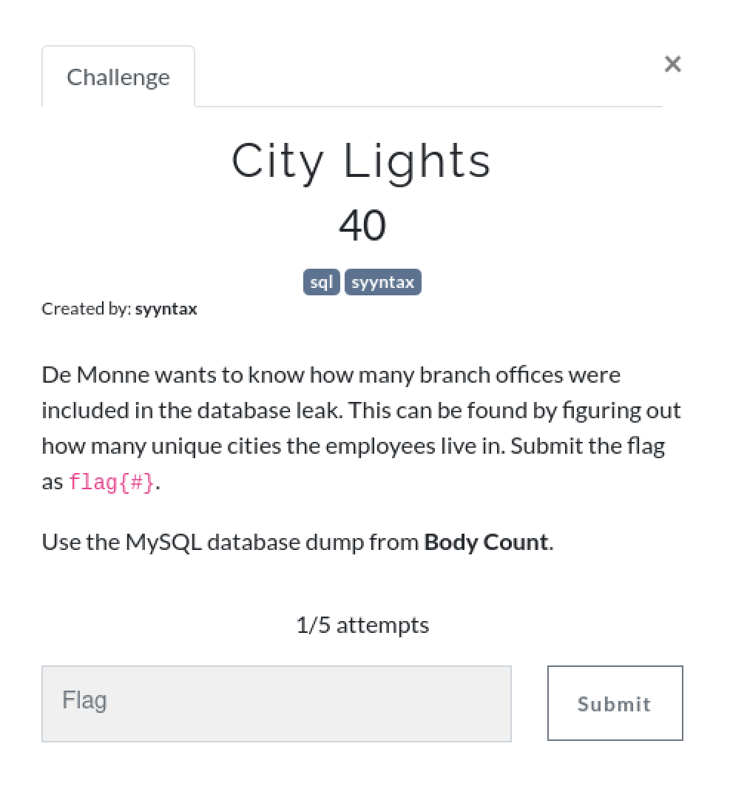
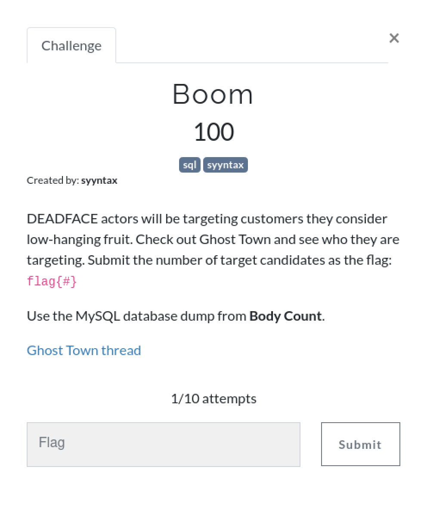
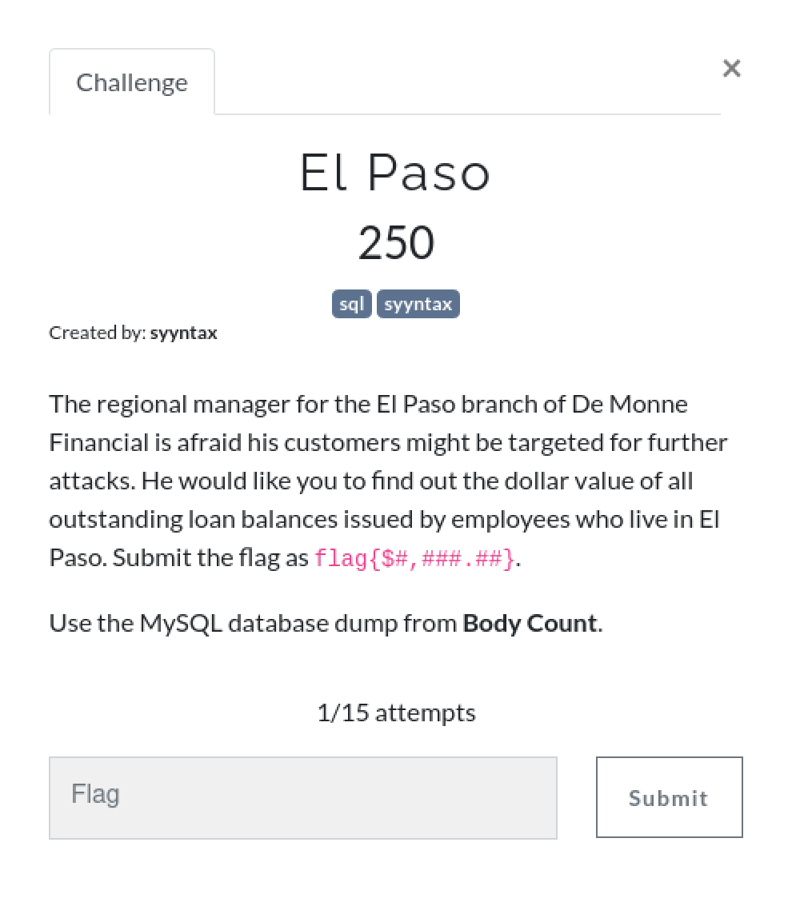
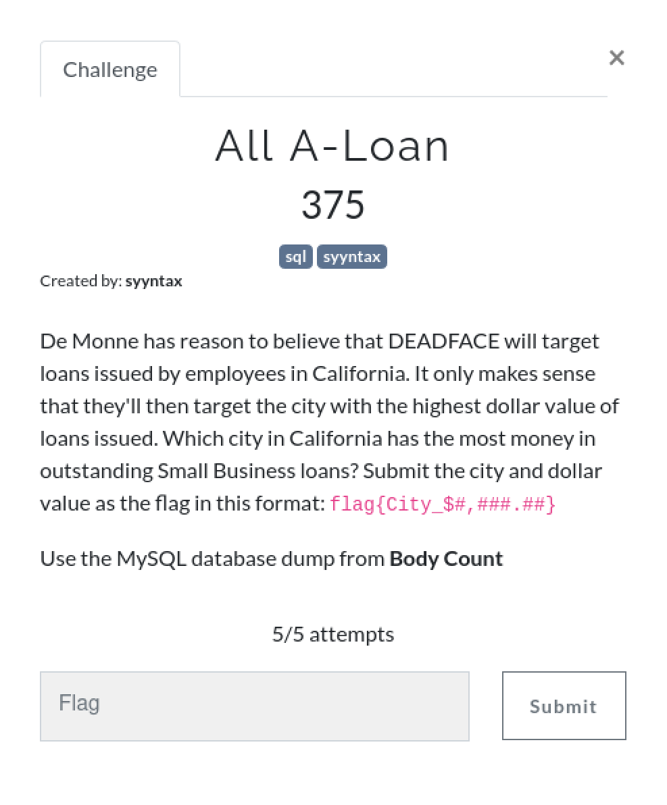

# SQL challenges

## Introduction
This writeup is for all the challenges under the category of `sql`. All challenges use one database dump, here is how to load it:

1. Download the SQL dump
2. Make sure MySQL or MariaDB is installed on your system
3. Log in to mysql and create a database
    ```sql
    $ mysql -u root -p
    mysql> CREATE DATABASE [new_database];
    ```
4. Import the database using the following command
    ```bash
    $ mysql -u root -p [new_database] < [sql_dump_name]
    ```
5. Use the database using the following command:
    ```sql
    mysql> USE [new_database];
    ```

These are the tables within the database:

```sql
mysql> SHOW TABLES;
+---------------------+
| Tables_in_bodycount |
+---------------------+
| credit_cards        |
| cust_passwd         |
| customers           |
| employee_passwd     |
| employees           |
| loan_types          |
| loans               |
| test                |
+---------------------+
8 rows in set (0.000 sec)
```

Now, on to the challenges! 

## Body Count | 10pts


### Solution
```sql
mysql> SELECT COUNT(cust_id) FROM customers;
+----------------+
| COUNT(cust_id) |
+----------------+
|          10000 |
+----------------+
1 row in set (0.003 sec)
```

Flag: `flag{10000}`
<br />

## Keys | 20pts


### Solution
This one took a bit of while to get right (as you can see I almost ran out of attempts too).

#### Initial Attempt
```sql
mysql> DESC loans;
+--------------+---------------+------+-----+---------+----------------+
| Field        | Type          | Null | Key | Default | Extra          |
+--------------+---------------+------+-----+---------+----------------+
| loan_id      | smallint(6)   | NO   | PRI | NULL    | auto_increment |
| cust_id      | smallint(6)   | NO   | MUL | NULL    |                |
| employee_id  | smallint(6)   | NO   | MUL | NULL    |                |
| amt          | decimal(10,2) | NO   |     | NULL    |                |
| balance      | decimal(10,2) | NO   |     | NULL    |                |
| interest     | decimal(10,2) | YES  |     | NULL    |                |
| loan_type_id | smallint(6)   | NO   | MUL | NULL    |                |
+--------------+---------------+------+-----+---------+----------------+
7 rows in set (0.001 sec)
```

The initial flags I tried were flag{cust_id}, flag{employee_id} and flag{loan_type_id}. None of them seemed to work. Considering I had only two attempts left, I searched this up on google to see if I was doing something wrong.

#### Actual Solution

I found an article, which led to the correct solution - https://tableplus.com/blog/2018/08/mysql-how-to-see-foreign-key-relationship-of-a-table.html


Modified the query a bit, which returned the following result:

```sql
mysql> SELECT COLUMN_NAME, CONSTRAINT_NAME, REFERENCED_TABLE_NAME FROM INFORMATION_SCHEMA.KEY_COLUMN_USAGE WHERE TABLE_NAME = 'loans';
+--------------+-----------------------+-----------------------+
| COLUMN_NAME  | CONSTRAINT_NAME       | REFERENCED_TABLE_NAME |
+--------------+-----------------------+-----------------------+
| loan_id      | PRIMARY               | NULL                  |
| cust_id      | fk_loans_cust_id      | customers             |
| employee_id  | fk_loans_employee_id  | employees             |
| loan_type_id | fk_loans_loan_type_id | loan_types            |
+--------------+-----------------------+-----------------------+
4 rows in set (0.001 sec)
```

I tried a flag with one of the records from the CONSTRAINT_NAME column, and it worked!

Flag: `flag{fk_loans_cust_id}` | `flag{fk_loans_employee_id}` | `flag{fk_loans_loan_type_id}`

<br />

## Address Book | 30pts


### Solution
Here's what the Ghost Town thread mentions:


So the query should include the following constraints:
- The gender is female
- The city is Vienna

Enter these constraints in the query and you have your answer, as there is only one female from Vienna in the database.

```sql
mysql> SELECT CONCAT(first_name, " ", last_name) FROM customers WHERE city="Vienna" AND gender="F";
+------------------------------------+
| CONCAT(first_name, " ", last_name) |
+------------------------------------+
| Collen Allsopp                     |
+------------------------------------+
1 row in set (0.008 sec)
```

Flag: `flag{Collen Allsopp}`

<br />

## City Lights | 40pts


### Solution
```sql
SELECT COUNT(DISTINCT city) FROM employees;
+----------------------+
| COUNT(DISTINCT city) |
+----------------------+
|                  444 |
+----------------------+
1 row in set (0.036 sec)
```

Flag: `flag{444}`

<br />

## Boom | 100pts


### Solution


Here is what the Ghost Town thread mentions:


The thread leads to this article - https://www.investopedia.com/terms/b/baby_boomer.asp


This clears the conditions to be added in the WHERE clause.

Before typing the query, I checked the data type of the dob field:
```sql
mysql> DESC customers;
+------------+-------------+------+-----+---------+----------------+
| Field      | Type        | Null | Key | Default | Extra          |
+------------+-------------+------+-----+---------+----------------+
| cust_id    | smallint(6) | NO   | PRI | NULL    | auto_increment |
| last_name  | tinytext    | NO   |     | NULL    |                |
| first_name | tinytext    | NO   |     | NULL    |                |
| email      | tinytext    | NO   |     | NULL    |                |
| street     | tinytext    | NO   |     | NULL    |                |
| city       | tinytext    | NO   |     | NULL    |                |
| state      | tinytext    | NO   |     | NULL    |                |
| country    | tinytext    | NO   |     | NULL    |                |
| postal     | tinytext    | NO   |     | NULL    |                |
| gender     | tinytext    | NO   |     | NULL    |                |
| dob        | tinytext    | NO   |     | NULL    |                |
+------------+-------------+------+-----+---------+----------------+
11 rows in set (0.001 sec)
```

As it is a string, I used the SUBSTRING function to extract the year, and converted it to an INT type so that the years can be compared.

```sql
mysql> SELECT COUNT(dob) FROM customers WHERE CONVERT (SUBSTRING(dob, 7, 4), INT) >= 1946 AND CONVERT(SUBSTRING(dob, 7, 4), INT) <=1964;
+------------+
| COUNT(dob) |
+------------+
|       2809 |
+------------+
1 row in set (0.009 sec)
```

Flag: `flag{2809}`

<br />

## El Paso | 250pts


### Solution

```sql
mysql> SELECT SUM(balance) FROM loans JOIN employees ON loans.employee_id = employees.employee_id WHERE employees.city = 'El Paso';
+--------------+
| SUM(balance) |
+--------------+
|    877401.00 |
+--------------+
```

Flag: `flag{$877,401.00}`
<br />

## All A-Loan | 375pts


### Solution

```sql
mysql> SELECT employees.city, SUM(loans.balance) AS outstanding FROM employees JOIN loans ON employees.employee_id = loans.employee_id WHERE loans.loan_type_id = 3 AND employees.state = "CA" GROUP BY employees.city ORDER BY outstanding DESC LIMIT 1;
+---------+-------------+
| city    | outstanding |
+---------+-------------+
| Oakland |    90600.00 |
+---------+-------------+
1 row in set (0.008 sec)
```

- SUM(loans.balance) has an alias of "outstanding" to make it easier to reference later in the query.
- The two tables, employees and loans are joined using the primary and foreign key.
- The loan type id is set to 3 (Small Business loans) and the state is set to California.
- The output is grouped by the cities so the balance is calculated for each city.
- The database is ordered in descending order of balance and limited to 1 entry, showing us the highest amount, and the answer to this challenge!

Fun fact: I wasted 4/5 attempts on this challenge as I kept referencing the customers table instead of employees 😬.

Flag: `flag{Oakland_$90,600.00}`
