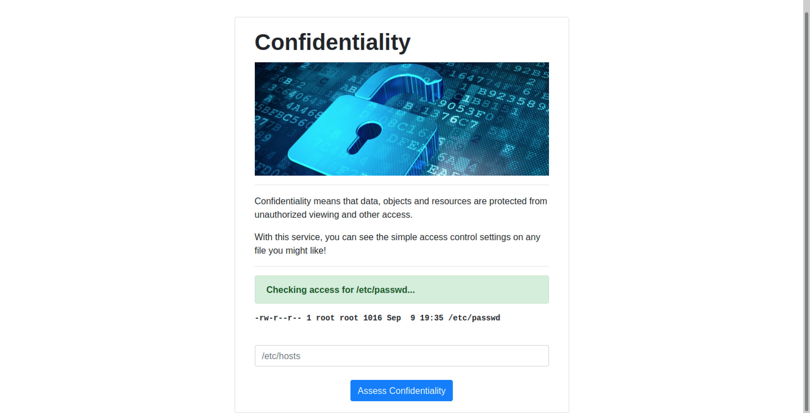
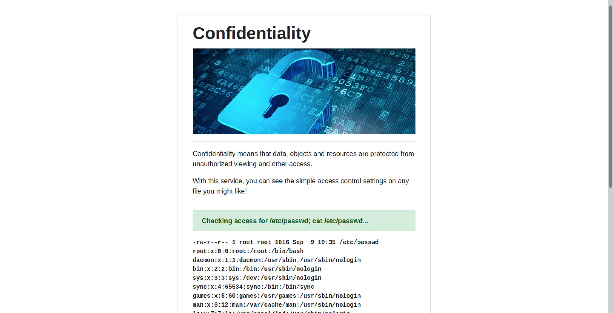
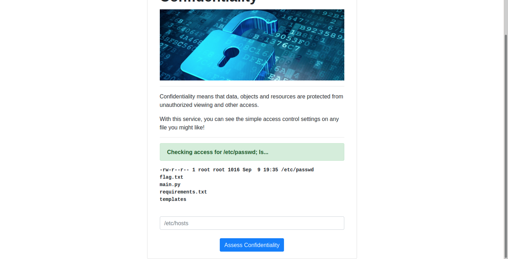

# Confidentiality
### easy | web | 50 points  
 

## Challenge Information
My school was trying to teach people about the CIA triad so they made all these dumb example applications... as if they know anything about information security. Can you prove these aren't so secure?
  

## Solution

This application included an input field. Enter a file name and the access control settings would appear like so

I tried /etc/passwd as a sample input to see what would appear. From the output, this look like the result from the `ls -l` command in bash.

As this is running bash commands, we can use `cat` to output the flag. But first, we need to know where the flag is and a way to run a cat command (this application currently only runs the ls command).

I tried the input `/etc/passwd ; cat /etc/passwd` to check if this would display the file permissions + the contents of /etc/passwd, and it did!

Now that we know this works, time to find the flag, I typed `ls` to check if there was anything in the current directory, and I found the flag!

All that was left to do is add the command `cat flag.txt` and its done!

Flag: `flag{e56abbce7b83d62dac05e59fb1e81c68}`