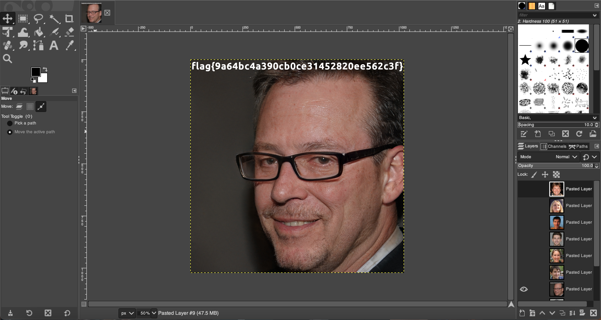

# Pimple
easy | warmups | 50 points  

>"This challenge is simple, it's just a pimple!"

A file called pimple was included with the description. As it didn't have a file extension, the first thing was to check the file type:

```
$ file pimple
pimple: GIMP XCF image data, version 011, 1024 x 1024, RGB Color
```

I added the file extension `.xcf` and opened the file in GIMP. Multiple layers are visible, so I started hiding each one till one image showed the flag.



Flag: `flag{9a64bc4a390cb0ce31452820ee562c3f}`