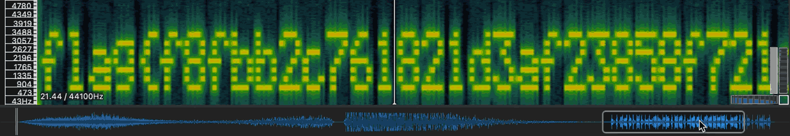

# Tsunami
easy | warmups | 50 points  

>Woah! It's a natural disaster! But something doesn't seem so natural about this big wave...

There was an audio file that came with the challenge, and I initially couldn't hear any audio. So I was under the impression that I wasn't supposed to hear anything lol.

Confused, I started looking up ways to extract information from audio, and was reminded about the [Spectrum Analyzer](https://academo.org/demos/spectrum-analyzer/):

> The spectrum analyzer above gives us a graph of all the frequencies that are present in a sound recording at a given time. The resulting graph is known as a spectrogram.

When I initially tried the online version, I couldn't make any sense of the spectogram. A part of it looked vaguely like a flag, but I wasn't sure.

I then remembered/looked up a tool I had used for a challenge in the past called [Sonic Visualizer](https://www.sonicvisualiser.org/index.html). After downloading it, I opened the sound file there, and added a spectogram. Zoomed in a little bit and there we have the flag for this challenge!

Flag: `flag{f8fbb2c761821d3af23858f721cc140b}`
