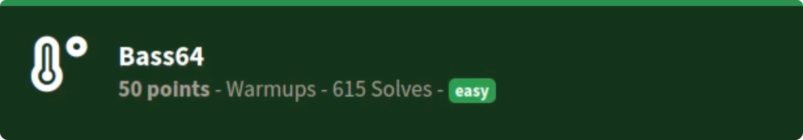
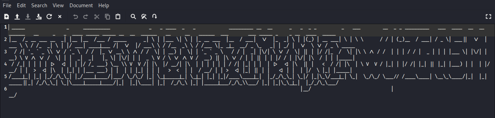
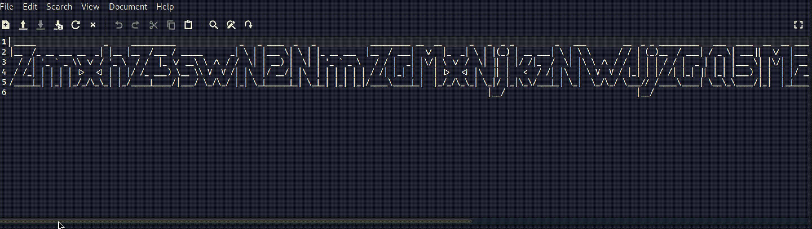
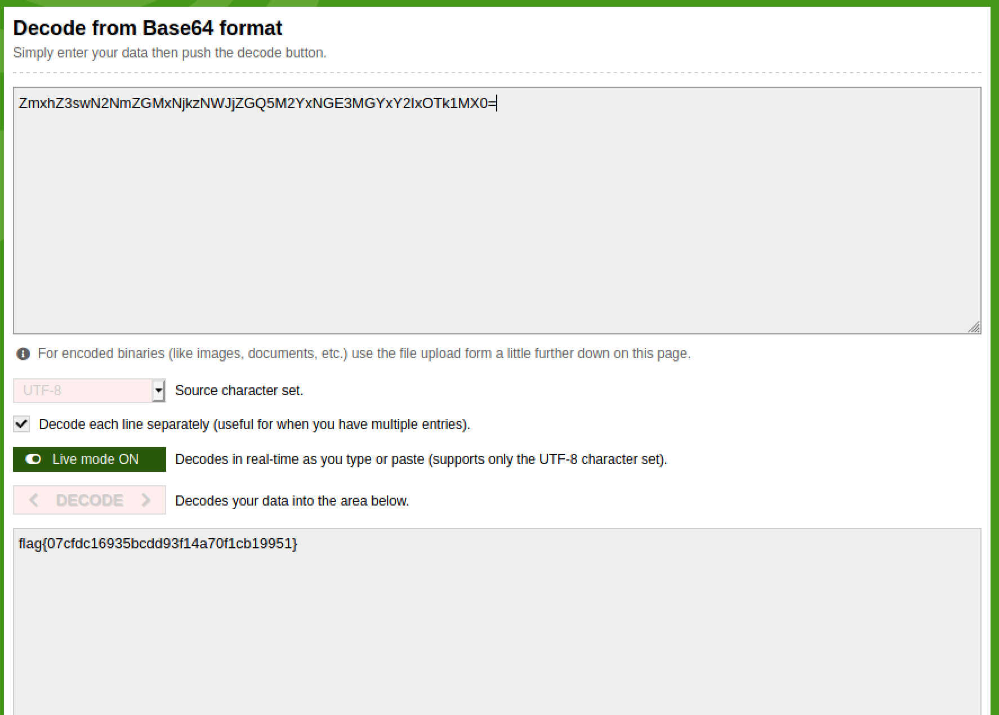

# Bass64
### easy | warmups | 50 points  
 

## Challenge Information
Woah! It's a natural disaster! But something doesn't seem so natural about this big wave...
  

## Solution

The challenge included a text file, which at first looked like absolute gibberish

After being stuck at this stage for quite a bit, I realized word wrap may have been on. Once that option was unchecked, things made a lot more sense!

Seeing the `=` in the end, this is definitiely base64 encoded text. So all that was left to do was figure out the letters and decode the text using a base64 decoder.

This took a little while, as some digits were a bit tough to figure out. However, once that was fixed, decoding the text returned the flag for the challenge!

Flag: `flag{07cfdc16935bcdd93f14a70f1cb19951}`