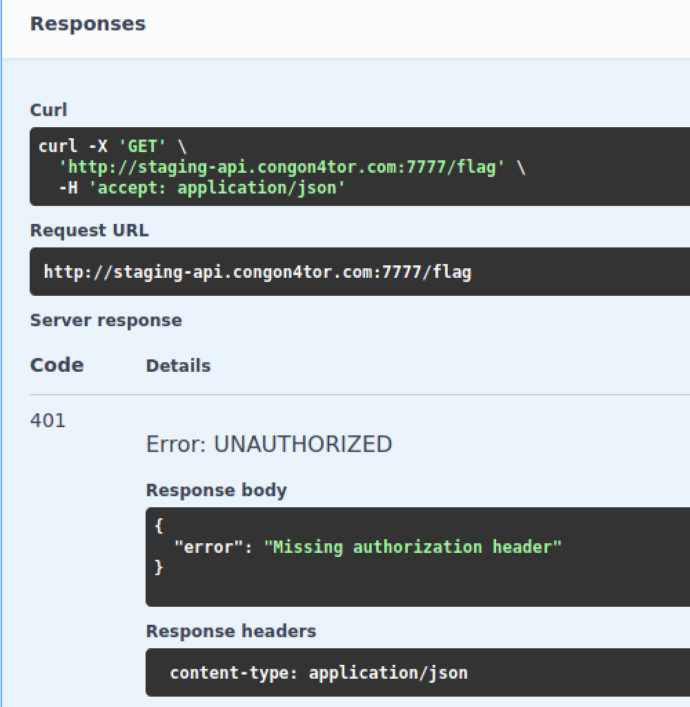

# Swagger
easy | warmups | 50 points  

>This API documentation has all the swag

This challenge looked increasingly complicated at first, but turned out to be super simple.

The website shows API documentation for `/flag`, which requires some authorization information as a parameter. There are two API portsgit , one is not available and the other is a testing one, which works.

The first attempt was to just test out the functionality of the website. I executed `/flag` on the test port, which returned a 401 status code. On checking the docs further, it mentions that the authentication is missing.

Then I clicked on the "Authorize" Button, entered random credentials and ran the API, this time returning a 403 meaning the credentials were incorrect.

Out of curiousity, I tried admin as both the username and password, executed the API again, and got the flag!

Flag: `flag{e04f962d0529a4289a685112bf1dedd3}`