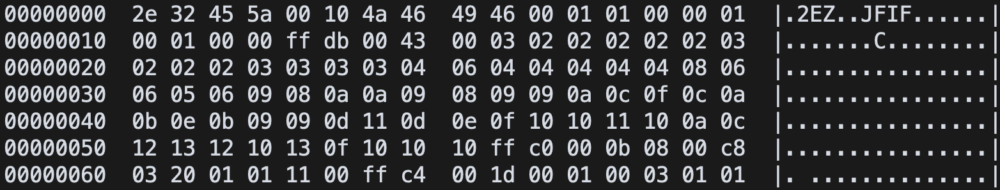
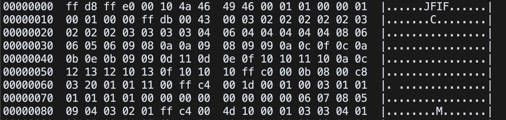

# 2EZ
easy | warmups | 50 points  

>These warmups are just too easy! This one definitely starts that way, at least!

The challenge included a file with no file type. Now usually my thought process goes to thinking that this may be an executable, and I immediately look for strings in the file.

```
$ strings 2ez                                      
.2EZ
JFIF
Baqv
...
```

However, this wasn't a binary file, as one of the strings was JFIF. So its an image file! Changing the extension and opening the image should work, EZ! Or so I thought... because the file wouldn't open. Hmm, something's up.

Checked the metadata, no information. Checked the hexdump, nothing that caught my eye.

A bit of googling later, I came across a writeup for a similar challenge ([Modified Header](https://marcellelee.medium.com/ctf-challenge-walkthrough-modified-header-2a4a33976b6d)). After reading that, I went back and looked at the hexdump again, to realize that the file header was corrupted.



The hexdump should start with `FF D8 FF E0`, which is the header for a JFIF file. As it is missing here, the file doesn't open.

The solution? Fix the file header by editing it in a hex editor.



Now I checked the file type again, and it recognizes the file type! I opened the image, and tada, its the challenge flag!


Flag: `flag{812a2ca65f334ea1ab234d8af3c64d19}`