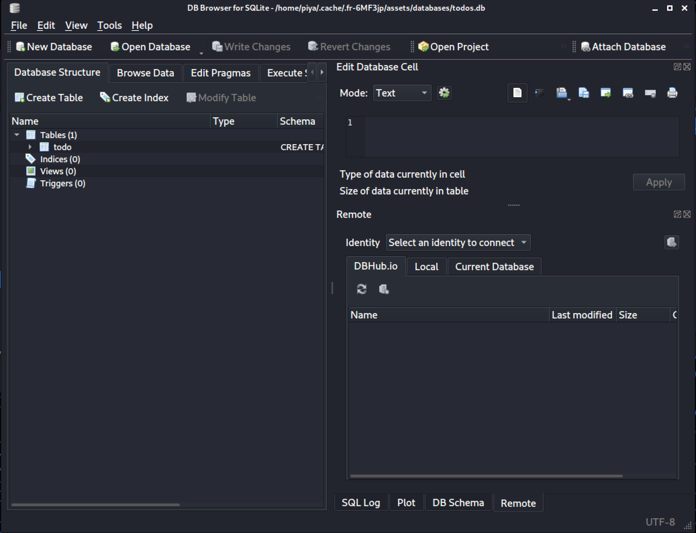

# To Do
easy | mobile | 50 points  

>I made my own app to remind me of all the things I need to do

What I thought would be the hardest easy challenge, turned out to be the challenge I solved the fastest!

The challenge included an `.apk` file. Knowing nothing about mobile CTF challenges, I started looking through the files and folders in this apk file.

```
todo.apk
├── resources.arsc
├── DebugProbes.Kt.bin
├── classes.dex
├── AndroidManifest.xml
├── res/
├── META-INF/
├── kotlin/
├── assets/
│	├── databases/
└──	└──	└── todos.db
```

I ended up finding a file called `todos.db` in `/assets/databases`

Again, not knowing what exactly to search for, I started browsing through the different options, and found some data in a table named `todo`.



The `=` at the end confirmed that this was base64 encoded data. The first few letters reminded me of the text from the [Bass64 challenge](4-Bass64.md), which meant that decoding this would output the flag for the challenge!

```
$ echo ZmxhZ3s1MjZlYWIwNGZmOWFhYjllYTEzODkwMzc4NmE5ODc4Yn0= | base64 -d
flag{526eab04ff9aab9ea138903786a9878b}
```

Flag: `flag{526eab04ff9aab9ea138903786a9878b}`