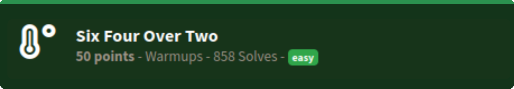

# Six Four Over Two
### easy | warmups | 50 points  
 

## Challenge Information
I wanted to cover all the bases so I asked my friends what they thought, but they said this challenge was too basic...
  

- challenge includes a text file with some gibberish
- got confused about the name of the challenge multiple times, thought of 64/2 as base8 and base16, before I finally realized it was base32.
- go to base16 decoder, paste the text and you have the flag!

Flag: `flag{a45d4e70bfc407645185dd9114f9c0ef}`