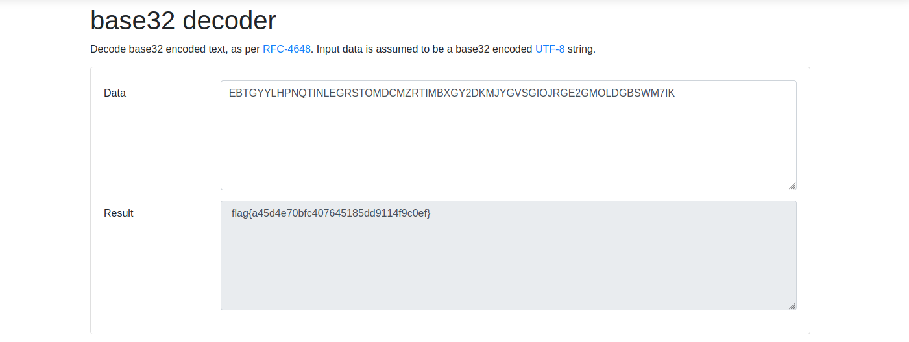

# Six Four Over Two
### easy | warmups | 50 points  
<br/>

## Challenge Information
I wanted to cover all the bases so I asked my friends what they thought, but they said this challenge was too basic...
<br/><br />

## Solution
The challenge included a text file with the following text

```
EBTGYYLHPNQTINLEGRSTOMDCMZRTIMBXGY2DKMJYGVSGIOJRGE2GMOLDGBSWM7IK
```

After getting confused multiple times on what "Six Four Over Two" actually meant, I finally came to the conclusion that the above text was encoded in base32. So all that was needed to do was use a base32 decoder and we have the flag!



Flag: `flag{a45d4e70bfc407645185dd9114f9c0ef}`