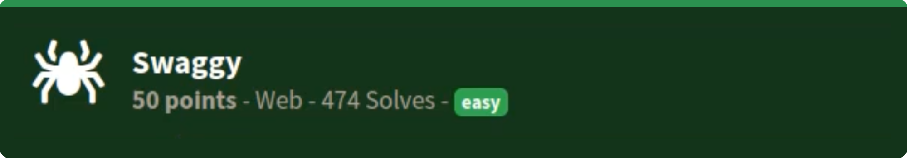

# Swagger
### easy | warmups | 50 points  
 

## Challenge Information
This API documentation has all the swag
  

- challenged look increasingly complicated at first, but turned out to be super simple
- website shows api documentation for a function called get_flag, which requires some authorization information
- there are two api ports, one is not available and one is a testing one, which works
- when trying to test the functionality, I executed the api on the test port, which returned a 401 message. checking docs, it says authentication is missing
- there is an authenticate button, where I entered random credentials and ran the api again, this time returning a 403 meaning the credentials were incorrect
- Out of curiousity, I tried admin as the username and password, ran the api again, AND IT WORKED!

Flag: ``