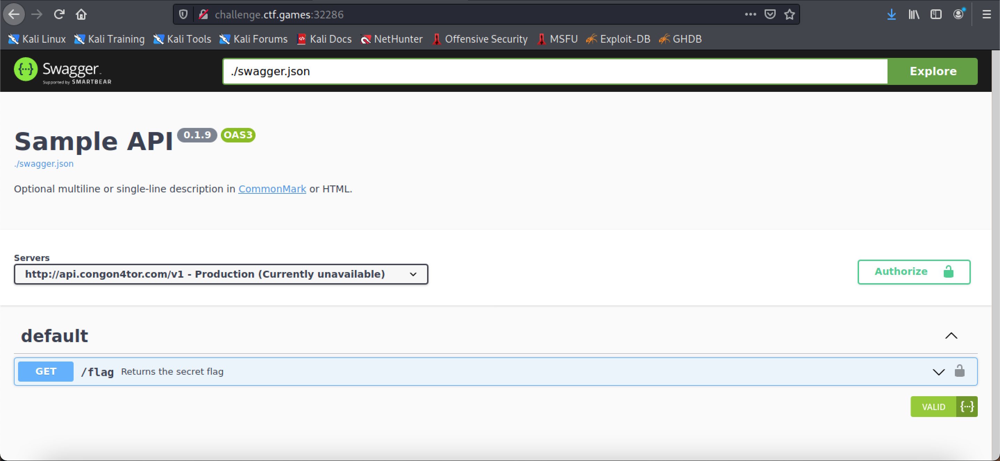
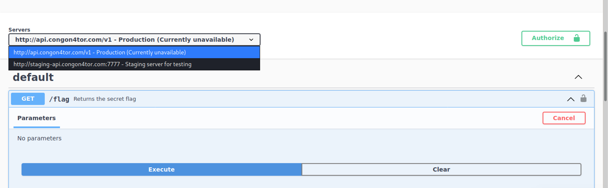
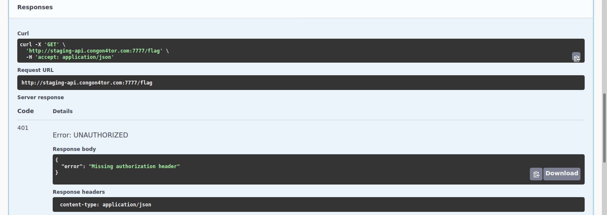
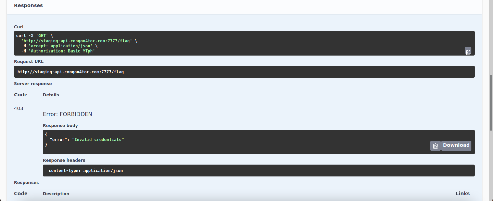
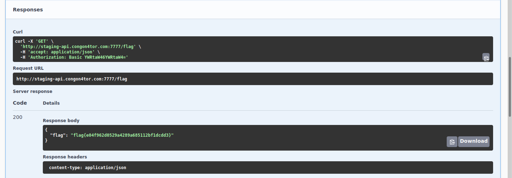

# Swagger
### easy | warmups | 50 points  
 

## Challenge Information
This API documentation has all the swag
  

## Solution
This challenge looked increasingly complicated at first, but turned out to be super simple.

 

The website shows API documentation for `/flag`, which requires some authorization information as a parameter, which will be mentioned later in the writeup. There are two API ports, one is not available and the other is a testing one, which works

The first attempt was to just test out the functionality of the website. I executed /flag on the test port, which returned a 401 message. On checking the docs further, itm mentions that the authentication is missing.

Then I clicked on the "Authorize" Button, entered random credentials and ran the api again, this time returning a 403 meaning the credentials were incorrect.

Out of curiousity, I tried admin as both the username and password, executed the api again, and got the flag!

Flag: `flag{e04f962d0529a4289a685112bf1dedd3}`