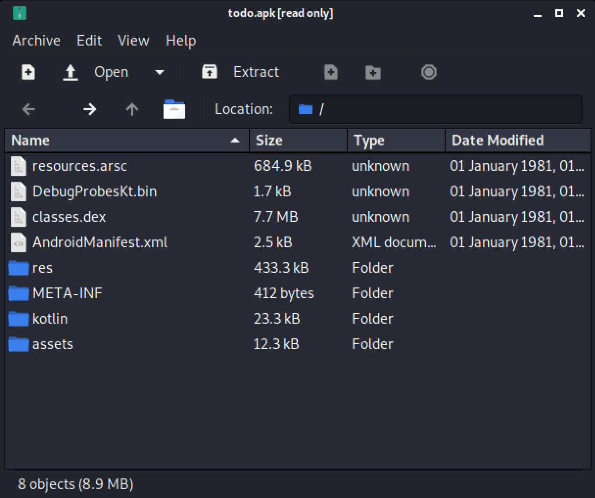
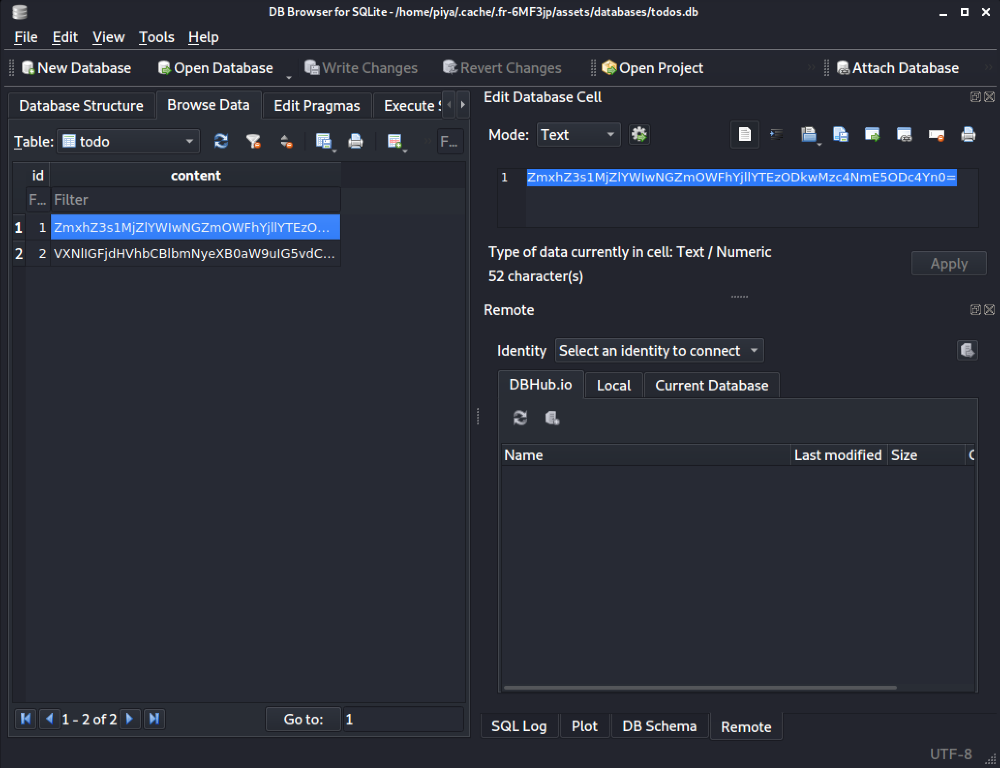
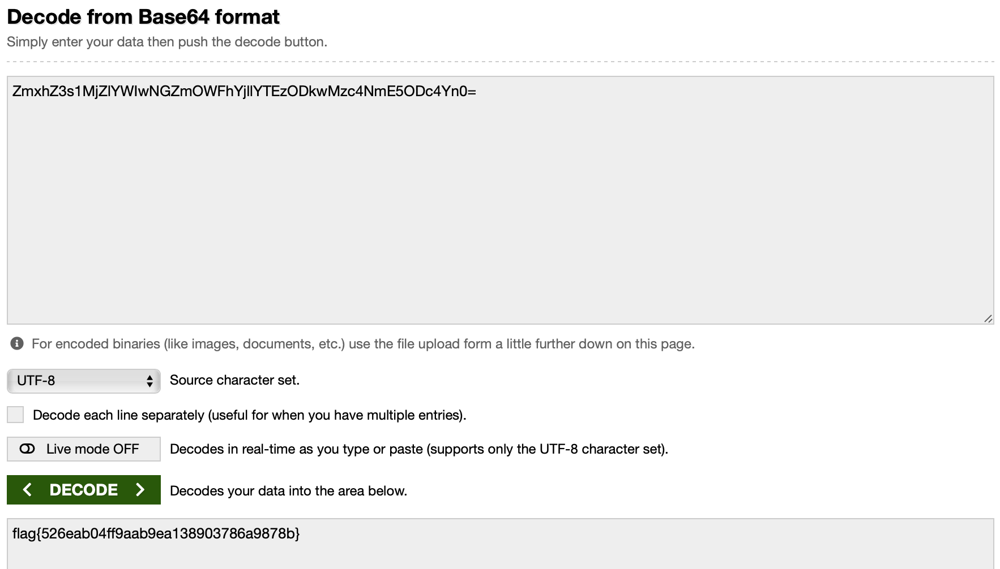

# To Do
### easy | mobile | 50 points  
 

## Challenge Information
I made my own app to remind me of all the things I need to do
  

## Solution
What I thought would be the hardest easy challenge, turned out to be the challenge I solved the fastest!

The challenge included an `.apk` file. Knowing nothing about mobile CTF challenges, I started looking through the files and folders in this apk file.

I ended up finding a file called `todos.db` in `/assets/databases`

Again, not knowing what exactly to search for, I started browsing through the different options, and found some data in the `Browse Data` section

The `=` at the end confirmed that this was base64 encoded data. The first few letters reminded me of the text from the [Bass64 challenge](4-Bass64.md), which meant that decoding this would output the flag for the challenge!

Flag: `flag{526eab04ff9aab9ea138903786a9878b}`