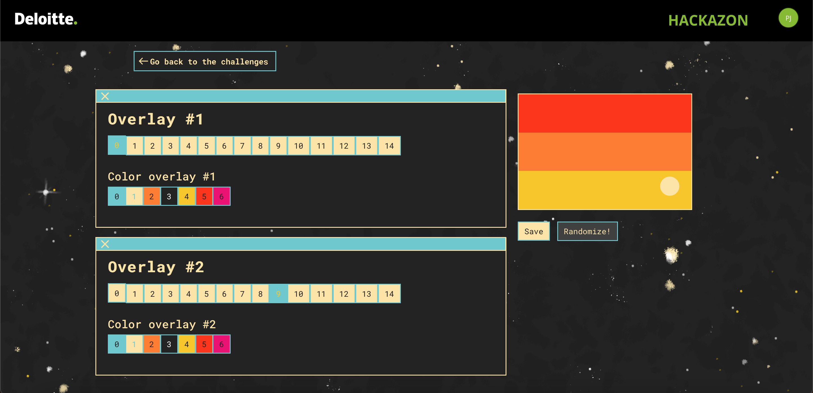

# TEASER: su admin
### beginner | web | 50 points  
<br/>

## Challenge Information
You arrived at the launch platform of SPACE RACE. Teams around you are preparing for the event the best they can by gathering their crew and designing their flag.

At the outset of the camp you notice the Hacky Holidays admin base, you decide to stake-out and see what's happening. After a while you notice that people are only allowed to access the admin base when they show the Hacky Holidays admin flag below.
<br/><br />

## Sub-Challenges
### [50 points] Identify yourself
Open the flag designer and see if you can hack your way into the admin base.

Note: Only the URL https://portal.hackazon.org/flagdesigner and its sub-URLs are part of the teaser challenge.

### Solution
There was one image attached with this challenge, admin_flag.png


\
The flag designer provides options to customize the flag.
The first step would be to recreate the admin flag, however this isn't possible as the logo in the center is not available out of the 14 available overlays.



One thing I tend to do with web challenges is check the source code of the website. Checking the source code of this website revealed a link to the flag's image.


## URL breakdown

After some trial and error, I realized that each of the numbers represented either a color or an overlay option of some part of the flag. 

```
https://portal.hackazon.org/flagdesigner/api/flag/7/0/9/5/2/4/1/1.svg
```
- 7 - flag style (three stripes)
- 0 - overlay #1 (currently set to no overlay)
- 9 - overlay #2 (the beige dot on the side)
- 5 - flag color #1 (the top stripe)
- 2 - flag color #2 (the middle stripe)
- 4 - flag color #3 (bottom stripe)
- 1 - overlay #1 color (set to beige)
- 1 - overlay #2 color (set to beige)

As there were only 14 overlay options in the flag designer, changing the part of the URL for overlay #1 to 15 for fun actually revealed the admin flag logo! Changing the color for the overlay to black (3) revealed the flag required to solve the challenge.


Flag: `CTF{YOU-HAZ-ADMIN-FLAG}`
<br/><br />

