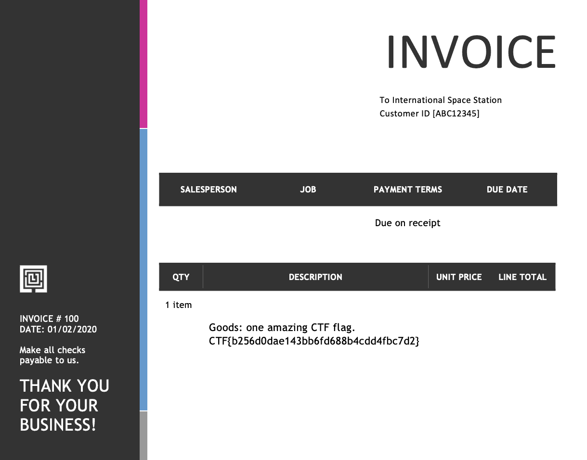

# Cute Invoice
medium | crypto | 200 points

>Who knew invoices could be secure AND cute? Our third-party contractor for space shuttle parts is using the best tooling for sending us secure invoices.

There were two files attached with the challenge, **invoice.pdf** and **invoice.png**.

**invoice.pdf** happens to be password protected. Tools like `qpdf` can be used to unlock the password, however we do require a list of passwords to check against the PDF.


The following details from invoice.png serve as clues to solving the challenge:
- The password generator used is **QtPass v1.2.0**, which will be referenced shortly.
- The password is **16 characters long**.
- The character set used is **All Characters**.

The initial idea was to brute force the password, which was not the correct approach for this challenge. I even went to the extent of cracking the password using an incremental mode in John the Ripper, setting a length of 16 chars and setting the mode to alphanumeric. I quickly realized that this was not the right way, as it would have taken forever. There had to be some catch to this.

Then my attention went towards the name and version of the password manager itself. A search for this version on Google revealed [a flaw](https://github.com/IJHack/QtPass/releases/tag/v1.2.1) in the way the password is generated:

>All passwords generated with QtPass's built-in password generator are possibility predictable and enumerable by hackers. The generator uses libc's random(), seeded with srand(msecs), where msecs is not the msecs since 1970 (not that that'd be secure anyway), but rather than msecs since the last second. This means there are only 1000 different sequences of generated passwords.

So if I were able to write an application to run the password generating function provided in the above link and generate the 1000 passwords, then cracking the password should be pretty easy!

## Generating the Passwords

### Character set
The password generating function takes characters from a charset. On searching the source code of this application on GitHub (specifically v1.2.0), the characters in each charset were found in [**datahelpers.h**](https://github.com/IJHack/QtPass/blob/v1.2.0/src/datahelpers.h).

```c++
Characters[ALLCHARS] =
        "ABCDEFGHIJKLMNOPQRSTUVWXYZabcdefghijklmnopqrstuvwxyz1234567890~!@#$%^&"
        "*()_-+={}[]|:;<>,.?"; /*AllChars*/
```

### Install Qt 
It is preferred to use the Online Installer as it made the installation process a lot smoother than the offline installers. Installing Qt will also install Qt Creator, the IDE used to create Qt applications. 

On opening Qt Creator, click on `New > Qt Console Application`. Follow the setup instructions and the application should be created.

### Writing the application

The [application](/src/genpass.cpp) recreates the vulnerable password generation function, mentioned in [this issue](https://github.com/IJHack/QtPass/issues/338) on GitHub.

```c++
#include <QtCore/QCoreApplication>
#include <QtCore/qglobal.h>
#include <QtGlobal>
#include <QString>
#include <iostream>

int main()
{
    QString charset = "ABCDEFGHIJKLMNOPQRSTUVWXYZabcdefghijklmnopqrstuvwxyz1234567890~!@#$%^&*()_-+={}[]|:;<>,.?";
    int length = 16;

    for (int i = 0; i < 1000; i++)
    {
        qsrand(i);
        QString passwd = NULL;
        for (int j = 0; j < length; ++j)
        {
            int index = qrand() % charset.length();
            QChar nextChar = charset.at(index);
            passwd.append(nextChar);
        }
        qDebug("%s", qUtf8Printable(passwd));
    }
    return 0;
}
```

Running this code returns 1000 passwords in the output, which are then copied in a text file.

```
hs]C:N.VOF(W3=?k
$?FbJaTahh289,VG
Kr>1ZnR,F0jAHHUq
r.K{p1mSA$Rt<RqM
=qYN6#kn0F?%xbpw
U,Pm_M6;hh*XlO!S
2pd!AZ4PF01tZY>3
,>U?Qm=8A$iB[i<Y
eoiYgz-]0FQu%sR9
...
```

## Cracking the Password

A [bash script](https://github.com/piyagehi/CTF-Writeups/blob/main/2021-Space-Race/src/crackpass.sh) runs `qpdf` to check each password against the PDF file and prints the password when found.

```bash
#!/bin/bash
filename="passwords.txt"
while read password;
do
    qpdf --password=$password --decrypt invoice.pdf invoiceout.pdf 2>/dev/null 
    if [ -f invoiceout.pdf ]
    then
            echo "Password found:" $password
            break
    fi
done < $filename
```

The password is found, and the unlocked PDF is saved as **invoiceout.pdf**. 

```
$ ./crackpass.sh
Password found: M=ZjV1z40MQF. 5HM
```

The flag is revealed in the PDF.



Flag: `CTF{b256d0dae143bb6fd688b4cdd4fbc7d2}`