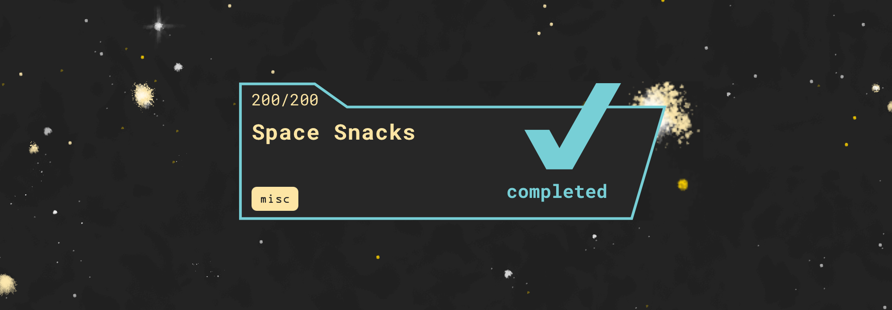

# Space Snacks
### beginner | misc | 200 points
<br/>

## Challenge Information


### [20 points] Roten to the core

You find a roten apple next to a piece of paper with 13 circles on and some text. What's the message?  
  
```shell
Vg nccrnef lbh unq jung vg gnxrf gb fbyir gur svefg pyhr  
Jryy Qbar fcnpr pnqrg  
pgs{Lbh_sbhaq_gur_ebg}  
Npprff pbqr cneg 1: QO
```
### Solution
Good ol' ROT13 :)

```shell
It appears you had what it takes to solve the first clue
Well Done space cadet
ctf{You_found_the_rot}
Access code part 1: DB
```
Flag: `ctf{You_found_the_rot}`
<br/><br/>

### [25 points] The roman space empire
You find a page with a roman insignia at the top with some text what could it mean?  
  
```shell
Jhlzhy ulcly dhz clyf nvvk ha opkpun tlzzhnlz.  
jam{Aol_vul_aybl_zhshk}  
jvkl whya: NW
```
### Solution
Caesar cipher with shift 7.

```shell
Caesar never was very good at hiding messages.  
ctf{The_one_true_salad}  
code part: GP
```

Flag: `ctf{The_one_true_salad}`
<br/><br/>

### [25 points] The space station that rocked
You hear the heavy base line of 64 speakers from the next compartment. you walk in and the song changes to writing's on the wall, there is some strange code painted on the wall what could it mean?

`
RXZlbiAgaW4gc3BhY2Ugd2UgbGlrZSB0aGUgYnV0dGVyeSBiaXNjdXQgYmFzZS4gY3Rme0lfbGlrZV90aGVfYnV0dGVyeV9iaXNjdWl0X2Jhc2V9IC4gQWNjZXNzIHBhcnQgMzogWEQ=
`
### Solution
base64decode.com to the rescue!

```shell
Even  in space we like the buttery biscut base. 
ctf{I_like_the_buttery_biscuit_base} . Access part 3: XD
```

Flag: `ctf{I_like_the_buttery_biscuit_base}`
<br/><br/>

### [25 points] What the beep is that?
You hear beeps on the radio, maybe someone is trying to communicate? Flag format: CTF:XXXXXX  
  
`
.. -. ... .--. . -.-. - --- .-. / -- --- .-. ... . / .-- --- ..- .-.. -.. / -... . / .--. .-. --- ..- -.. / --- ..-. / -.-- --- ..- .-. / . ..-. ..-. --- .-. - ... .-.-.- / -.-. - ..-. ---... ... .--. .- -.-. . -.. .- ... .... ..--- ----- ..--- .---- / .- -.-. -.-. . ... ... / -.-. --- -.. . ---... / .--- --...
`

### Solution

```shell
INSPECTOR MORSE WOULD BE PROUD OF YOUR EFFORTS. CTF:SPACEDASH2021 ACCESS CODE: J7
```

Flag: `CTF:SPACEDASH2021`
<br/><br/>

### [25 points] The container docker
You are now in the space cafe, the cake is in the container that should not be here. You can see random names on all the containers. What will Docker never name a container? Note: Please enter it as ctf{full_name}

A quick google search reveals the boring-wozniak as the answer


snippet from https://medium.com/peptr/why-boring-wozniak-will-never-be-generated-as-a-container-name-in-docker-763b755f9e2a

Flag: `ctf{boring_wozniak}`
<br/><br/>

