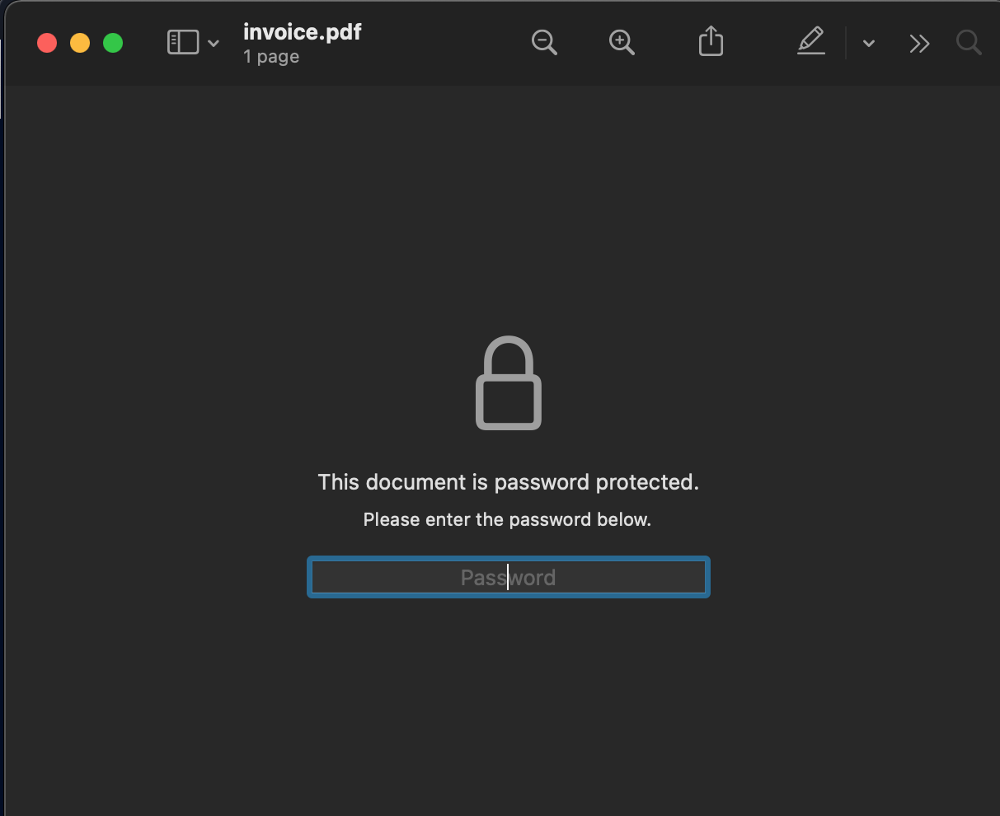
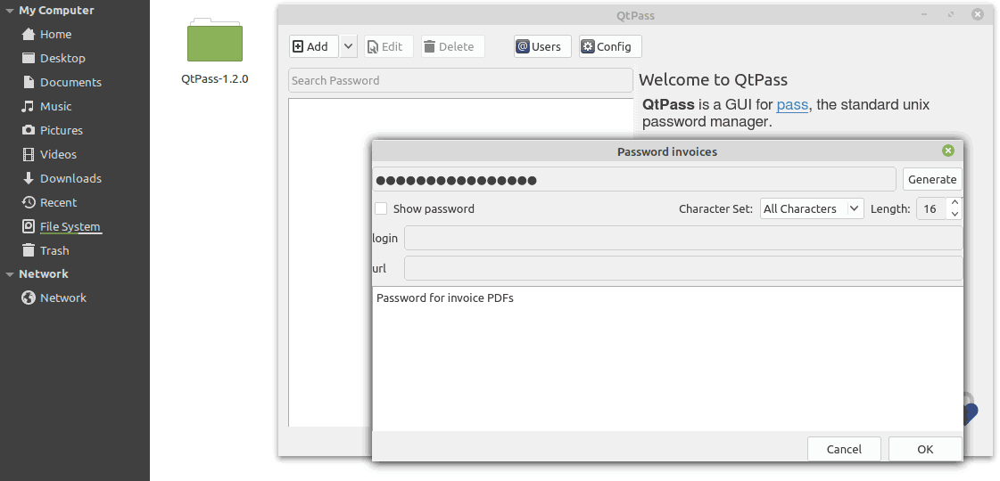
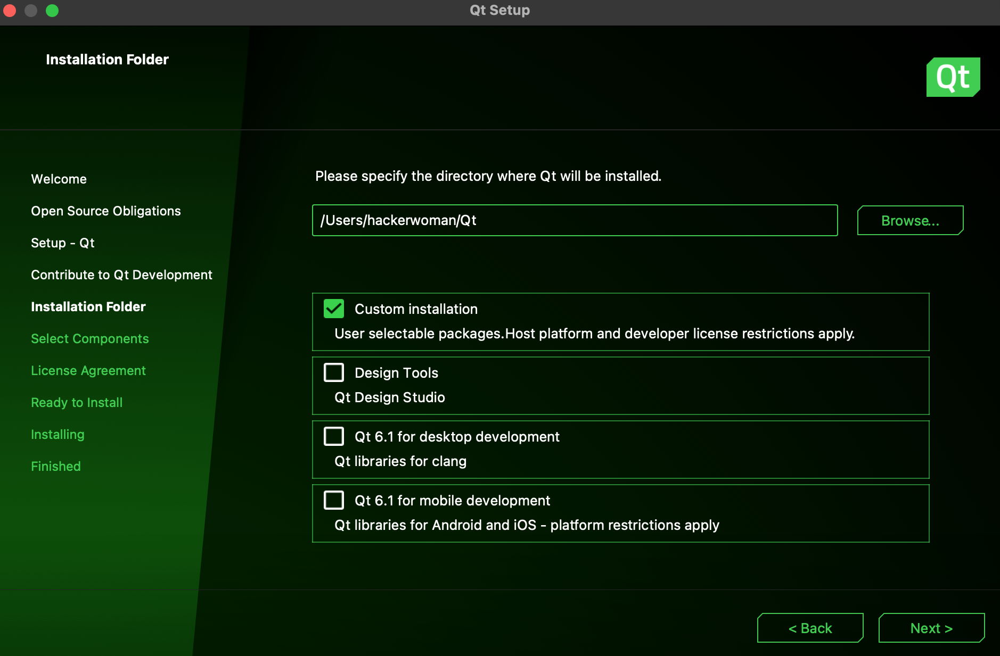

# Cute Invoice
### medium | crypto | 200 points


> Who knew invoices could be secure AND cute? Our third-party contractor for space shuttle parts is using the best tooling for sending us secure invoices.

There were two files attached with the challenge, invoice.pdf and invoice.png



On opening invoice.pdf, we see that it is password protected. Tools like qpdf can be used to unlock the password, however we do require a list of passwords to check against the pdf.



The following details from the image serve as clues to solving the challenge:
- The password generator used is QtPass v1.2.0, which will be referenced shortly.
- The password is 16 characters long
- The character set used is 'All Characters'

The initial idea was to brute force the password, which was not the correct approach for this challenge. I even went to the extent of cracking the password using an incremental mode in John the Ripper, setting a length of 16 chars and setting the mode to alphanumeric. I quickly realized that this was not the right way, as it that way would have taken forever. There had to be some catch to this.

Then my attention went towards the name and version of the password manager itself. A search for this version on Google revealed a flaw in the way the password is generated.


from https://github.com/IJHack/QtPass/issues/338

The seed provided to the random number generator is the milliseconds past since the last second. Due to this, there are only 1000 possible seeds, hence only 1000 possible passwords!

So if I were able to write an application to run the password generating function provided in the above link and generate the 1000 passwords, then cracking the password should be pretty easy!

## Generating the Passwords

### 1. Get information on the character set used
The password generating function takes characters from a charset. On searching the source code of this application on GitHub, the characters in each charset were found in [datahelpers.h](https://github.com/IJHack/QtPass/blob/v1.2.0/src/datahelpers.h)

### 2. Install Qt 
It is preferred to use the Online Installer as it makes the installation process a lot smoother than the offline installers. I initially installed the most recent version of Qt, which is 6.1.2, however as I began writing the application, I found that some functions were made obsolete in this version. So I installed Qt 5.1.5 later on. However it is possible to install it from the Online Installer directly.




Installing Qt will also install Qt Creator, the IDE used to create Qt applications. On opening Qt Creator, click on New > Qt Console Application. Follow the setup instructions and the application should be created.

[screenshot of qt creator screen]

The following code is written using the source code of QtPass 1.2.something

```c++
#include <QtCore/QCoreApplication>
#include <QtCore/qglobal.h>
#include <QtGlobal>
#include <QString>
#include <iostream>


int main()
{
    QString charset = "ABCDEFGHIJKLMNOPQRSTUVWXYZabcdefghijklmnopqrstuvwxyz1234567890~!@#$%^&*()_-+={}[]|:;<>,.?";
    int length = 16;

    for (int i = 0; i < 1000; i++)
    {
        qsrand(i);
        QString passwd = NULL;
        for (int j = 0; j < length; ++j)
        {
            int index = qrand() % charset.length();
            QChar nextChar = charset.at(index);
            passwd.append(nextChar);
        }
        qDebug("%s", qUtf8Printable(passwd));
    }
    return 0;
}
```

Running this code returns 1000 passwords in the output, which are then copied in a text file.
[screenshot of passwords file]

A bash script runs qpdf to check each password against the pdf file and stops when the password is found:

```bash
#!/bin/bash
filename="passwords.txt"
while read password;
do
        qpdf --password=$password --decrypt invoice.pdf invoiceout.pdf 2>/dev/null 
        if [ -f invoiceout.pdf ]
        then
                echo "Password found:" $password
                break
        fi
done < $filename
```

The password is found, and the unlocked pdf is saved as invoiceout.pdf. 
[Screenshot of password found]

On checking the contents of invoiceout.pdf, the flag is revealed.
[Screenshot of invoiceout.pdf]

Flag: `CTF{b256d0dae143bb6fd688b4cdd4fbc7d2}`