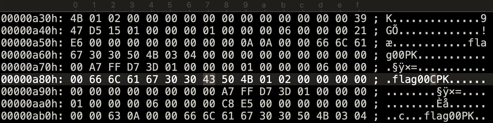

# Appnote.txt
misc | 50pts | 210 solves

## Description
Every single archive manager unpacks this to a different file...

## First Impressions
The challenge comes with an zip file called `dump.zip`. Unzipping it results in a file called `hello.txt` containing the following text:

```txt

There's more to it than meets the eye...

```

From the challenge description and the text from `hello.txt`, we can guess that there are some hidden files. I checked the zip file with `binwalk`, and we can find A LOT of hidden files.

```bash
DECIMAL       HEXADECIMAL     DESCRIPTION
--------------------------------------------------------------------------------
0             0x0             Zip archive data, v0.0 compressed size: 41, uncompressed size: 41, name: hello.txt
135           0x87            Zip archive data, v0.0 compressed size: 33, uncompressed size: 33, name: hi.txt
256           0x100           Zip archive data, v0.0 compressed size: 1, uncompressed size: 1, name: flag00
345           0x159           Zip archive data, v0.0 compressed size: 1, uncompressed size: 1, name: flag00
434           0x1B2           Zip archive data, v0.0 compressed size: 1, uncompressed size: 1, name: flag00
523           0x20B           Zip archive data, v0.0 compressed size: 1, uncompressed size: 1, name: flag00
612           0x264           Zip archive data, v0.0 compressed size: 1, uncompressed size: 1, name: flag00
...
60598         0xECB6          Zip archive data, v0.0 compressed size: 1, uncompressed size: 1, name: flag18
60687         0xED0F          Zip archive data, v0.0 compressed size: 1, uncompressed size: 1, name: flag18
60776         0xED68          Zip archive data, v0.0 compressed size: 1, uncompressed size: 1, name: flag18
60865         0xEDC1          Zip archive data, v0.0 compressed size: 1, uncompressed size: 1, name: flag18
60954         0xEE1A          Zip archive data, v0.0 compressed size: 1, uncompressed size: 1, name: flag18
61043         0xEE73          Zip archive data, v0.0 compressed size: 1, uncompressed size: 1, name: flag18
61572         0xF084          End of Zip archive, footer length: 22
```
The names range from flag00.zip to flag18.zip, and each file name appears 36 times. Interesting, maybe we can find something if we check the strings in this zip file?

```txt
V~uK)
hello.txtThere's more to it than meets the eye...
V~uK)
hello.txtPK
hi.txtFind a needle in the haystack...
hi.txtPK
flag00aPK
flag00PK
flag00bPK
flag00PK
flag00cPK
flag00PK
...
flag18{PK
flag18PK
flag18CPK
flag18PK
flag18TPK
flag18PK
flag18FPK
flag18PK
flag180PK
flag18PK
flag181PK
flag18PK
flag183PK
flag18PK
flag187PK
flag18PK
flag18}PK
flag18PK
flag18_PK
flag18PK
```

Each file name is followed by a character, which is one of the following: all lowercase letters (`a-z`), `{`, `C`, `T`, `F`, `0`, `1`, `3`, `7`, `}`, `_`. From the range of characters, it looks like extracting the right files would make the flag. We need to find out which files to extract.

## Searching for the Solution
I came across [this Stack Overflow post](https://stackoverflow.com/questions/4802097/how-does-one-find-the-start-of-the-central-directory-in-zip-files) in my searches. What caught my eye was the name APPNOTE.TXT in the question, which is the name of this challenge.

[APPNOTE.TXT](https://pkware.cachefly.net/webdocs/casestudies/APPNOTE.TXT) happens to be the document containing the file format specification for the ZIP file. With that I figured that I would have to look into the hex bytes for something.

The second thing that caught my eye was the term "central directory". I knew a bit about the ZIP file structure, but needed to look it up more in detail.

### Central directory: a short introduction

The central directory consists of[^1] :
- central directory file headers, which point to files in the archive and contain additional metadata.
- end of central directory record or EOCDR, which is used by zip tools to correctly read and extract files from the archive. This structure contains information about the archive and points to the start of the central directory, which further points to the data in the archive.

File structure from APPNOTE.TXT
```
4.3.16  End of central directory record:

      end of central dir signature    4 bytes  (0x06054b50)
      number of this disk             2 bytes
      number of the disk with the
      start of the central directory  2 bytes
      total number of entries in the
      central directory on this disk  2 bytes
      total number of entries in
      the central directory           2 bytes
      size of the central directory   4 bytes
      offset of start of central
      directory with respect to
      the starting disk number        4 bytes
      .ZIP file comment length        2 bytes
      .ZIP file comment       (variable size)
```

The APPNOTE also mentioned that a ZIP file must have only one EOCDR. So, maybe checking the EOCDR segment of the ZIP file will help find out which files to extract?

## Solution

The EOCDR begins with the hex bytes `50 4B 05 06` (big-endian). After opening the file in a hex editor (UltraEdit in my case) I searched for the hex bytes. And...there's multiple results, specifically 21 of them?

```txt
50 4B 05 06 00 00 00 00 01 00 01 00 00 EE 00 00 CC 00 00 00
50 4B 05 06 00 00 00 00 01 00 01 00 5A E4 00 00 88 0A 00 00
50 4B 05 06 00 00 00 00 01 00 01 00 93 D7 00 00 65 17 00 00
50 4B 05 06 00 00 00 00 01 00 01 00 CC CA 00 00 42 24 00 00
50 4B 05 06 00 00 00 00 01 00 01 00 69 BF 00 00 BB 2F 00 00
50 4B 05 06 00 00 00 00 01 00 01 00 CE B6 00 00 6C 38 00 00
50 4B 05 06 00 00 00 00 01 00 01 00 29 A5 00 00 27 4A 00 00
50 4B 05 06 00 00 00 00 01 00 01 00 E7 9C 00 00 7F 52 00 00
50 4B 05 06 00 00 00 00 01 00 01 00 42 8B 00 00 3A 64 00 00
50 4B 05 06 00 00 00 00 01 00 01 00 21 86 00 00 71 69 00 00
50 4B 05 06 00 00 00 00 01 00 01 00 71 73 00 00 37 7C 00 00
50 4B 05 06 00 00 00 00 01 00 01 00 66 70 00 00 58 7F 00 00
50 4B 05 06 00 00 00 00 01 00 01 00 E3 59 00 00 F1 95 00 00
50 4B 05 06 00 00 00 00 01 00 01 00 AC 52 00 00 3E 9D 00 00
50 4B 05 06 00 00 00 00 01 00 01 00 A2 47 00 00 5E A8 00 00
50 4B 05 06 00 00 00 00 01 00 01 00 8E 33 00 00 88 BC 00 00
50 4B 05 06 00 00 00 00 01 00 01 00 9A 2A 00 00 92 C5 00 00
50 4B 05 06 00 00 00 00 01 00 01 00 16 1C 00 00 2C D4 00 00
50 4B 05 06 00 00 00 00 01 00 01 00 38 15 00 00 20 DB 00 00
50 4B 05 06 00 00 00 00 01 00 01 00 2F 02 00 00 3F EE 00 00
50 4B 05 06 00 00 00 00 01 00 01 00 34 F0 00 00 50 00 00 00
```
When checking for hidden files in `dump.zip`, we found a total of 21 unique file names:
- hello.txt
- hi.txt
- flag00 to flag18

OH! Each EOCDR corresponds to each of the files in the archive. And since we have multiple files with the same name for flag00 to flag18, the EOCDR will help to point out which file to extract, LETSGO!

To understand the data in the records better, here is a representation with one of the records as an example

```txt
50 4B 05 06 00 00 00 00 01 00 01 00 5A E4 00 00 88 0A 00 00

50 4B 05 06     end of central dir signature 
00 00           number of this disk
00 00           number of the disk with the start of the central directory
01 00           total number of entries in the central directory on this disk
01 00           total number of entries in the central directory
5A 34           size of the central directory
00 00 88 0A     offset of start of central directory with respect to the starting disk number
00 00           .ZIP file comment length
```

The data significant for the solution is the "offset of start of central directory with respect to the starting disk number". In short, this points to the start of the central directory. In the above example, the address is 0x0000880a in big-endian, or 0x00000a88 in little-endian. I entered the address (in little-endian format) in the hex editor and it points to the central directory header (40 5B 01 02). We can see the character 'C' 1 byte before the file header (highlighted). As the flag begins with `CTF`, I know that this is the correct character.



A similar process can be followed remaining records, and we get our flag! Of course, I wanted to make a script to make this process easier, so I did.

**[appnote-sol.py](src/appnote-sol.py)**
```python
import binascii

with open('dump.zip', "rb") as file:
    content = file.read()
hexadecimal = binascii.hexlify(content)

flag = []
for i in range(0, len(hexadecimal), 32):
    line = hexadecimal.decode('utf-8')[i:i+32]
    if "0506" in line:
        f = line.find("0506")

        # offset of start of central directory
        address = hexadecimal.decode('utf-8')[i+f+28:i+f+36]

        # converting address to little-endian format
        ba = bytearray.fromhex(address)
        ba.reverse()
        s = ''.join(format(x, '02x') for x in ba)

        # retriving the byte before the file header, i.e., the character
        index = int(s, 16) - 0x1
        flag.append(chr(content[index]))

print(''.join(flag).strip('\n'))
```

```bash
$ python3 appnote-sol.py
CTF{p0s7m0d3rn_z1p}
```

Flag: `CTF{p0s7m0d3rn_z1p}`


[^1]: Sources
    - https://users.cs.jmu.edu/buchhofp/forensics/formats/pkzip.html#centraldirectory
    - https://www.hanshq.net/zip.html#eocdr
    - https://en.wikipedia.org/wiki/ZIP_(file_format)#End_of_central_directory_record_(EOCD)
