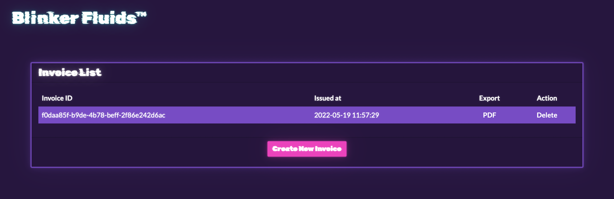
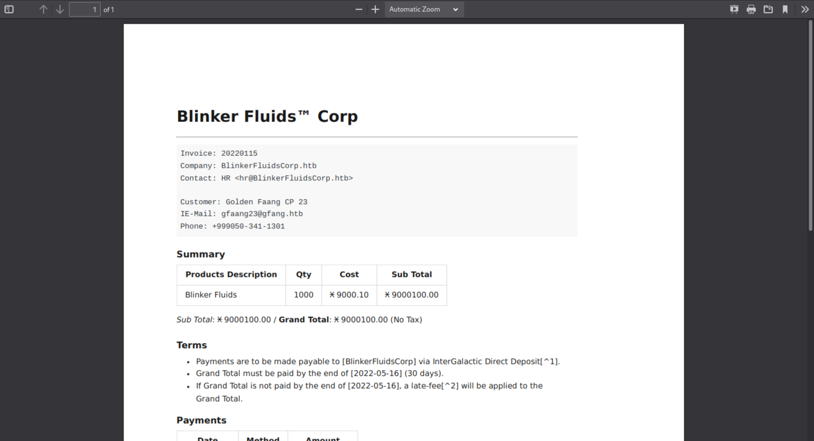
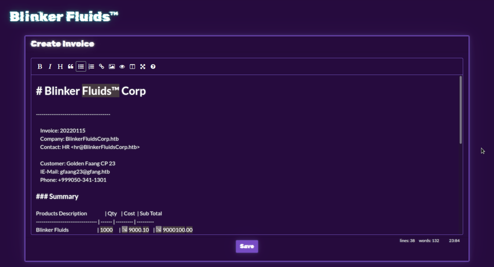
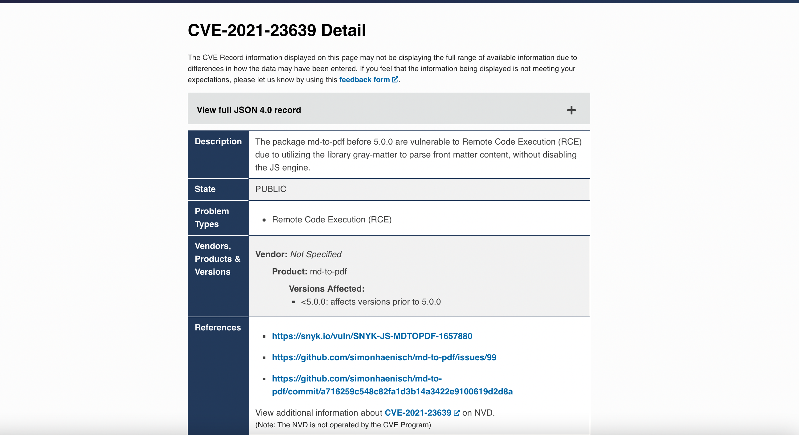
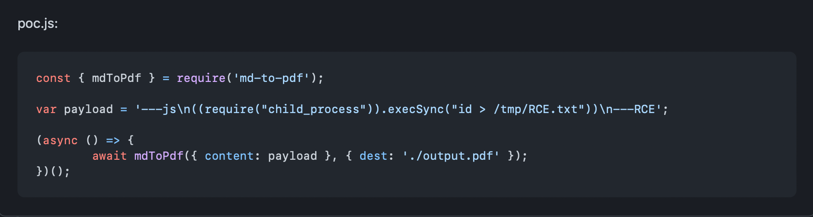
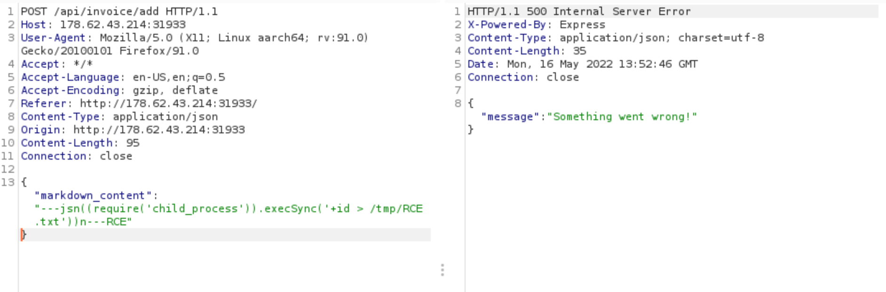
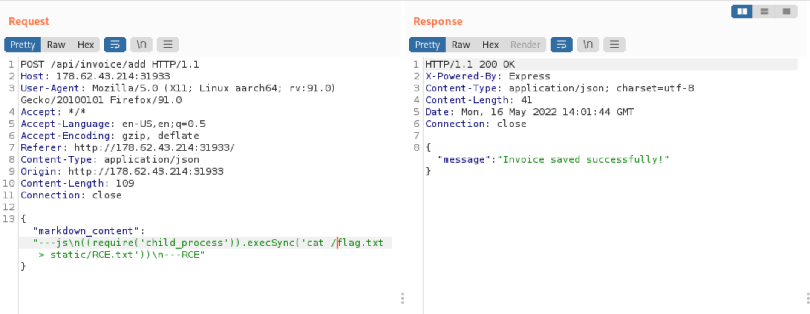
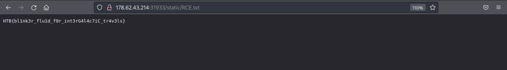

# Blinker Fluids
### web | 300 points | 916 solves

## Description
Once known as an imaginary liquid used in automobiles to make the blinkers work is now one of the rarest fuels invented on Klaus' home planet Vinyr. The Golden Fang army has a free reign over this miraculous fluid essential for space travel thanks to the Blinker Fluids™ Corp. Ulysses has infiltrated this supplier organization's one of the HR department tools and needs your help to get into their server. Can you help him?

## First Impressions
The website shows an invoice list with one invoice, and the options to view the invoice or delete it.



The invoices appear as a PDF and are stored in `/static/invoices`.



On the homepage, there is also a `Create Invoice` button, which opens a markdown editor with the sample template for the invoice.



So probably we should be able to inject some code through this markdown document? Let's check the source code.

```txt
web_blinkerfluids
├── build-docker.sh
├── challenge
│	├── database.js
│	├── helpers
│	│	└── MDHelper.js
│	├── index.js
│	├── package.json
│	├── routes
│	│	└── index.js
│	├── static
│	│	├── css
│	│	│	├── bootstrap.min.css
│	│	│	├── easymde.min.css
│	│	│	└── main.css
│	│	├── images
│	│	│	└──favicon.png
│	│	├── invoices
│	│	│	└── f0daa85f-b9de-4b78-beff-2f86e242d6ac.pdf
│	│	└── js
│	│		├── easymde.min.js
│	│		├── jquery-3.6.0.min.js
│	│		└── main.js
│	└── views
│		└── index.html
├── config
│	└── supervisord.conf
├── Dockerfile
└── flag.txt
```

From the challenge's `Dockerfile`, we can see that on the challenge website, the flag is saved at `/flag.txt`

```sh
...

# Setup challenge directory
RUN mkdir -p /app

# Add flag
COPY flag.txt /flag.txt

...
```

Another file to look at in web challenge files is `challenge/routes/index.js`, as that provides most of the core functionality of the web app.

```js
const express        = require('express');
const router         = express.Router();
const MDHelper       = require('../helpers/MDHelper.js');

let db;

const response = data => ({ message: data });

...

router.post('/api/invoice/add', async (req, res) => {
    const { markdown_content } = req.body;

    if (markdown_content) {
        return MDHelper.makePDF(markdown_content)
            .then(id => {
                db.addInvoice(id)
					.then(() => {
						res.send(response('Invoice saved successfully!'));
					})
					.catch(e => {
						res.send(response('Something went wrong!'));
					})
            })
            .catch(e => {
                console.log(e);
                return res.status(500).send(response('Something went wrong!'));
            })
    }
    return res.status(401).send(response('Missing required parameters!'));
});
```

One thing that stands out here is an import called MDHelper, which calls a file called `MDHelper.js`. This is where the conversion from Markdown to PDF takes place.

```js
const { mdToPdf }    = require('md-to-pdf')
const { v4: uuidv4 } = require('uuid')

const makePDF = async (markdown) => {
    return new Promise(async (resolve, reject) => {
        id = uuidv4();
        try {
            await mdToPdf(
                { content: markdown },
                {
                    dest: `static/invoices/${id}.pdf`,
                    launch_options: { args: ['--no-sandbox', '--js-flags=--noexpose_wasm,--jitless'] } 
                }
            );
            resolve(id);
        } catch (e) {
            reject(e);
        }
    });
}

module.exports = {
    makePDF
};
```

The package used for the conversion is `md-to-pdf`. While the code itself does not seem particularly vulnerable, searching online for vulnerabilities may reveal something.

## Solution

After a search, a vulnerability immediately shows up.



I quickly checked the version of `md-to-pdf` used in this app (from `/challenge/package.json`), and this is a version that has the vulnerability

```json
"dependencies": {
        "express": "4.17.3",
        "md-to-pdf": "4.1.0"
}
```

On checking [one of the reference links from the CVE page](https://github.com/simonhaenisch/md-to-pdf/issues/99), we can find the following exploit.



Side note: [another reference](https://security.snyk.io/vuln/SNYK-JS-MDTOPDF-1657880) displays the PoC incorrectly, which delayed the process of completing the challenge.

The payload is modified to suit this challenge. The location of the flag is known as seen earlier. And since the static file is accessible to us (the invoices), that was the best location to save RCE.txt.

```markdown
'---js\n((require("child_process")).execSync("cat /flag.txt > static/RCE.txt"))\n---RCE';
```

Crafting this payload took a while due to the side note mentioned above, and the fact that none of the payloads I tried seemed to work when entered through the markdown editor on the website. After a lot of tries, I reached out for a hint, and they suggested I use Burpsuite (and also about the payload being incorrect).

I setup Burpsuite on my system, created a sample invoice (the incorrect payload) and captured the request.



I changed the payload to the one modified for the challenge and sent the edited request.



Invoice sent successfully! I checked `static/RCE.txt` and found the flag for the challenge!



Flag: `HTB{bl1nk3r_flu1d_f0r_int3rG4l4c7iC_tr4v3ls}`
