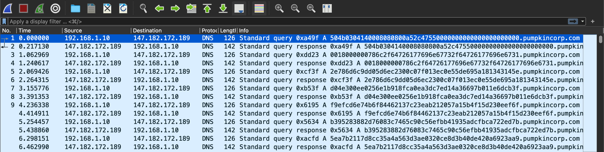
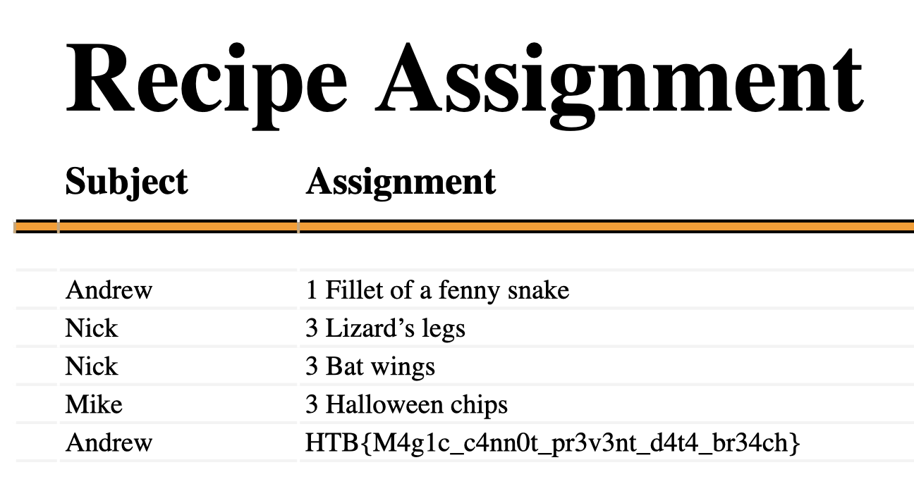

# Trick Or Breach
easy | forensics | 200pts

>Our company has been working on a secret project for almost a year. None knows about the subject, although rumor is that it is about an old Halloween legend where an old witch in the woods invented a potion to bring pumpkins to life, but in a more up-to-date approach. Unfortunately, we learned that malicious actors accessed our network in a massive cyber attack. Our security team found that the hack had occurred when a group of children came into the office's security external room for trick or treat. One of the children was found to be a paid actor and managed to insert a USB into one of the security personnel's computers, which allowed the hackers to gain access to the company's systems. We only have a network capture during the time of the incident. Can you find out if they stole the secret project?

## First Impressions

The challenge comes with a pcap file, `capture.pcap` containing only DNS requests.



The website names requested in the DNS requests are interesting. The URL of the first packet has the same initial characters as the [local file header of a ZIP file](https://en.wikipedia.org/wiki/ZIP_(file_format)#Local_file_header). As each of DNS query contains hex bytes, I came to the conclusion that combining these bytes would form a ZIP file which would contain the flag for the challenge. Now we need to find a way to extract these values automatically.

## Solution

Enter [tshark](https://www.wireshark.org/docs/man-pages/tshark.html), the command-line equivalent to Wireshark. After [a bit of searching](https://www.netresec.com/?page=Blog&month=2012-06&post=Extracting-DNS-queries) as to how the syntax works, I ended up with the following command to extract the bytes.

```txt
$ tshark -r capture.pcap -T fields -e dns.qry.name -Y 'ip.src==192.168.1.10' | tr -d '.pumpkincorp.com\n'
504b0304140008080800a524755000000000000000000000000180000007862f64726177696e67732f64726177696e67312e786d69dd05d6e230007f013e0e55de695a181343145ed04e300ee0256e1b918fa0ea3d7ed14a36697b011e6db3ff9efd6e74b6f8446213723eab212057a15b4f15d230eef6fb395283882d7608374659056efbb41935adfba722ed7b5ea7b2117d835a4a563d3ae0320e8d3b40de420a6923aa909e497656eabea45f240089a7b4b89f26e2ea1039a03e3f3fe4dd784b6350af7419d1fa3821841662fa05f766e0aa907ae513d50f0167f82338a028736962ab8eb29d94842fd30938fe1af5dd852bead55f8dd147011d4f32b9437a887b1265ebe93654677ee81b768031d81b8b838f8e3ddb12a936b5282b6b15edeadb322b75f504b0708076269830501000007030000504b0304140008080800a524755000000000000000000000000180000007862f64726177696e67732f64726177696e67322e786d69dd05d6e230007f013e0e55de695a181343145ed04e300ee0256e1b918fa0ea3d7ed14a36697b011e6db3ff9efd6e74b6f8446213723eab212057a15b4f15d230eef6fb395283882d7608374659056efbb41935adfba722ed7b5ea7b2117d835a4a563d3ae0320e8d3b40de420a6923aa909e497656eabea45f240089a7b4b89f26e2ea1039a03e3f3fe4dd784b6350af7419d1fa3821841662fa05f766e0aa907ae513d50f0167f82338a028736962ab8eb29d94842fd30938fe1af5dd852bead55f8dd147011d4f32b9437a887b1265ebe93654677ee81b768031d81b8b838f8e3ddb12a936b5282b6b15edeadb322b75f504b0708076269830501000007030000504b0304140008080800a524755000000000000000000000000180000007862f776f726b7368656574732f7368656574312e786d6d58ed72da38147d827d07d793e990d914636383a1402760039949d2049bbb33f155b8037b6e5da7220fbf42b59f297402dd976f64f620ee75e9d23dd2b248fbee035f7a8671e2a1702abed8e21d041ae176e6f2b787f92753961204217f8288463f90526f29796fa31d8a9f922d8458220926426f318e868a92385b1880a48d2218926fd6280e00261fe38d924431046e1614f88ad6e9f4940078a1320e35372a0f5da73a0859348021664962e8034e4275b2f4af261be912ef091825688ddb0e0a7826a2051e0de819920b32628704e511480f8298d3e91941151f1e8f91e7e97415699e7721a87439ee3532183609f83e70f97b553f4d77633207aa0a67eaf1aff2e93da51545548a583e6592e0b3845a6e0b43458af012998b29477f1648452e7b21b8ba5240d8e4bf4a18f766399142e0756de668b29a04464a11973d7f7e02ea934bb481f117aa21fae51a3419452084d2b7d4456722ebb423308aaee11afa0ef8fe54b43968083bd677807684732285140bff3a0513681da3bf614874fa00f1d5a9384a59892e2487e470d1e23314f219aaa3ee7dae75901923970d284042d21b3aa920bd720f5f10f97f782ede1246bf7ba05be42bb826b4fb061da417e92fde5d9f240590ab90fd07fbeff8e7da3b5f3b83111a8fd08a08553f12d2e521dd2244ef97f20e7e83462f87d1dadadb31068f318a981b1617a3a4ff133983614e7461939d2da2053098862b493e22325b148dd69bb8aa6424ab924a4847e56383015819908580d00a06640b700e6226321e65856180a915b68d698665da7d3f1aa684d14d00b26a849610daf3a433529ee9de42e183285d30a0570951eb213663f44b5b22b010932e196036675992d6df0a6ad6e163d286de540a9511363519dd3a3620b553a1e882514e512b14a34e991fa0f4ea945014abf4e59560d6a647e7abde7e63727496be2aa2947aba9b35108b237a59a129176dde40160d64591dbd26dde04df696748305f74ae91294b69611b394e91b21686689d523a47a4e5834906515a949ef15027b852995b8e742b8b690aa5729d5a61b08b572946b59846b439a7993947faa5675b36bb485a08548311a946541116df70bdbfd86ed7ed3b62a60bb37ed3b72ab4a5d53f605684bbdf30deaf48663efb77df65ff369163ed864ff3049fe6019f2e6199272b0d9f0691e5f6091720b8f99af141617d0303e38605d8eb668303685de1a1302ee76f6a0617201ad71a645a01e383d78ab9df267bdd3b09e436ff574ea9791748564eaa99175adfe4915f73954a9ef26b4a41757bf440e3b92e06b07187e94302b4e1bd0287addd4e250b7d4eed1522ba239543d34a0656d44265aa91802186fb2737a2239280de94940aea0123bb66b359965202d6db860bf3b651a7a4e05d8fde0280f4eee985aff31b0218529584b55ea53e94f04b446e03704f6e5209bd9593b3fb7edee2652147b282617436a7f41a9afa6072796bb5beae5a679631fef82345f8f355489868431330e0a2fee16617a4d89317419209d5fd0e0853168052fadf30ba9f2e177f5f7a4e423919a9446607d9039e8e58b58a1d5b44aae7afe5552d854ab369198ddb96380115939f823057e5f72b867ead5ad2ab77b56e636dde4deea53159e5448ddaa64bda2700537f6fe066067dba2d5747e1145a2884ee9fd4a616e0e74db1d80be01d24dad42a5e154b77b18242e8b446f9b5eabd2416bb9ed0786773e3a38f3f3f7b52effa4bd73a411a5373af1e73ad25bbd577e07b2e7bf92502d8eef25589680efa3ddd407e153d65f916edae2285374418d840de74288886e37f33de74902a12b11035802d233f05328ad9f752020d94eed37bfa083930f536338d53ae5b0b5b22da9931b183238f970363d3386e48fd629fa94575defafd18fb75062939d7be09b20068fa50de22afb797e5727e2f1735eed281e74a241d942bd5bba84f37a9bdbaf0fadab7b7bb522fd6e583fdfdf2fa9bdd9a1be7e7a43269b55edddf7ebb99da2b8a5d48d7f6fa135b3afaf5b616d87bdb5269182f55ab51a0ffe102de6380d344426bb25a5e2201d289b90beee956b1b736d811a1d755169bd8bfb272f8a08566e64ff8b42a429a94d0f32029dd557f56d67273a529a9b45076742f8871ed9e1e22b975d398bd7fa937f00504b0708ab4dfad36d0600001a180000504b0304140008080800a524755000000000000000000000000230000007862f776f726b7368656574732f5f72656732f7368656574312e786d62e72656738df4b0a2301006e0137887307b93d6858834ed46846ea51e6048a60f61e24f1d1db9b8da2e02e5f735f350f33b31b8538392ba1e40530b2ae990e12edd71bd0316135a8db3b32461a1084dbdaa4e3463a3771976419b15129892df0b11d5480623779e64e7a170a63864178541714868a622b2a701f59795a2d21b4ba04d62d9efeb15ddf4f8a0e4e5d0dd9f4e385d001efb95826310942470fedabd3926716445d89af8af513504b0708ada8eb4db30000002a010000504b0304140008080800a524755000000000000000000000000180000007862f776f726b7368656574732f7368656574322e786d69d96ed8ea3361486afa0f740a954ed4a9d101b85709ab1966475da99546e9d76f0f98091a0a6d12d2abaf8d0133986a3fe49e0e59e73d367d81a7a68ad13a6223e5de068ba56de132264956beeeed3fff78badbd816e3a84504e4abb72f98d99f2ef8233a16fe8831b704a0647bfb879b5731161f7181d88254b8144f52420b452d7d755845314adaa42277e072b9720a9495b622ee82d092a65981f49517b8e40a42718eb8289f1db38af5b4a23170451653248a1731293a92a820767013e3b6a0dbb828af8968a0a44dfeaea4e202b5154b9667fd2d635604e7bbba6e5ae63d0d65899df0df9d8ab0f6e80775bdd6646e9dedbbea1be0ff3f12583a004501e32e7e2f6b2503908adb3031be95a2405ae4330d0352f332bf133b5585d889bf3e099f7b668d4e3864af472e05270921afbdf82b36736bab6641bbf10f2266fbe24322902a5462ebf27b25dee4def6e48ae0a4fa15a73279beb7ef7ddb4231f4ef819915f1423827857deae142ea494927f7029fd19e7129bb34b518807d11e2b5a9baaa69a17059d6f8baaffda96d40310771d44d22f580d19d856825354e7322f9df5928f42838b953be807721e82fd5da975631959fbdbd1fa44db2ab252fda3a6fd3fab2770d1e7d6702e030e19aefb1f296e97e24e4d1555d3bea47451185072b6689bd98e02a17349d06e12463ee451093f74e2734854809b0b512e4010f151e6e17d0bfe8753be12531011744d2984b039981f4962a666358ba3759baa1d39e8332f20413f71d63b534f997a8b6f587a2ad9d7969db2d2f3388e7967e077efe95b06be9a468d7be894f56849b99054080486e36ae0ae5408d4d4e19bf1f309dab2e666d80d703786d80d733607f025e5f036f06f06002b55deba9de53607d60285dd68f61a062f5fa591a20538a7a6906355a8a0441952d44b3328a851d0441952d44b332857a35136548512fda038df24942145bd3483f235a37518614f5d204a2f0160ae01538a0d59e07bae981d9f5a61481ab5d0e749b03b3f4d2902573b1de8560766af9b5204ae763bd4dd0ed6e37a5089addee8b6a79894492677794ab5d9a8ba374bfdbdffbbb4819a6873a716bf5462e778d383531790217fb7493a738868b88a66848a3a4fa50a23679da3f0805f3f37bf211e1f3f7f8e1f0f9e9fb8f3ffdf8b526fe74771357571f03a78f161f9fd6a8dd4767ea0a8384a2b3290ee32614bbf24ea7b3a1ef37f01504b0708ef4af5bab0300002200000504b0304140008080800a524755000000000000000000000000230000007862f776f726b7368656574732f5f72656732f7368656574322e786d62e72656738df4b0a2301006e0137887307b93b60b1169da8d08dd4a3d09041fd82621898fdede6140b2e5ef37f65fd92776271f466b24e43034646593d9a5e2a53d6df704244a371b28624214a0ae36e599268e9260a30b22126481862740721821a6860ad239392efa19631a7d2f1aa2bf6248a2db09ff6d40b53259a325f846e70da5d13fb6edba51d1d1aadb426fe7821b47472a9648f43d45099bf779fb0e0890551956255b17a01504b07088501f515b40000002a010000504b0304140008080800a524755000000000000000000000000140000007862f736861726564537472696e67732e786d675935f8ed3301064f01d4679a7699b082194645b25a2d1245882df956b4f13d36463932d0b42e21a58f93e0047889e1214af1b7f9e3ff955d7d1e7a7800d6519d6d56eb090b43396da3afbb0bf7dfa303164546f58eb0e1e91b3abe6495210a5475d689f81779eba341f1a79a41839b9302889bd0e6e032a31da207dbe5daf9fe583b294817623499d6d639291ea7115ffd01dbaa9d8369534ef515b8ff092d9b6342049954b53e553f0f786d704d25986f9f8f88901414dfa40332188ed043436a19d69467ea433d2f402461da2d607f711b5a9619ee7e3497f8ff25dd8b929197746f07f7e20609424919b11151929340b926ee0d6f67de20b6a6e084448f0a4e9a17156b19380a4eaa7b6bf57990a7863bfa8607e7eff1d0639b8a94ee088226d55e2b814b17a2dad9b4b202ee54dfbb0b65fa23beb13d14db4df92ddedafbfeea76a30fba245ab187e2a120399852a33114a5eebe25233f5befd37af7a806d8e17087721297867f8df36e36ee49bd43079b17d2f504b070841df7709501000055030000504b0304140008080800a5247550000000000000000000000000d0000007862f737479665732e786d6e55ad9929b3814fd82f9074aef69796b2f294aae3694fd4bf2d09daa799541d85440a240ed8f9fab992683dba20318b64e8aa366839f71491749e8da9f365168fda0491a703645dd870eb22873b917b0e5147d7b9d7f18232b15847924e484ed196a6e893f3879d8a6d485f56940a0b10583a452b21e28f18a7ee8a46247de0316590e3f32422021e93254ee384122f9595a210f73a9d218e4809046f8b8e90e887b8213056e253ee8b07974798fb7ee0d253a4099e60e2ee91a25318039d8824dfd7f107808d890816411888ad628519bada3792452be56b26a05d0e4996fef9db834e100591a7063d689b087b780b1728e8d77088eed739603ea219de2d8e94feb070921a9038d0e3551ef244a968b299af3bea929844541774a02122a60d700d3eb1960f4f506067413265685484642462423a105ea0fa392da9e5de3874357903874b911baaeb18f12b74b8f542585a4de7643e7b71e57d5d91d9a9b3b0b58fa9451f74b0a555f38a7ae728523f72e807617818fa8f48273836b89ba0099b383b5bb7fdd6e04005e311a4695fb45e93058ae45f09d996af92f230f0248fe5dd8ba20933dbda64a25bf14da3ea3416bb3d9d368343258b328d6d40ff4e182271e40f87175807edd3f0fe6b143ea0b4b4d09532456f04a2f1efb2a86327b2ef4ad650651d5bf0b864052829a9091a39235746175a305d516761596f7d29af7d185edb766658e395f2d93157a3175857a16fd37fbf2eff6074846f37f2fe1d97dedd0ae4d23079120fff8478bf48d6fe93272810e7b193989ed6f614db2bbdd6f0f040e238d3e1628245543e8a439d74f9249de9369eb3db9fd433bf14b32706b2fb4e4be07f6665fa52955395d2501fbfeae78150fb09713b01a8395996e3e64fd9b90f8956e54b614b3f1dfd0ed66747b19dd6e55ba9fb92675a00f988d8981d19357d2ada2a477b61203f7154f829f902e949ef41bf8d1ae5d92d8e919e5f4db90d338f7bed1a307ef722f228a4bb5be39d0eda418b2d657688e19db6d4a351de8afee042799ad16fdb33ae3d605557fdd96563414f53345e31b98d8af46fd42e7141fa97718e2b096ad139466896ad28445507bba1d1db98d6b6ba9958e69d776e8961813354a0d83dda83aa03ada2f5d39775b4a0959d823557dda267d616ed333af8a7ba675e9064dfb12433dba2b30ba0f479b4e88875b06bf654e5717e416e27e3f9608bd33ad8ee6358177ef3ff83e725be449977a9ad72d6a791f31b8df2d69a3d42fd4f2bff9aa0aef4e6572674347274387d488606299a22ff2dd12226bb10e4211309d7774e80398de63f0a64f1a4926ae6d49ea3e4a661f5d5329eae51058195919a58258986ad04a7513fe30be8962b8a5929087779567f8670972318ee52412d725f279f8e7e8696209265942122ff3f8359ba5f31f504b0708f9f9daa39040000b4290000504b0304140008080800a5247550000000000000000000000000f0000007862f776f726b626f6f6b2e786d69d93d16a833014869f60ef20b96fa35d373aa996118f4626317db03478aa126919d4d9b7dfd15a695718b22b13dffe523f95d6f5a5d050d3854d62429a87200236dae2e615f9fafb3150bd00b938ba1a48d811906dd2bbf5b775fbda7d407983092bbdaf63e5196a005e6d0d86be14d669e169ea7616b07227120eb8a2f2f0916ba103b11623785618b424978b1f2a01f813441253d963a96a3d3747b83d34a3a8bb6f07369f54022039a195d00badae84b4962a485db1fea19216bb2854a5fb1f71a314d20ee40363366a749998f68f1b5d9d17b7d1729af7d613ef1a72bfb367af81f290a7914fd422d5ed594d7127224e96998f146868aa463dd3e14fd73d1f8767d74e4f5614aaa021618a169fa8a876a66b0975a25fb8da9df270b1a281dbe6f78ff8d78039dd18f71115f54975d99f5572289481f9d8248efa5a864afafe2e90f504b0708d09a438a5b0100006a030000504b0304140008080800a5247550000000000000000000000001a0000007862f5f72656732f776f726b626f6f6b2e786d62e7265673bd9216a3300869f60ef60745f9a463851a79731e8b5b1e0d84a19ad86d2dae5ede731b6a550a0e652721197dff87f07af33e8de2808986e01554450902bd0976f0bd82d7f6f9f60104b1f6568f1a382190936dd7a87a3e6b436e88243249302711fa524e370d25484883ebf74214d9a739b7a19b5d9eb1e655d96f7322d19d09305d62a485b5b8168e7887f6187ae1b03e05f336a1e7331192781eb3bf6875ea91157f545e68031f5f5f35dee984f685533eeed26239be24b3baa631a43d3944fe15f9197daae6525d92b9fb6799fa5b469e7bde603504b07089f22ae0e20000002020000504b0304140008080800a5247550000000000000000000000000b0000005f72656732f2e72656738df410e82301005d013788766f65270618a1b0312660d1ea0b6432140a769ab2eded528d0b9793f9f37ea6a9779620ff461202ba0872606815e911a01d7f6b3d000b515a2d27b2286050075b5292f389986e423fb80126283803e4677e43a81e6719327268d3a6233fb98466fb8936a9406f92eff7dbf1b507d98ad1027a30b60edeaf01f9bba6e507822759fd161f155f89244b6f300a5826fe243fde8862a10ab927f358bd00504b0708a46fa120b200000028010000504b0304140008080800a524755000000000000000000000000130000005b436f6e74656e745f54797065735d2e786d6554db6a023110fd82fe392d762a23e945257de8e5b12dd47e034997583b99189bafbf7dae5aa858a8a0f89499999734e26219359634db1648dabb928df89015e8a457da2d4af6397f19db38212380563b2598b466d39b9b0d48456e7654b23aa5f0200491a2d10f7015d462a1f2da49685082097b040311e0eef84f42ea14b83d471b0e9e4092b58995436ef73bea924108464b48d997864a786e32b8b5d9e5e21f7d6ba70e076467844d3d750ad03dd1e0a64943a85b7399a8159e24e1ab4a4b545eae66ee1142282a21a31593373e2efb78abf90e31bd82da4a231e20724d12f23be3be9957d82fe7836a88a83e520f8e8e79f955704e1f2a226731ed3d41b40fe7a0f27e85e72eea935787e03d7291bf2bb7a0dd5f4fefbfbe55e5ff41fdf41b504b0708732e8eb934010000a8040000504b01021400140008080800a5247550762698305010000070300001800000000000000000000000000000000007862f64726177696e67732f64726177696e67312e786d6504b01021400140008080800a52475507626983050100000703000018000000000000000000000000004b0100007862f64726177696e67732f64726177696e67322e786d6504b01021400140008080800a524755ab4dfad36d0600001a1800001800000000000000000000000000960200007862f776f726b7368656574732f7368656574312e786d6504b01021400140008080800a524755ada8eb4db30000002a0100002300000000000000000000000000490900007862f776f726b7368656574732f5f72656732f7368656574312e786d62e7265673504b01021400140008080800a524755ef4af5bab030000220000018000000000000000000000000004d0a00007862f776f726b7368656574732f7368656574322e786d6504b01021400140008080800a5247558501f515b40000002a01000023000000000000000000000000003e0e00007862f776f726b7368656574732f5f72656732f7368656574322e786d62e7265673504b01021400140008080800a52475541df77095010000550300001400000000000000000000000000430f00007862f736861726564537472696e67732e786d6504b01021400140008080800a524755f9f9daa39040000b42900000d000000000000000000000000001a1100007862f737479665732e786d6504b01021400140008080800a524755d09a438a5b0100006a0300000f000000000000000000000000008e1500007862f776f726b626f6f6b2e786d6504b01021400140008080800a5247559f22ae0e200000020200001a00000000000000000000000000261700007862f5f72656732f776f726b626f6f6b2e786d62e7265673504b01021400140008080800a524755a46fa120b2000000280100000b00000000000000000000000000501800005f72656732f2e7265673504b01021400140008080800a524755732e8eb934010000a804000013000000000000000000000000003b1900005b436f6e74656e745f54797065735d2e786d6504b05060000000000000036030000b01a00000000
```
The URL is stored in the `dns.qry.name` field, which is printed here. Since this pcap file contains both query requests and responses, I've filtered out the responses by setting a filter with the source IP address of the DNS request packets. 

There's one last step left, as each URL ends with the domain name `.pumpkincorp.com`. As we need just the hex values, the output from tshark is piped to the tr command, which removes the domain name and the new line.

At this stage, you can either paste the output manually into a hex editor, or automate the process of creating the file by piping the output further to convert the hex values to bytes using `xxd` and finally, redirecting that output to a file.

```txt
$ tshark -r capture.pcap -T fields -e dns.qry.name -Y 'ip.src==192.168.1.10' | tr -d '.pumpkincorp.com\n' | xxd -r -p > trickorbreach.zip
```

After saving the file, I found that the my host machine (Mac) recognized the file as a `.xlsx` file or an Excel spreadsheet, which the Linux VM I was working on failed to recognize (the file command showed it as a regular ZIP file).

```txt
$ file trickorbreach.zip
trickorbreach.zip: Microsoft Excel 2007+
```

I changed the extension to .xlsx, opened the file and there it was, the challenge flag.



Flag: `	HTB{M4g1c_c4nn0t_pr3v3nt_d4t4_br34ch}`