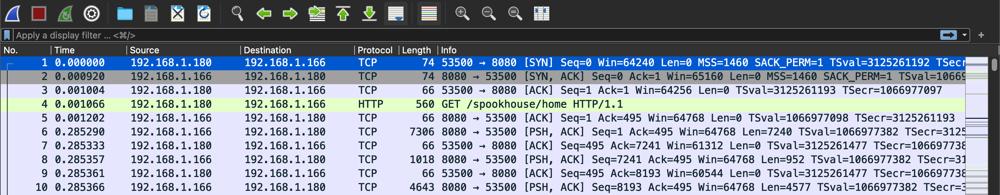
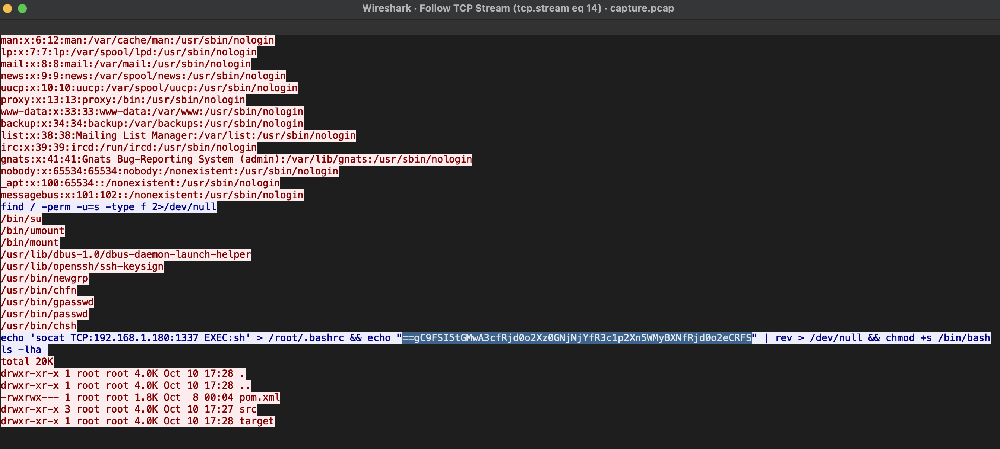

# Wrong Spooky Season
easy | forenics | 200pts

>"I told them it was too soon and in the wrong season to deploy such a website, but they assured me that theming it properly would be enough to stop the ghosts from haunting us. I was wrong." Now there is an internal breach in the `Spooky Network` and you need to find out what happened. Analyze the the network traffic and find how the scary ghosts got in and what they did.

## First Impressions

The challenge comes with a pcap file, `capture.pcap` containing TCP and HTTP packets



## Solution

By following the TCP Stream (Right click on any TCP packet > Follow > TCP Stream), I noticed a few remote code execution attempts on the website, with the help of a JSP or Java Server Pages file, used to define the look of the web pages as part of the [Spring Framework](https://stackoverflow.com/questions/52659476/what-is-the-difference-between-jsp-and-spring). One of these streams contains a base64 encoded string with the characters reversed.



The flag for the challenge can be found by reversing and decoding this string.

```txt
$ echo "==gC9FSI5tGMwA3cfRjd0o2Xz0GNjNjYfR3c1p2Xn5WMyBXNfRjd0o2eCRFS" | rev | base64 -d
HTB{j4v4_5pr1ng_just_b3c4m3_j4v4_sp00ky!!}
```

Flag: `HTB{j4v4_5pr1ng_just_b3c4m3_j4v4_sp00ky!!}`