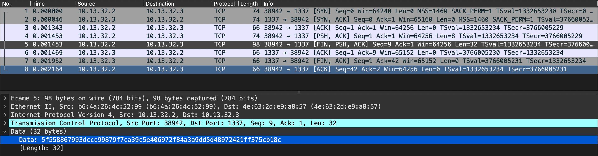

# Secured Transfer
medium | rev | 200pts

>Ghosts have been sending messages to each other through the aether, but we can't understand a word of it! Can you understand their riddles?

## First Impressions

A little different from the previous rev challenges, we're provided with a pcap file along with the binary, containing the messages from the ghost. 

Opening the binary in a reverse engineering tool, the main function shows two possible functions, sending and receiving.

```c
int32_t main(int32_t argc, char** argv, char** envp)
{
    OPENSSL_init_crypto(2, 0);
    OPENSSL_init_crypto(0xc, 0);
    OPENSSL_init_crypto(0x80, 0);
    if (argc == 3)
    {
        printf("Sending File: %s to %s\n", argv[2], argv[1]);
        sub_1835(argv[1], argv[2]);
    }
    else if (argc != 1)
    {
        puts("Usage ./securetransfer [<ip> <file>]");
    }
    else
    {
        puts("Receiving File");
        sub_1b37();
    }
    return 0;
}
```

If the number of arguments are 3, then the send function is executed (`sub_1835`). If there is only one argument, then the receive function is executed (`sub_1b37`). 

The send function opens a socket, encrypts the text after some basic checks and sends two values. The encryption function is a separate function, `sub_1529`.

```c
int64_t sub_1835(char* arg1, char* arg2) 
{
    int64_t rax_25 = malloc(rax_18); // rax_18 = file data
    int64_t rax_28 = malloc((rax_18 + rax_18));
    if (rax_18 == fread(rax_25, 1, rax_18, rax_12))
    {
        int64_t var_50 = ((int64_t)sub_1529(rax_25, rax_18, rax_28)); // encryption
        write(rax_2, &var_50, 8); // size of the file
        write(rax_2, rax_28, var_50); // file contents
        puts("File send...");
        free(rax_28);
        free(rax_25);
        fclose(rax_12);
        close(rax_2);
        rax_3 = 1;
    }
<snip>
}
```

The encryption performed is an AES encryption, using the CBC mode of operation.

```c
uint64_t sub_1529(int64_t arg1, int32_t arg2, int64_t arg3)

{
    void* fsbase;
    int64_t rax = *(int64_t*)((char*)fsbase + 0x28);
    char var_38 = 0x73;
    char var_2f = 0x65;
    char var_2e = 0x74;
    char var_2d = 0x6b;
    char var_1d = 0x74;
    char var_1c = 0x69;
    char var_37 = 0x75;
    char var_36 = 0x70;
    char var_22 = 0x6e;
    char var_21 = 0x63;
    char var_1b = 0x6f;
    char var_32 = 0x65;
    char var_31 = 0x63;
    char var_33 = 0x73;
    char var_20 = 0x72;
    char var_1f = 0x79;
    char var_30 = 0x72;
    char var_26 = 0x66;
    char var_25 = 0x6f;
    char var_24 = 0x72;
    char var_1a = 0x6e;
    char var_2c = 0x65;
    char var_2b = 0x79;
    char var_2a = 0x75;
    char var_29 = 0x73;
    char var_28 = 0x65;
    char var_27 = 0x64;
    char var_23 = 0x65;
    char var_35 = 0x65;
    char var_34 = 0x72;
    char var_1e = 0x70;
    char var_19 = 0x21;
    int64_t rax_1 = EVP_CIPHER_CTX_new();
    uint64_t rax_2;
    if (rax_1 == 0)
    {
        rax_2 = 0;
    }
    else
    {
        int32_t var_50;
        if (EVP_EncryptInit_ex(rax_1, EVP_aes_256_cbc(), 0, &var_38, "someinitialvalue") != 1)
        {
            rax_2 = 0;
        }
        else if (EVP_EncryptUpdate(rax_1, arg3, &var_50, arg1, ((uint64_t)arg2)) != 1)
        {
            rax_2 = 0;
        }
        else
        {
            int32_t rax_8 = var_50;
            int64_t rcx_3 = (((int64_t)var_50) + arg3);
            if (EVP_EncryptFinal_ex(rax_1, rcx_3, &var_50, rcx_3) == 1)
            {
                int32_t var_4c_2 = (rax_8 + var_50);
                EVP_CIPHER_CTX_free(rax_1);
                rax_2 = ((uint64_t)var_4c_2);
            }
            else
            {
                rax_2 = 0;
            }
        }
    }
    if ((rax ^ *(int64_t*)((char*)fsbase + 0x28)) == 0)
    {
        return rax_2;
    }
    __stack_chk_fail();
    /* no return */
}
```

The encryption takes in a key, the characters of which are placed out of order here, and an IV, `someinitialvalue`. The decryption function also performs similar checks and decrypts the text using AES CBC decryption with the same key and IV. 

Now moving on to the pcap file, it can be seen that it follows the encryption process and sends two values, the size of the file and the file data in hex bytes. The file data can be seen in the image below



## Solution

The bytes of the key were displayed in the incorrect order in the source code. So the first step would be to rearrange the order of the keys. 

You can either manually arrange the characters, or speed up the process with the help of a python script. The values are stored in an array, with `var_38` becoming `var[0x38]` in Python. However, since the values don't start from 0 (range being 0x19 to 0x38), we would have to subtract each value from the position of the first character, which is 0x38 (from `var_38`). This makes the python equivalent `var[0x38-0x38]` or `var[0]`. A similar process is followed for all the characters and the key is printed.

```python
var = [0]*0x20

var[0x38-0x38] = 0x73
var[0x38-0x2f] = 0x65
var[0x38-0x2e] = 0x74
var[0x38-0x2d] = 0x6b
var[0x38-0x1d] = 0x74
var[0x38-0x1c] = 0x69
var[0x38-0x37] = 0x75
var[0x38-0x36] = 0x70
var[0x38-0x22] = 0x6e
var[0x38-0x21] = 0x63
var[0x38-0x1b] = 0x6f
var[0x38-0x32] = 0x65
var[0x38-0x31] = 0x63
var[0x38-0x33] = 0x73
var[0x38-0x20] = 0x72
var[0x38-0x1f] = 0x79
var[0x38-0x30] = 0x72
var[0x38-0x26] = 0x66
var[0x38-0x25] = 0x6f
var[0x38-0x24] = 0x72
var[0x38-0x1a] = 0x6e
var[0x38-0x2c] = 0x65
var[0x38-0x2b] = 0x79
var[0x38-0x2a] = 0x75
var[0x38-0x29] = 0x73
var[0x38-0x28] = 0x65
var[0x38-0x27] = 0x64
var[0x38-0x23] = 0x65
var[0x38-0x35] = 0x65
var[0x38-0x34] = 0x72
var[0x38-0x1e] = 0x70
var[0x38-0x19] = 0x21

print(var)

key = ''.join([chr(i) for i in var])
print(key)
```

```
$ python3 securetransfer-sol.py
Key: supersecretkeyusedforencryption!
```

Using this and the IV, we can extend the script to decrypt the flag using AES encryption.

**[securetransfer-sol.py](src/securetransfer-sol.py)**
```py
from Crypto.Cipher import AES

var = [0]*0x20

var[0x38-0x38] = 0x73
var[0x38-0x2f] = 0x65
var[0x38-0x2e] = 0x74
var[0x38-0x2d] = 0x6b
var[0x38-0x1d] = 0x74
var[0x38-0x1c] = 0x69
var[0x38-0x37] = 0x75
var[0x38-0x36] = 0x70
var[0x38-0x22] = 0x6e
var[0x38-0x21] = 0x63
var[0x38-0x1b] = 0x6f
var[0x38-0x32] = 0x65
var[0x38-0x31] = 0x63
var[0x38-0x33] = 0x73
var[0x38-0x20] = 0x72
var[0x38-0x1f] = 0x79
var[0x38-0x30] = 0x72
var[0x38-0x26] = 0x66
var[0x38-0x25] = 0x6f
var[0x38-0x24] = 0x72
var[0x38-0x1a] = 0x6e
var[0x38-0x2c] = 0x65
var[0x38-0x2b] = 0x79
var[0x38-0x2a] = 0x75
var[0x38-0x29] = 0x73
var[0x38-0x28] = 0x65
var[0x38-0x27] = 0x64
var[0x38-0x23] = 0x65
var[0x38-0x35] = 0x65
var[0x38-0x34] = 0x72
var[0x38-0x1e] = 0x70
var[0x38-0x19] = 0x21

key = ''.join([chr(i) for i in var])

data = bytes.fromhex("5f558867993dccc99879f7ca39c5e406972f84a3a9dd5d48972421ff375cb18c")
key = b'supersecretkeyusedforencryption!'
iv = b'someinitialvalue'

cipher = AES.new(key, AES.MODE_CBC, iv)
pt = cipher.decrypt(data)
print(pt)
```

```txt
$ python3 securetransfer-sol.py
b'HTB{vryS3CuR3_F1L3_TR4nsf3r}\x04\x04\x04\x04'
```

Flag: `HTB{vryS3CuR3_F1L3_TR4nsf3r}`