# Keeber
### Challenge Group | medium | OSINT | 1842 points
<br />

[Keeber 1](#keeber-1--50-pts) \
[Keeber 2](#keeber-2--50-pts) \
[Keeber 3](#keeber-3--50pts) \
[Keeber 4](#keeber-4--318pts) \
[Keeber 5](#keeber-5--50pts) \
[Keeber 6](#keeber-6--368pts) \
[Keeber 7](#keeber-7--474pts) \
[Keeber 8](#keeber-8--482pts) \

## Keeber 1 | 50 pts
### Description
You have been applying to entry-level cybersecurity jobs focused on reconnaissance and open source intelligence (OSINT). Great news! You got an interview with a small cybersecurity company; the Keeber Security Group. Before interviewing, they want to test your skills through a series of challenges oriented around investigating the Keeber Security Group.

The first step in your investigation is to find more information about the company itself. All we know is that the company is named Keeber Security Group and they are a cybersecurity startup. To start, help us find the person who registered their domain. The flag is in regular format.
<br /> <br />

### Solution
Searching `Keeber Security Group` on Google brings up their website - [keebersecuritygroup.com](keebersecuritygroup.com)

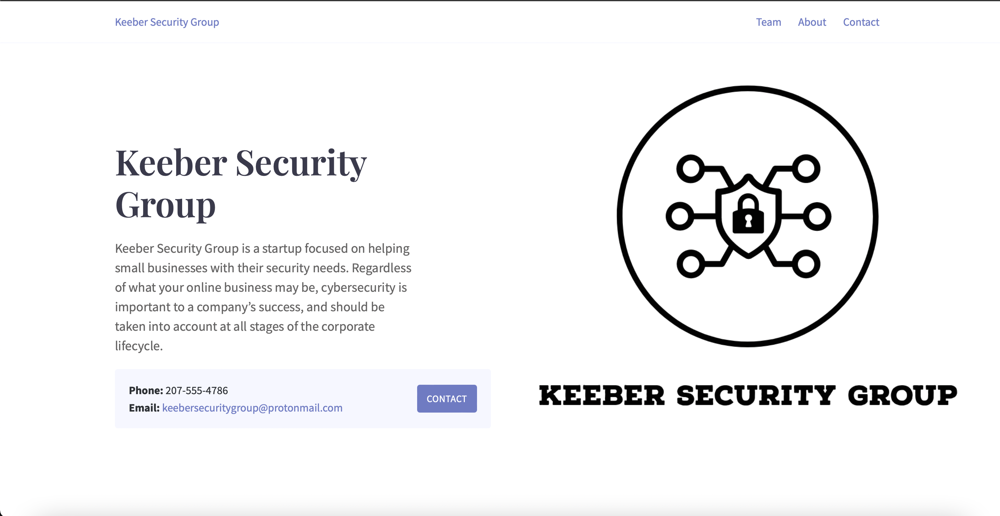

The first thing that comes to mind is `whois`, a command line tool that provides information about a particular domain.

```bash
$ whois keebersecuritygroup.com
    Domain Name: KEEBERSECURITYGROUP.COM
    Registry Domain ID: 2689392646_DOMAIN_COM-VRSN
    Registrar WHOIS Server: whois.name.com
    Registrar URL: http://www.name.com
    Updated Date: 2022-04-15T01:52:49Z
	...
	Registry Registrant ID: Not Available From Registry 
	Registrant Name: flag{ef67b2243b195eba43c7dc797b75d75b} Redacted 
	Registrant Organization:  
	Registrant Street: 8 Apple Lane  
	Registrant City: Standish 
	Registrant State/Province: ME 
	Registrant Postal Code: 04084 
	Registrant Country: US 
```
A lot of information shows up, however after a bit of scrolling, you find the flag in the Registrant Name field.

Flag: `flag{ef67b2243b195eba43c7dc797b75d75b}`
<br /> <br />

## Keeber 2 | 50 pts
### Description
The Keeber Security Group is a new startup in its infant stages. The team is always changing and some people have left the company. The Keeber Security Group has been quick with changing their website to reflect these changes, but there must be some way to find ex-employees. Find an ex-employee through the group's website. The flag is in regular format.
<br /> <br />

### Solution
The challenge in reality has just one step, however I ended up taking a longer route due to not taking the challenge description seriously :P The current Team page on their website lists 6 employees:


Their website also has a link to their GitHub, and so previous commits would have the flag right? Nope :/

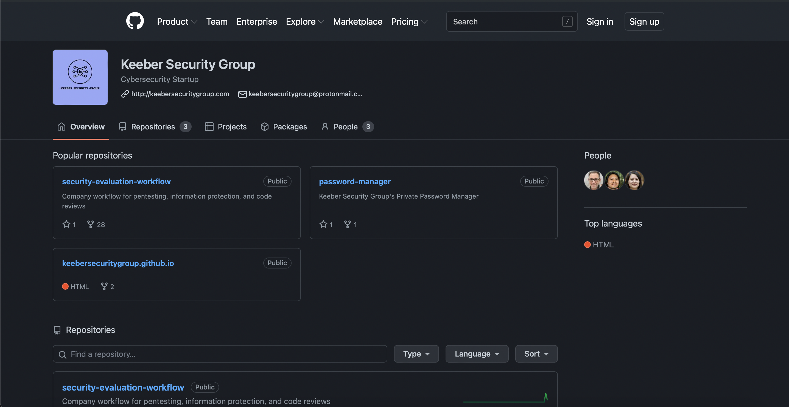

However, searching their GitHub repositories did reveal something. In one of their repos, [security-evaluation-workflow](https://github.com/keebersecuritygroup/security-evaluation-workflow), the contributors list mentioned a name that was not in the list of employees at the website - Tiffany Douglas.

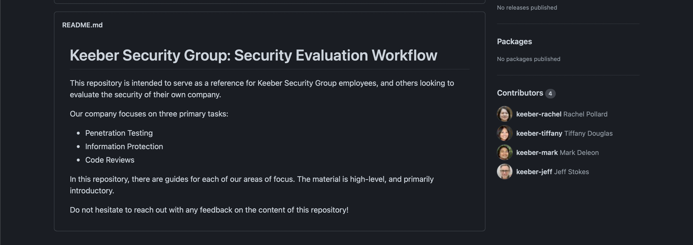

So this has to be the ex-employee we have to find, but still no flag :/ I actually went further ahead in this rabbit hole, most of which is the solution for another Keeber challenge ([Keeber 4](#keeber-4--318pts)). After all that and still no flag, I reached out for help, and this one line alone from an admin made the solution crystal clear:
> There are ways beyond github to look at a websites history

WAYBACK MACHINE!!! The description clearly said "Find an ex-employee through the group's **website.**" So searching the GitHub had nothing to do with this challenge, oh well. At least it proved helpful for the upcoming challenges.

Searching for the domain on Wayback Machine shows snapshots from three separate dates, I clicked on the oldest one, which the April 19th screenshot.

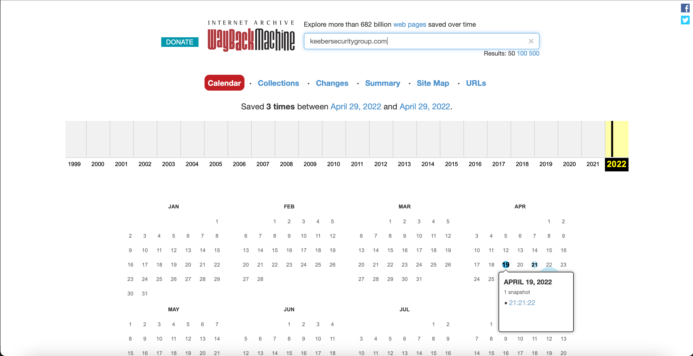

Clicking on the Team page and scrolling below shows Tiffany Douglas' name, and below it, the flag!

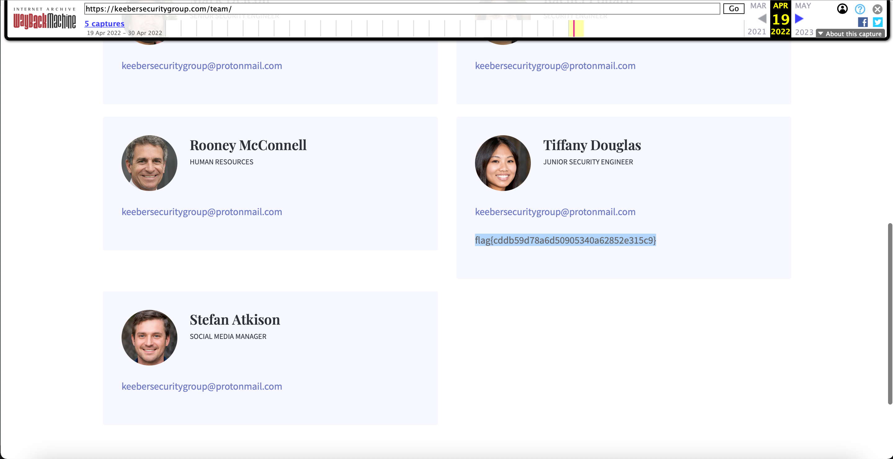

Flag: `flag{cddb59d78a6d50905340a62852e315c9}`
<br /> <br />

## Keeber 3 | 50 pts
### Description
The ex-employee you found was fired for "committing a secret to public github repositories". Find the committed secret, and use that to find confidential company information. The flag is in regular format.
<br /> <br />

### Solution
The searching through GitHub in the previous challenges definitely wasn't all gone to waste, as I ended up getting the flag for this challenge a lot faster. In the commits of the security-evaluation-workflow repo, one commit reads `Removed secret from repository`. 

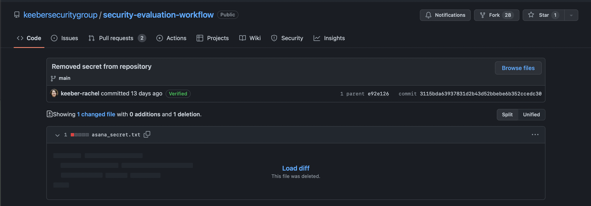

From the file name, we know its the secret token to Asana, that helps companies track and manage their work. So now we need to find the commit in which the secret was added. It is added in just a few commits prior - `added .gitignore`. Quick intro to .gitignore: A gitignore file specifies intentionally untracked files that Git should ignore. This includes files that contain confidential information, like passwords and secret keys.

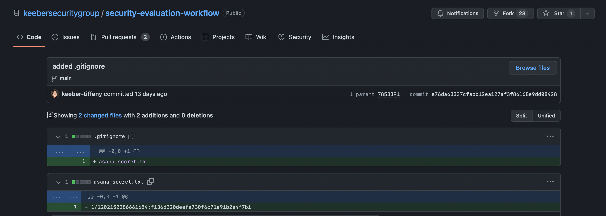

Oh, it was a spelling mistake in `.gitignore` that led to this, yikes. Moving on, to find out how I can use this secret key to get the flag, off to Google! This brings up to Asana's documentation about [Personal Access Tokens](https://developers.asana.com/docs/personal-access-token):

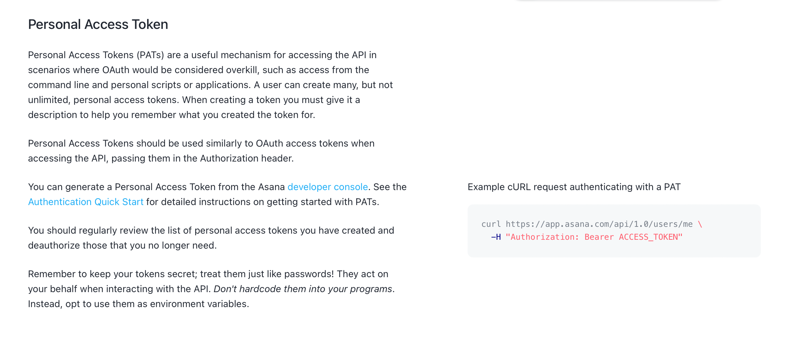

Using the example cURL request on the right, I could get the flag, replacing the ACCESS_TOKEN field with the secret we found from the repo:

```bash
$ curl https://app.asana.com/api/1.0/users/me \
>   -H "Authorization: Bearer 1/1202152286661684:f136d320deefe730f6c71a91b2e4f7b1"
{"data":{"gid":"1202152286661684","email":"keebersecuritygroup@protonmail.com","name":"flag{49305a2a9dcc503cb2b1fdeef8a7ac04}","photo":null,"resource_type":"user","workspaces":[{"gid":"1202152372710256","name":"IT","resource_type":"workspace"},{"gid":"1146735861536945","name":"My Company","resource_type":"workspace"},{"gid":"1202202099837958","name":"Marketing","resource_type":"workspace"},{"gid":"1202201989074836","name":"Informatique","resource_type":"workspace"},{"gid":"1202203933473664","name":"Engineering","resource_type":"workspace"},{"gid":"1202205585474112","name":"Design","resource_type":"workspace"},{"gid":"1202206423101119","name":"IT","resource_type":"workspace"},{"gid":"1202166412558403","name":"richdn.com","resource_type":"workspace"},{"gid":"1202206546743807","name":"IT","resource_type":"workspace"}]}}
```

Flag: `flag{49305a2a9dcc503cb2b1fdeef8a7ac04}`
<br /> <br />

## Keeber 4 | 318 pts
### Description
The ex-employee also left the company password database exposed to the public through GitHub. Since the password is shared throughout the company, it must be easy for employees to remember. The password used to encrypt the database is a single lowercase word somehow relating to the company. Make a custom word list using the Keeber Security Groups public facing information, and use it to open the password database The flag is in regular format.

(Hint: John the Ripper may have support for cracking .kdbx password hashes!)
<br /> <br />

### Solution
(Solved after the CTF ended)

I found the password database when solving Keeber 2, in the password-manager repo.

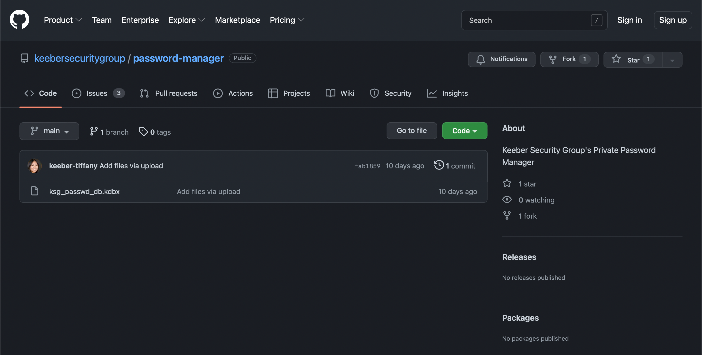

On further searching, I found that this is a password database file for an application called KeePass, an open source password manager. To get the flag, we're required to get the password to this database file. There are three steps to this:
1. Extract the password hash from the database file using `keepass2john`
2. Create a custom wordlist for cracking the hash using `CeWl`
3. Run `john-the-ripper` to crack the hash using the custom wordlist

#### Step 1
John The Ripper ships with a tool called `keepass2john`, which extracts password hashes from .kdbx files. We use the tool and save the hash in a text file (in this case `kp.txt`)

```
$ john-the-ripper.keepass2john ksg_passwd_db.kdbx 
ksg_passwd_db:$keepass$*2*58823528*0*d1aa5a09ccf3f75d30ea2d548ca045d28252c90adc8bf016bd444cbb3d6d5f65*580f6c41d95ea9407da649ee0312209f1686edf0b779458d57288ed7043c60ff*aec6b24ac45bf46d4b632d5e408799c7*4fa205b599089f79005e176c9c47690ffc58492169309a47613d4269a8ef2a52*f51a2a1f36f1ca1d10439aa78eccece46337274880f594f5a62a703f6007374f
$ john-the-ripper.keepass2john ksg_passwd_db.kdbx > kp.txt
```

<details>
  <summary>BIG RABBIT HOLE ALERT</summary>
  I was getting a different hash originally than the one above. It was only during the password cracking phase that I realized this because none of the wordlists I made were working. Hours later, after checking with another user, I finally realized that it maybe had something to do with the keepass2john tool I was using (downloaded separately from GitHub). I then switched to the one that came with the john-the-ripper tool I had installed (the command you see above, happened to find it entirely by chance), and that seemed to work perfectly. This probably explains why I solved it after the CTF ended, installations are confusing sometimes.
</details>

#### Step 2
There are a couple of approaches. You could try creating a wordlist manually, or use an wordlist generator tool like `CeWl`. There are pros and cons to both approaches. 

Using `CeWl` saves time to generate the wordlist. However it may create a very long wordlist, which means the hash takes longer to crack (not to forget that cracking hashes takes up a lot of computer resources as well).

Creating a manual wordlist can be pretty time consuming, especially when you don't have an idea of what phrase the password could potentially be, however for someone who has an idea of what phrases could be the password (probably comes with inituition over time as you practice more), they can create a short wordlist manually and crack the password super quick.

Since I'm still a noob to password cracking, we're going with `CeWl` to generate the wordlist. We'll be using the security-evaluation-workflow repo to generate the wordlist from. Compared to the website which has more generic information, this repo has certain specific details about the company's processes, so this is likely where we'd find the password. 

A depth of 1 will visit other pages linked to the URL and add words from there to the list. As the password is a single letter lowercase word, we can use the `--lowercase` flag to get all passwords in lowercase.

```
$ ./cewl.rb https://github.com/keebersecuritygroup/security-evaluation-workflow -w list.txt --lowercase -d 1
```

#### Step 3
Time to run `john-the-ripper` with the wordlist and the text file containing the hash. Many hours later, we have the password: `craccurrelss` (yes, so much for a word that doesn't make much sense \*sigh\*)

```
$ john-the-ripper --wordlist=list.txt ../kp.txt 
Using default input encoding: UTF-8
Loaded 1 password hash (KeePass [SHA256 AES 32/64])
Cost 1 (iteration count) is 58823528 for all loaded hashes
Cost 2 (version) is 2 for all loaded hashes
Cost 3 (algorithm [0=AES, 1=TwoFish, 2=ChaCha]) is 0 for all loaded hashes
Will run 2 OpenMP threads
Press 'q' or Ctrl-C to abort, almost any other key for status 
craccurrelss     (ksg_passwd_db)
1g 0:04:30:02 DONE (2022-05-05 00:30) 0.000061g/s 0.03209p/s 0.03209c/s 0.03209C/s colin..musitionently
```

Before opening the password file, ensure that you have KeePass installed on your system. Then open the file, and enter the password.

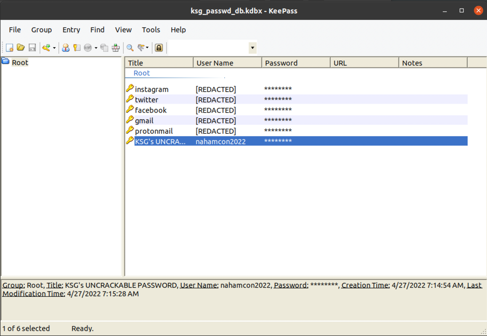

Ta da, we have access to the passwords! Double-click on `KSG's UNCRACKABLE PASSWORD` and unhide the password, revealing the flag for the challenge! \*phew\*

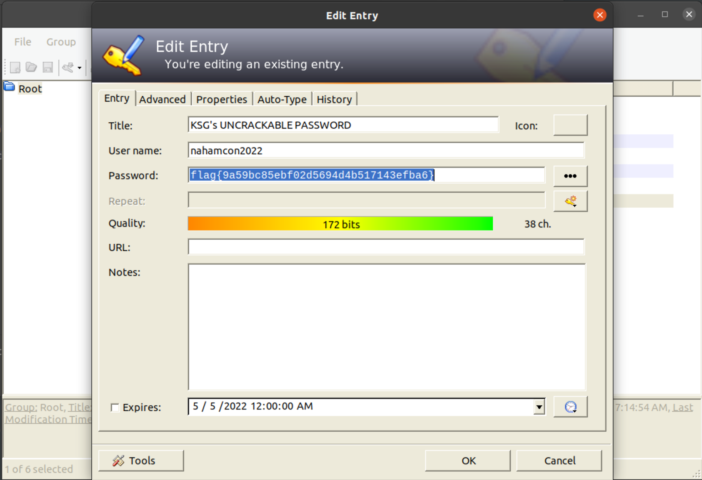

Flag: `flag{9a59bc85ebf02d5694d4b517143efba6}`
<br /> <br />

## Keeber 5 | 50 pts
### Description
The ex-employee in focus made other mistakes while using the company's GitHub. All employees were supposed to commit code using the keeber-@protonmail.com email assigned to them. They made some commits without following this practice. Find the personal email of this employee through GitHub. The flag is in regular format.
<br /> <br />

### Solution
The solution for this challenge comes from [this link](https://www.nymeria.io/blog/how-to-manually-find-email-addresses-for-github-users)

I went through the commits of the security-evaluation-workflow repo written by `keeber-tiffany`, and entered .patch at the end of each commit's URL until I found the email account and the flag.

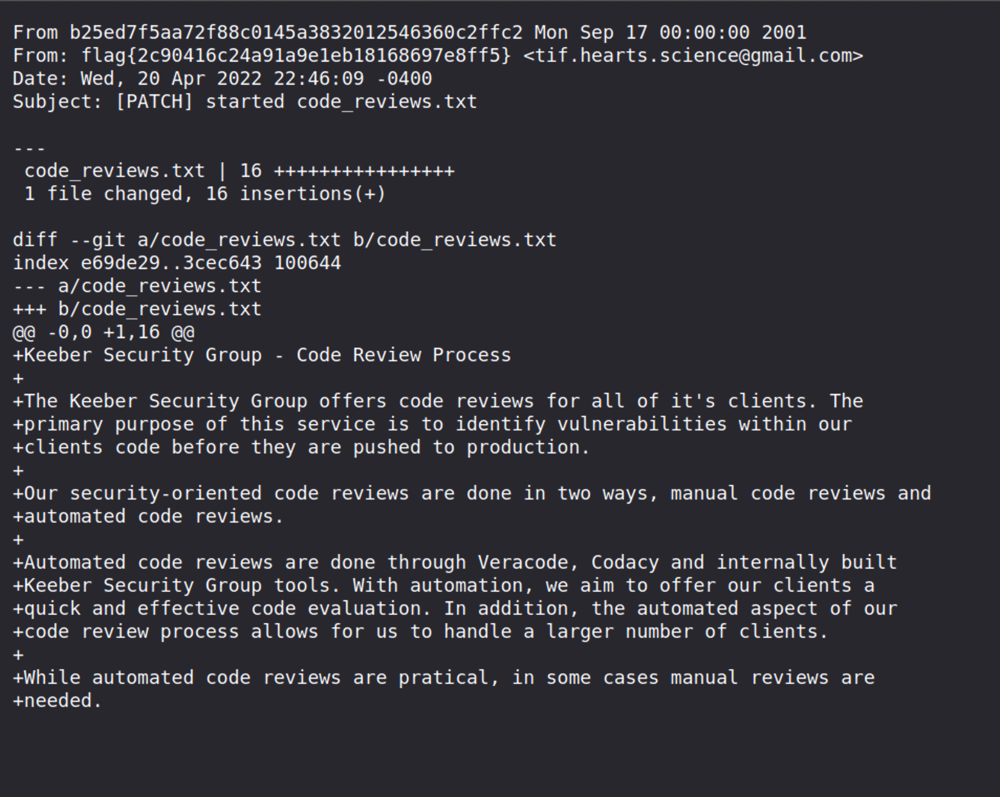

Flag: `flag{2c90416c24a91a9e1eb18168697e8ff5}`
<br /> <br />

## Keeber 6 | 368 pts
### Description
After all of the damage the ex-employee's mistakes caused to the company, the Keeber Security Group is suing them for negligence! In order to file a proper lawsuit, we need to know where they are so someone can go and serve them. Can you find the ex-employee’s new workplace? The flag is in regular format, and can be found in a recent yelp review of their new workplace.

(Hint: You will need to pivot off of the email found in the past challenge!)
<br /> <br />

### Solution
This challenge had quite a few steps. As someone who hadn't tried much of OSINT before this, I set out to look for tools that could help me get information with the help of the email address. Tried a bunch of tools, but the one that helped was `holehe`, that checks if an email address is used on several social networks or websites.

```bash
$ holehe --only-used tif.hearts.science@gmail.com

**********************************
   tif.hearts.science@gmail.com
**********************************
[+] github.com
[+] instagram.com

[+] Email used, [-] Email not used, [x] Rate limit
124 websites checked in 10.65 seconds
```

So this email is linked with an Instagram account, nice! But what could the username be. I got stuck on this step for a while until I decided to check the user tif.hearts.science. And that happened to be the correct username...\*facepalm\*

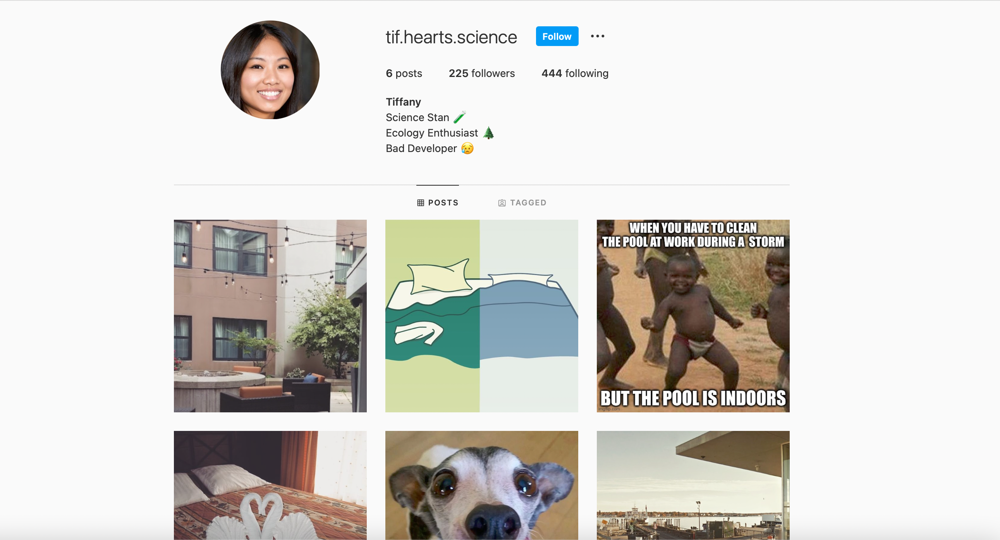

I expected to find the flag in one of these posts, but turns out this challenge isn't that simple. Looking through the posts reveals some further details about Tiffany's new workplace.

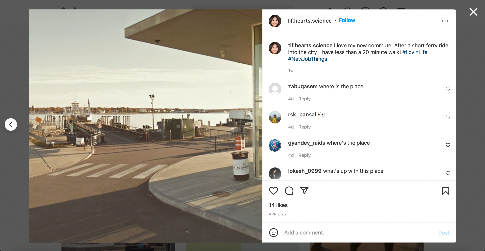

From an earlier search on Tiffany's GitHub, her location showed as Maine. Considering her commute is short, we can assume that her new workplace is in Maine as well. A short "ferry ride into the city" indicates that the workplace is close to a port of some sort.


Hmm...towel art? Her new workplace is very likely a hotel.

Okay, so we have most of the information, however where in Maine would the hotel be? For this challenge, I also happened to check LinkedIn, because who doesn't like to show off their new jobs there heheheh and found Keeber Security Group's CEO's page.

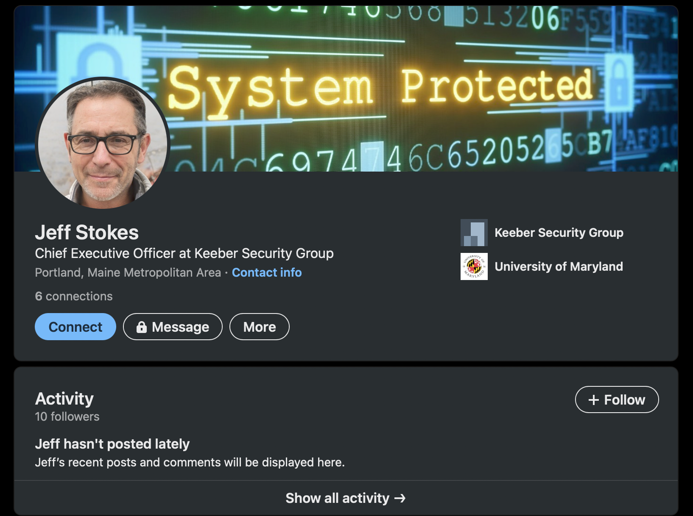

Jeff Stokes' location is Portland, Maine Metropolitan Area. Considering Keeber was a startup, and Jeff would likely recruit people from nearby, that means Tiffany could be staying close to Portland. Since the commute to her new workplace is short, it is likely that the new workplace is in Portland too!

I searched `portland maine ferry` to make the location even more specific. The first two results revealed the location, Casco Bay Ferry Lines Terminal.

Now to find the hotel, the only way I could find was to search all hotels in Portland, Maine on yelp and check the comments till I found the flag. And that's what I did. The flag was under the comments of the hotel Residence Inn by Marriott Portland Downtown/Waterfront. 
PS: The comment is no longer on the page as the account got deleted at some point during the CTF.


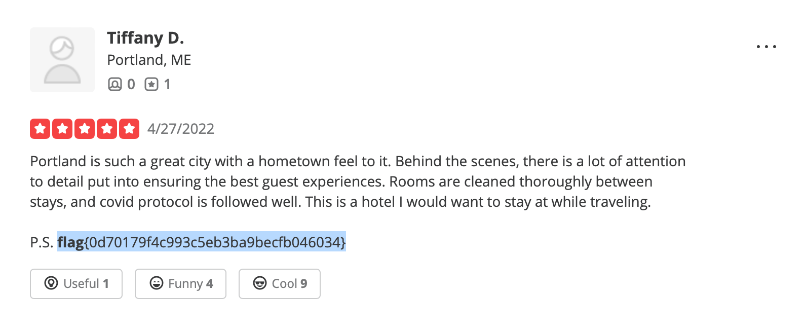

Good luck at your new workplace Tiffany!
Flag: `flag{0d70179f4c993c5eb3ba9becfb046034}`
<br /> <br />

## Keeber 7 | 474 pts
### Description
Multiple employees have gotten strange phishing emails from the same phishing scheme. Use the email corresponding to the phishing email to find the true identity of the scammer. The flag is in regular format.

(Note: This challenge can be solved without paying for anything!)
<br /> <br />

### Solution
(Solved after the CTF ended)

The challenge had the following PDF file attached:

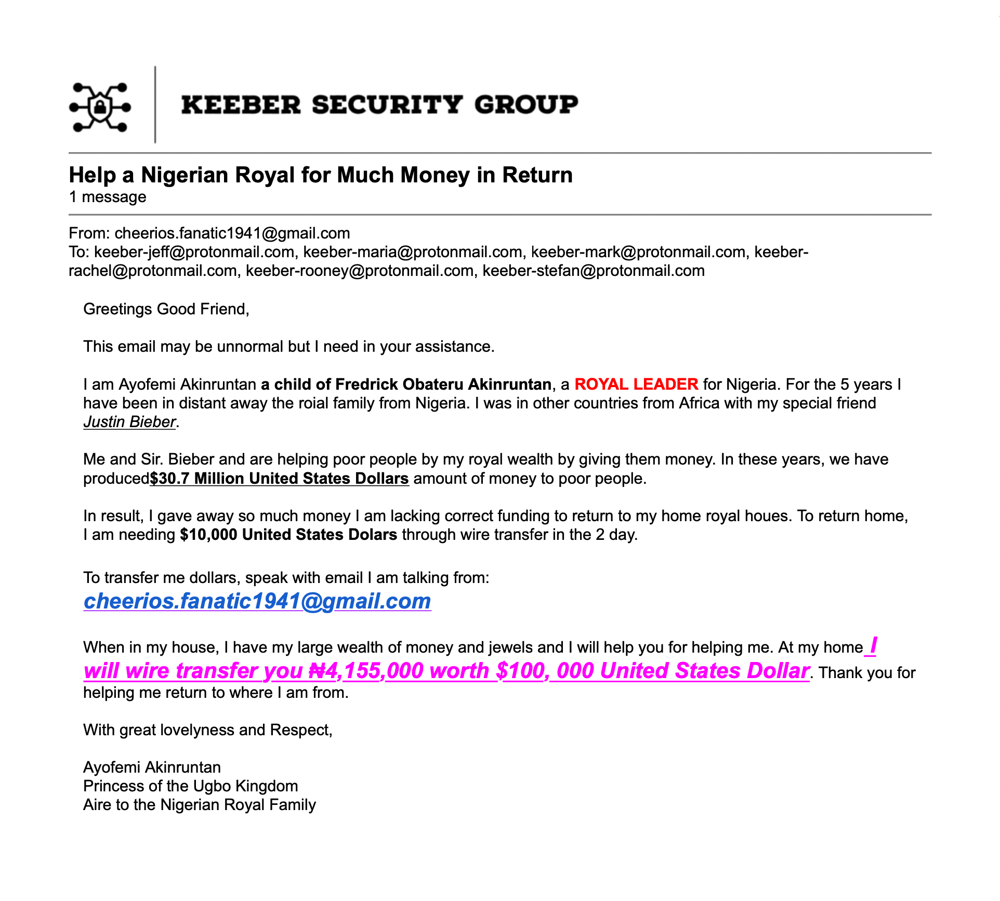

My first instinct was to use `holehe` once again to see if there were any accounts associated with it, but it didn't return any results.

The next tool I used was an online tool called [epieos](epieos.com). Entering the email here returned the following information.

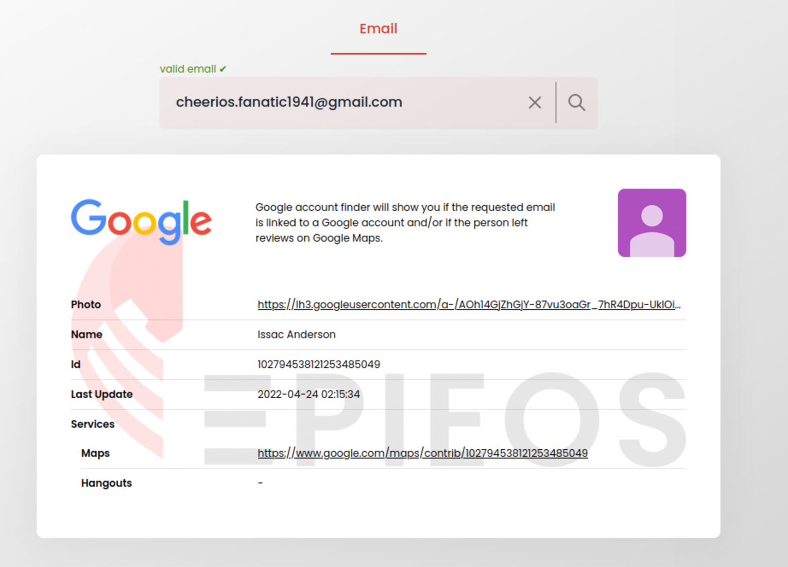

PS. The epieos output initially showed a social media account, however at some point it stopped showing, which is why I could not proceed with the challenge while the CTF was going on.

After it ended, users on Discord suggested a tool called `maltego`. I set up the Community Edition, and ran all of the Standard Transforms that came with the tool. The interface did take some time to get used to, online setup tutorials should help with this.

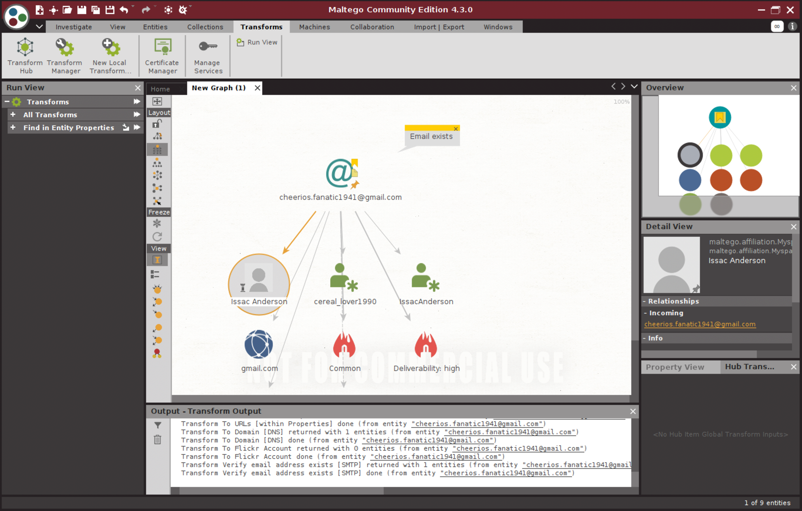

After running the transforms, it detected a Myspace account (i had no idea myspace still existed, i thought it closed or something), with the username cereal_lover1990. On visiting this username on myspace, we see the flag on the top right.


Flag: `flag{4a7e2fcd7f85a315a3914197c8a20f0d}`
<br /> <br />

## Keeber 8 | 482 pts
### Description
Despite all of the time we spend teaching people about phishing, someone at Keeber fell for one! Maria responded to the email and sent some of her personal information. Pivot off of what you found in the previous challenge to find where Maria's personal information was posted. The flag is in regular format.
<br /> <br />

### Solution
(Solved after the CTF ended)

In the previous challenge, we found a second username - `cereal_lover1990`. I saw writeups after the CTF ended and discovered a tool called sherlock, which takes a username and checks for accounts on the internet with the same name.

```bash
$ python3 sherlock cereal_lover1990 --timeout 1
[*] Checking username cereal_lover1990 on:

[+] Myspace: https://myspace.com/cereal_lover1990
[+] Pastebin: https://pastebin.com/u/cereal_lover1990
[+] skyrock: https://cereal_lover1990.skyrock.com/
```

A Pastebin? Interesting, let's visit it.


A quick look through the Chump List paste will reveal the flag, as Maria Haney's password.

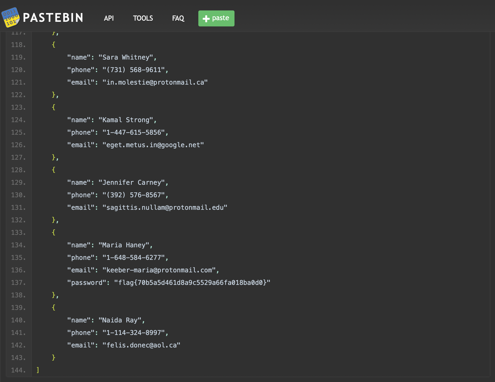

Flag: `flag{70b5a5d461d8a9c5529a66fa018ba0d0}`
<br /> <br />
