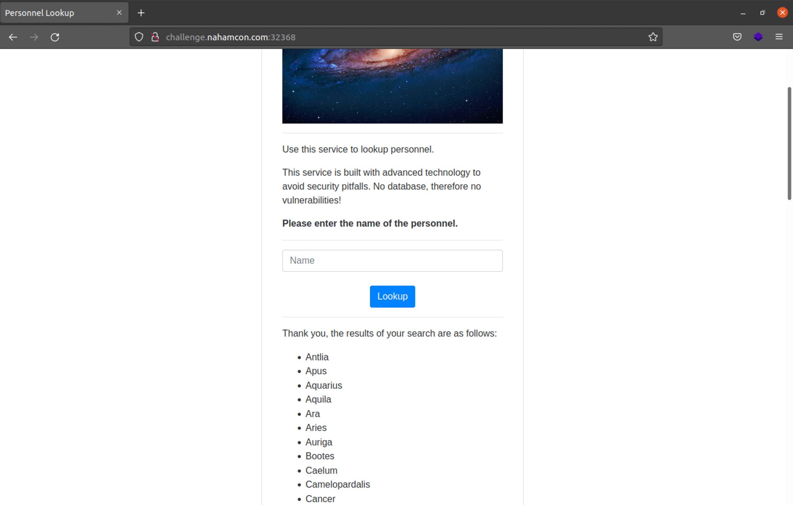
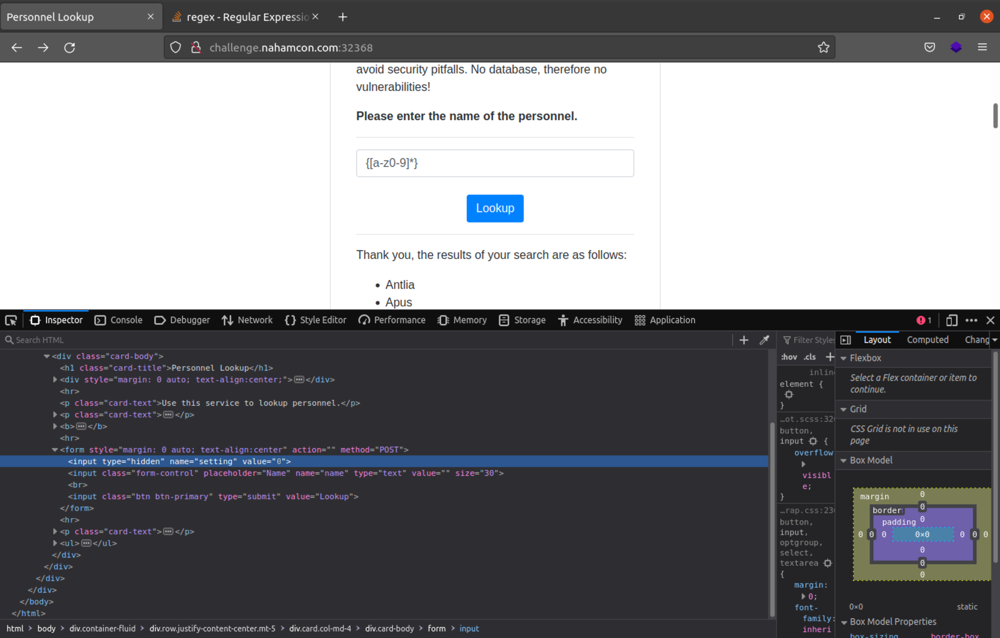
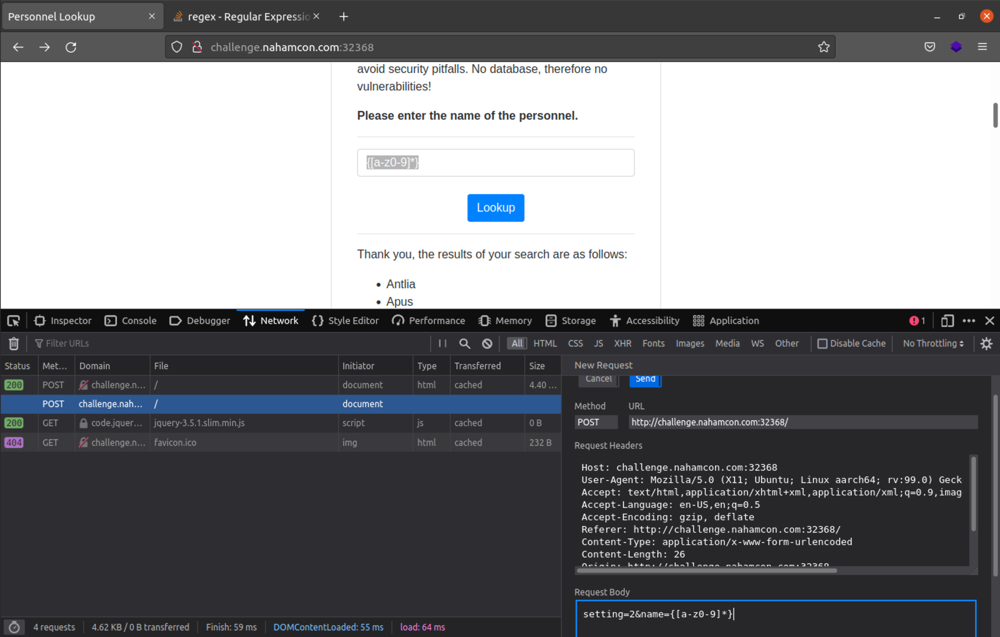
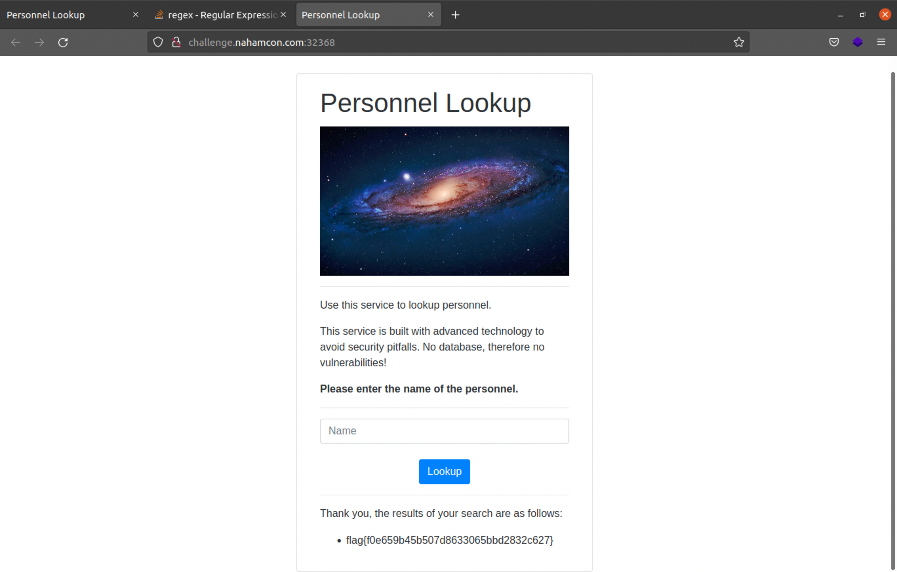

# Personnel
### easy | web | 50 points
<br />

## Description
A challenge that was never discovered during the 2021 Constellations mission... now ungated :) 
<br /><br />

## First Impressions
The challenge comes with the link to a website and an `app.py` file, which is the backend code for the website.


The website contains a field to enter a name and since it's a lookup website, will return names based on what we enter. On leaving the field blank, we get a list of all the names.



Alright, now to see what's happening in the backend:

```python
#!/usr/bin/env python

from flask import Flask, Response, abort, request, render_template
import random
from string import *
import re

app = Flask(__name__)

flag = open("flag.txt").read()
users = open("users.txt").read()

users += flag


@app.route("/", methods=["GET", "POST"])
def index():
    if request.method == "GET":
        return render_template("lookup.html")
    if request.method == "POST":
        name = request.form["name"]
        setting = int(request.form["setting"])
        if name:
            if name[0].isupper():
                name = name[1:]

        results = re.findall(r"[A-Z][a-z]*?" + name + r"[a-z]*?\n", users, setting)
        results = [x.strip() for x in results if x or len(x) > 1]

        return render_template("lookup.html", passed_results=True, results=results)


if __name__ == "__main__":
    app.run()
```

- `users += flag` \
This suggests that the flag is in the list of names. So when we left the field blank earlier, we should have gotten the flag in the output, but did not. This means there's some condition later that stops it from being displayed.

- `setting = int(request.form["setting"])` \
I don't recall seeing a setting field on the website, is it a hidden field? YES IT IS! On checking the source code of the website, we see the setting field with a value of 0. Not sure what this setting field does just yet though.



- `results = re.findall(r"[A-Z][a-z]*?" + name + r"[a-z]*?\n", users, setting)` \
This is the main check that filters the names from the list. Let's break it down.
	- `r"[A-Z][a-z]*?"` - Starting with one uppercase letter, followed by zero or more lowercase letters
	- `name` - the string that the user enters on the website
	- `r"[a-z]*?\n` - Zero or more lowercase letters and ending with a new line.
	- `users` - names of the users + the flag
	- `setting` - a parameter of `re.findall()`, that allows for added conditions to the regex search. More information about this parameter can be found [here](https://pynative.com/python-regex-flags/).

This brings up a few observations/questions:
- Since the regex starts with an uppercase letter, the flag won't be possible to retrieve as the flag starts with a lowercase letter 'f'. We would need a way to bypass that.
- There are also no brackets anywhere in the regex, so the flag won't pass the regex. The name we enter on the website needs to include the opening and closing brackets
- How can the `setting` parameter be used to change the output?

## Solution

The `setting` parameter is incredibly useful in this challenge. One of the options of the settings parameter is `re.IGNORECASE`, which allows for case-insensitive matching. \*mind-blown\* 

However, the setting parameter only takes in an integer value (as seen in the code). Seeing that `re.IGNORECASE` is a constant value, it must have an integer value. To check this, I searched the following in a python interactive shell

```python
$ python3
Python 3.8.10 (default, Mar 15 2022, 12:22:08) 
[GCC 9.4.0] on linux
Type "help", "copyright", "credits" or "license" for more information.
>>> import re
>>> int(re.IGNORECASE)
2
```

So now we know the setting value to enter, but what about the regex itself? I went for the following regex `{[a-z0-9]*}`, which looks for numbers and letters within brackets.

A much simpler solution, which I recently saw in [CryptoCat's video](https://www.youtube.com/watch?v=ttsFRYkL8wQ) for the same challenge is `.*`, which looks for all characters (numbers, letters and symbols).

I entered these values in the Edit and Resend feature in Firefox's Inspect Element (in the Network tab), that sends another request to a site with different parameters (Burpsuite is another tool that has this feature and many more). 



I checked the response from the request, and there we have our flag!



Flag: `flag(f0e659b45b507d8633065bbd2832c627}`