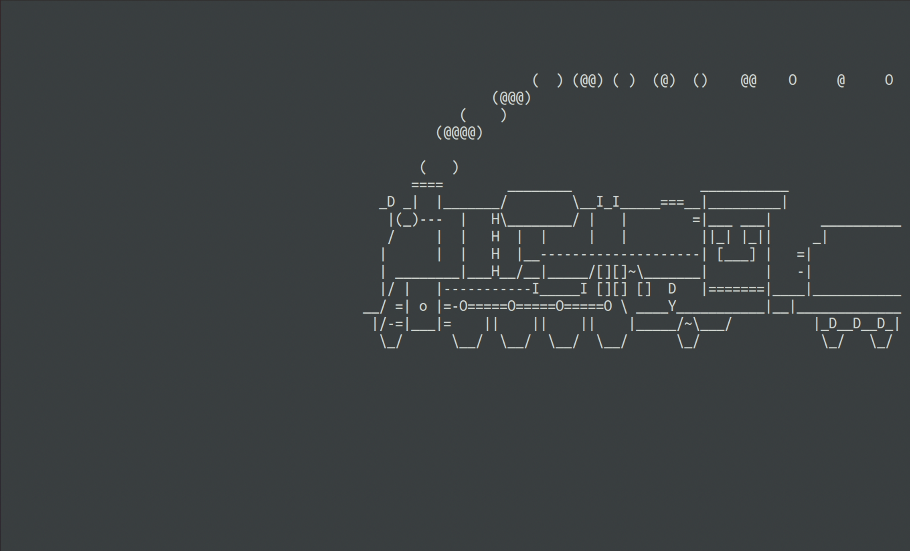

# Steam Locomotive
### easy | Miscellaneous | 50 points

## Description
I keep accidentally mistyping the ls command! 
<br /><br />

## Solution

I kind of freaked out when I got the solution, as I didn't expect the solution to be this simple.

The challenge provides an ssh server to log into. Logging into the server shows this

```txt
# password is userpass
ssh -p 31862 user@challenge.nahamcon.com
```



A train moving across the screen. I tried typing stuff for a long time, nothing happens. I even managed to stop the train, still nothing. 

Then suddenly, I happened to try something:
```bash
$ echo "ls" | ssh -p 31862 user@challenge.nahamcon.com
Pseudo-terminal will not be allocated because stdin is not a terminal.
user@challenge.nahamcon.com's password: 
flag.txt
```

WHAT?!?!??! THIS ACTUALLY WORKED???? \*confused happiness\*

After a mini-celebration, I tried this:
```bash
$ echo "cat flag.txt" | ssh -p 31862 user@challenge.nahamcon.com
Pseudo-terminal will not be allocated because stdin is not a terminal.
user@challenge.nahamcon.com's password: 
flag{4f9b10a81141c7a07a494c28bd91d05b}
```

I'm speechless \*mind blown\*

PS: The correct way to send in the command is `ssh -p 31862 user@challenge.nahamcon.com <command>` but I didn't know this at the time. Now I know and you do too!

Flag: `flag{4f9b10a81141c7a07a494c28bd91d05b}`