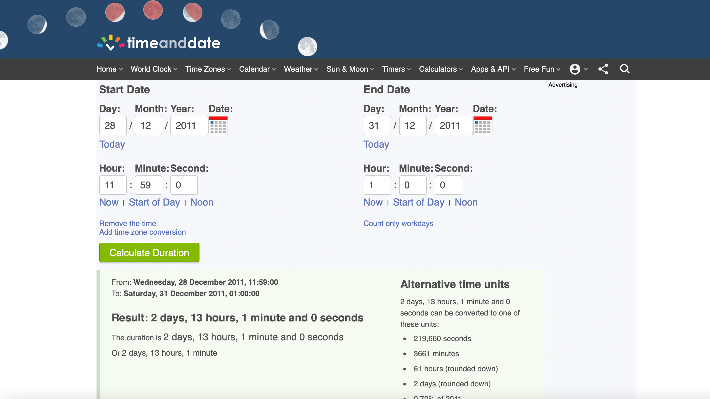
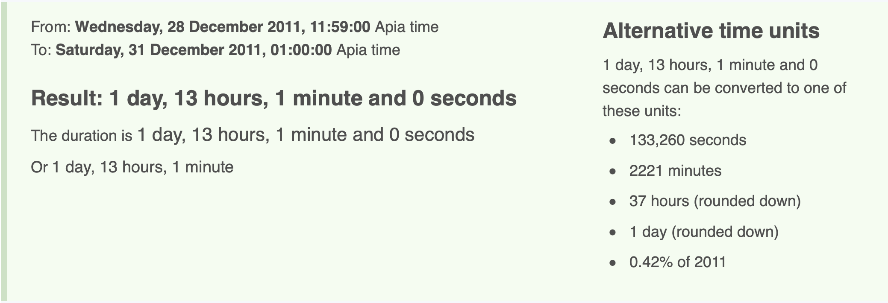

# WhenAmI
### easy | Miscellaneous | 284 points

## Description
I know where I am, but... when am I? 

NOTE: Flag submission format is flag{[number of seconds goes here]}, such as flag{600}.

## First Impressions

The challenge came with a file, `challenge.txt`

```txt
When am I??

So, I look down at my watch. It's December 28, 2011 at 11:59AM, and I'm just minding my own business at -13.582075733990298, -172.5084838587106.
I hung out there until the local time was 1:00AM on December 31st, and then I hopped on a plane and took a 1 hour flight over to -14.327595989244111, -170.71287979386747.
Some time has passed since I landed, and on December 30th, 12PM local time, I took a 1 hour flight back to my original location.
It's been 10 hours since I landed on my most recent flight - how many seconds have passed since I first looked at my watch?

(Submission format is flag{<number of seconds goes here>}, such as flag{600}.)
```

After a quick glance over the text, the dates suggest a change in time zones. We need to know the time zones to be able to convert the timings. The co-ordinates help us know the locations and in turn the time-zones.

## Solution
(Solved after the CTF ended)

I used a [time duration calculator](https://www.timeanddate.com/date/timeduration.html) online for this challenge.

First up, converting the coordinates to locations:

- -13.582075733990298, -172.5084838587106: A'opo Conservation Area, Samoa (GMT +13) 
- -14.327595989244111, -170.71287979386747: Tualauta, Western District, American Samoa (GMT -11)

With this information, we can now begin calculating the seconds.

`It's December 28, 2011 at 11:59AM, and I'm just minding my own business at A'opo Conservation Area, Samoa. I hung out there until the local time was 1:00AM on December 31st`



Okay, so far we're at 219,660 seconds right? Welll nope, and this is exactly where I messed up. After I completed the challenge and checked another writeup, the value I got was different from the actual answer. While seeing the solution, something struck, the dates. I vaguely recalled reading something about Samoa and time zones.

> Until the end of 2011, Samoa lay east of the International Date Line, observing UTC−11:00 (UTC−10:00 during daylight saving time). This was in line with neighboring American Samoa, which continues to observe UTC−11:00 (Samoa Time Zone) year-round. At the end of Thursday, 29 December 2011, Samoa continued directly to Saturday, 31 December 2011, skipping the entire calendar day of Friday, 30 December 2011 and effectively re-drawing the International Date Line.

Samoa skipped a day in 2011! The start date for this challenge is around the same time the switch happened, so that needs to be accounted for as well! Time and Date gave the option to specify a time zone so that helped.



Now we're back on track! 

`I hopped on a plane and took a 1 hour flight over to Tualauta, Western District, American Samoa.
Some time has passed since I landed, and on December 30th, 12PM local time, I took a 1 hour flight back to my original location.`

I chose to convert all timings to Samoa time from this point to avoid confusion. December 30th, 12PM (GMT-11) becomes December 31st 1PM (GMT+14)


If you're wondering why its GMT+14 instead of GMT+13, this is due to Samoa observing Daylight Savings Time around that time in 2011, as denoted by the asterisk.

After adding one hour of the flight duration, the current date is now December 31st, 2PM or 180,060 seconds since the start date.


`It's been 10 hours since I landed on my most recent flight - how many seconds have passed since I first looked at my watch?`

For the last part of this challenge, we add 10 hours to December 31st, 2PM, making the end date January 1st 2012, 12 midnight (HAPPY NEW YEAR!). The final count, and the answer to this challenge, is 216,060 seconds.


Flag: `flag{216060}`
