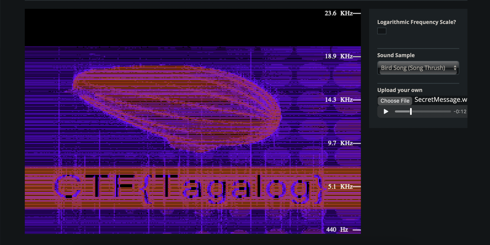
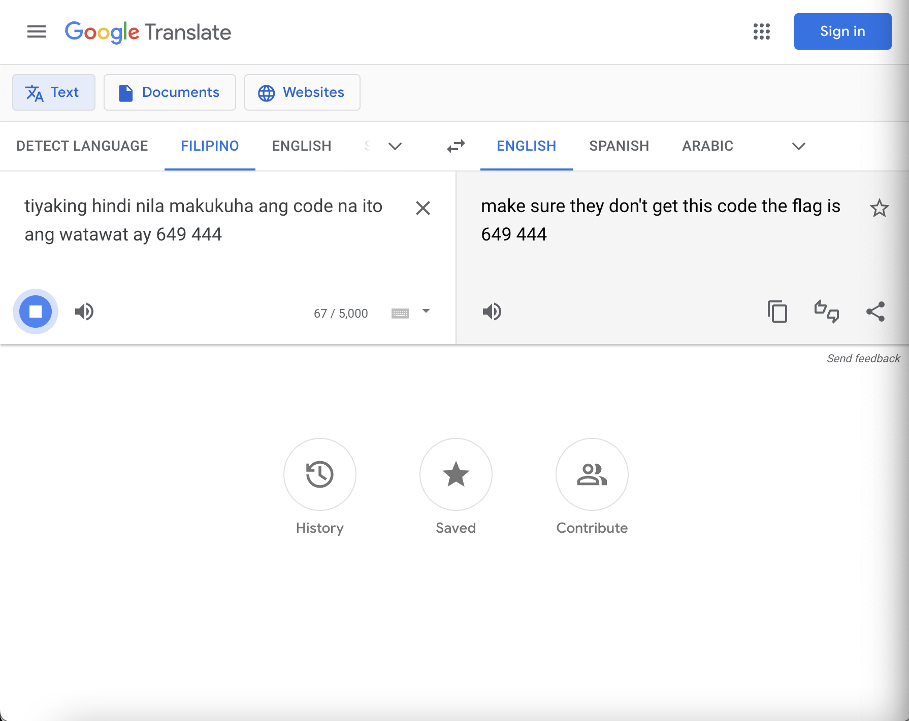

# Audible Transmission
easy | stego | 100 points

## Description
We intercepted an audio transmission the AI was sending to Rizal, however we have not been able to identify the contents of the message, are you able to help us out? 

## First Impressions
We were provided with an audio file, `SecretMessage.wav`. From solving similar challenges in the past, I knew I would have to analyze the audio further to get the flags.

## Solution

### [25 points] For Your Eyes Only
Are you able to see what was being sent?

I uploaded the file to [Spectrum Analyzer](https://academo.org/demos/spectrum-analyzer/), which lets you see the frequencies present in audio files. There were three different sections in the audio file. The first and third parts contained the flag for the challenge.

Flag: `CTF{Tagalog}`

### [75 points] Code
We think it may have something to do with a code, can you find it?

The second part of the audio file sounded like someone speaking in Tagalog, but it didn't sound right. Almost as if the audio was being played in reverse.

I reversed that section of the audio, and it started to sound a lot better! I don't speak Tagalog, but one of the words that stood out was "apat". It translated to "four" in English, so I was on the right track here.

I used Google Translate's "Translate by voice" feature, and played the reversed audio section. This message revealed the flag for this challenge!

Flag: `649444`
