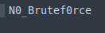
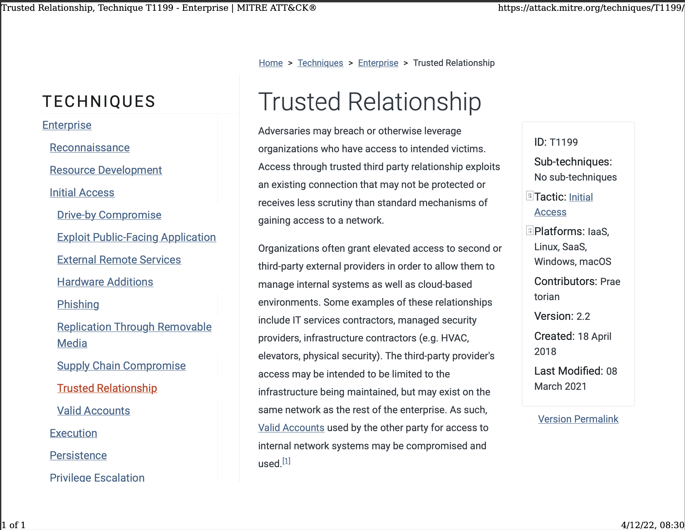
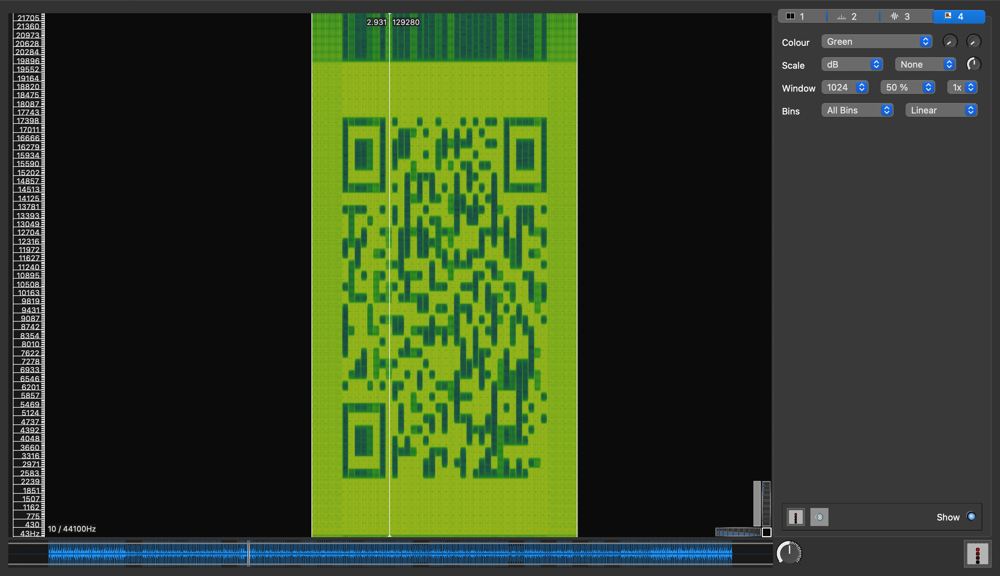
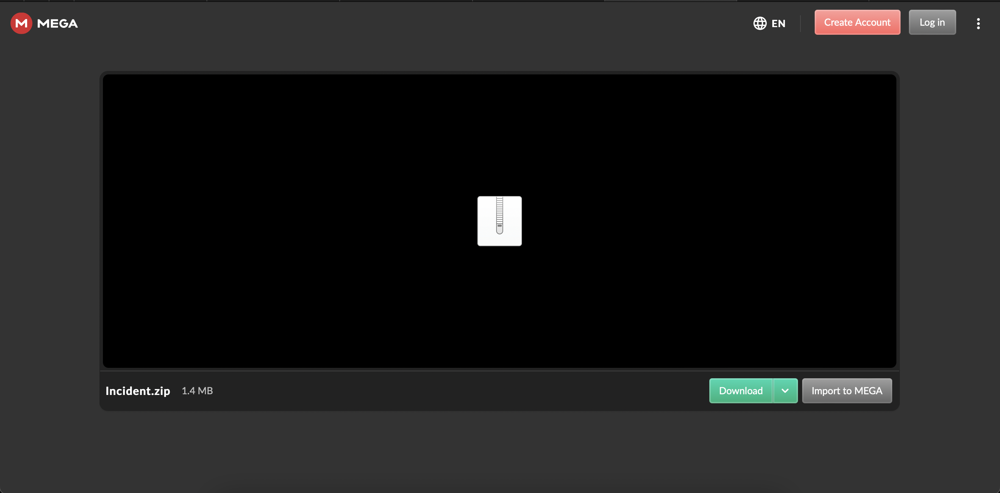
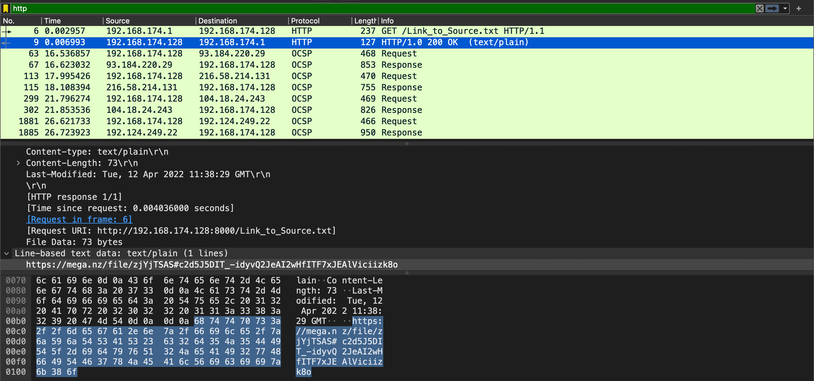
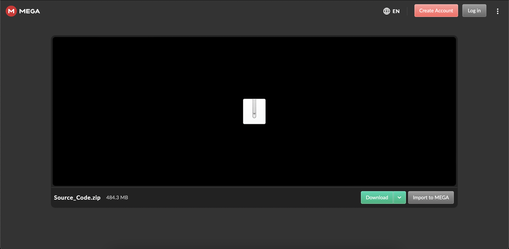

# Bring in the Cavalry
easy | stego, forensics | 150 points

## Description
It turns out that taking over a whole city proves challenging even for an AI.
That's why the AI hired reinforcements to help take control of the city.
Can you figure out which group the AI hired? 

## First Impressions

The challenge comes with a zip file, `bring-in-the-cavalry.zip`, which contains a file named `stage0`

```txt
stage0
├── Trusted_Relationships.pdf
└── key.txt
```

The PDF is password protected, and the key.txt file is mostly gibberish.

## Solution

### [25 points] Where it all started
Look in the eyes chicho, they never lie

I noticed the PNG header at the start of `key.txt`. So its a PNG image with txt as its extension. 

```bash
$ hexdump -C key.txt
00000000  89 50 4e 47 0d 0a 1a 0a  00 00 00 0d 49 48 44 52  |.PNG........IHDR|
00000010  00 00 00 84 00 00 00 2a  08 02 00 00 00 fd 30 64  |.......*.....�0d|
00000020  6e 00 00 00 09 70 48 59  73 00 00 0e c4 00 00 0e  |n....pHYs...�...|
...
```

So I changed the file extension, opened the pictured and found the password.



Entered that password for the PDF, which shows a website article?

```bash
$ qpdf --decrypt --password=N0_Brutef0rce Trusted_Relationships.pdf output.pdf
```



From the description, it looks like hiding files is a common theme for this subtask, so I checked for any files with `binwalk`

```bash
$ binwalk output.pdf

DECIMAL       HEXADECIMAL     DESCRIPTION
--------------------------------------------------------------------------------
0             0x0             PDF document, version: "1.5"
7392          0x1CE0          Zlib compressed data, default compression
439127        0x6B357         Zlib compressed data, default compression
453435        0x6EB3B         Zlib compressed data, default compression
460201        0x705A9         Zlib compressed data, default compression
460488        0x706C8         Zlib compressed data, default compression
460775        0x707E7         Zlib compressed data, default compression
461062        0x70906         Zlib compressed data, default compression
461349        0x70A25         Zlib compressed data, default compression
461636        0x70B44         Zlib compressed data, default compression
461923        0x70C63         Zlib compressed data, default compression
462210        0x70D82         Zlib compressed data, default compression
462609        0x70F11         Zlib compressed data, default compression
463387        0x7121B         Zlib compressed data, default compression
463934        0x7143E         Zlib compressed data, default compression
464565        0x716B5         Zlib compressed data, default compression
465173        0x71915         Zlib compressed data, default compression
465400        0x719F8         Zlib compressed data, default compression
465627        0x71ADB         Zlib compressed data, default compression
465854        0x71BBE         Zlib compressed data, default compression
466081        0x71CA1         Zlib compressed data, default compression
466308        0x71D84         Zlib compressed data, default compression
466535        0x71E67         Zlib compressed data, default compression
466762        0x71F4A         Zlib compressed data, default compression
466892        0x71FCC         Zlib compressed data, default compression
473514        0x739AA         Zlib compressed data, default compression
476296        0x74488         Zlib compressed data, default compression
484689        0x76551         Zlib compressed data, default compression
```

I extracted these files to a folder and checked the resulting filetype:

```bash
$ binwalk -e output.pdf
$ cd _output.pdf.extracted
$ file *
1CE0:       RIFF (little-endian) data, WAVE audio, Microsoft PCM, 16 bit, mono 44100 Hz
1CE0.zlib:  zlib compressed data
6B357:      ASCII text, with no line terminators
6B357.zlib: zlib compressed data
6EB3B:      ASCII text
6EB3B.zlib: zlib compressed data
70A25:      data
70A25.zlib: zlib compressed data
70B44:      data
70B44.zlib: zlib compressed data
70C63:      data
70C63.zlib: zlib compressed data
70D82:      data
70D82.zlib: zlib compressed data
70F11:      ASCII text
70F11.zlib: zlib compressed data
71ADB:      data
71ADB.zlib: zlib compressed data
71BBE:      data
71BBE.zlib: zlib compressed data
71CA1:      data
71CA1.zlib: zlib compressed data
71D84:      data
71D84.zlib: zlib compressed data
71E67:      data
71E67.zlib: zlib compressed data
71F4A:      data
71F4A.zlib: zlib compressed data
71FCC:      TrueType Font data, 10 tables, 1st "cmap"
71FCC.zlib: zlib compressed data
705A9:      data
705A9.zlib: zlib compressed data
706C8:      data
706C8.zlib: zlib compressed data
707E7:      data
707E7.zlib: zlib compressed data
716B5:      ASCII text
716B5.zlib: zlib compressed data
719F8:      data
719F8.zlib: zlib compressed data
739AA:      TrueType Font data, 10 tables, 1st "cmap"
739AA.zlib: zlib compressed data
7121B:      ASCII text
7121B.zlib: zlib compressed data
7143E:      ASCII text
7143E.zlib: zlib compressed data
70906:      data
70906.zlib: zlib compressed data
71915:      data
71915.zlib: zlib compressed data
74488:      TrueType Font data, 10 tables, 1st "cmap"
74488.zlib: zlib compressed data
76551:      TrueType Font data, 9 tables, 1st "cvt "
76551.zlib: zlib compressed data
```

What stands out is the file `6B357` with the file type `ASCII text, with no line terminators`. Printing out this file gives us the flag for this challenge

```bash
$ cat 6B357
CTF{Th1rd_P@rty_Vend0r5_@re_R15ky}
```

Flag: `CTF{Th1rd_P@rty_Vend0r5_@re_R15ky}`

### [25 points] Trying to be resilient
It would be nice if we could see sounds.

One of extracted files was a WAV file.

```txt
1CE0:       RIFF (little-endian) data, WAVE audio, Microsoft PCM, 16 bit, mono 44100 Hz
```

I first uploaded the file to [Spectrum Analyzer](https://academo.org/demos/spectrum-analyzer/), however the output didn't make much sense. So I decided to upload it to another tool called [Sonic Visualizer](https://www.sonicvisualiser.org). I clicked on Layer > Add Spectogram, and it looks like a QR code!



The QR code links to a `mega.nz` URL, containing a ZIP file called `Incident.zip`



On downloading this zip, we see the following files, one of them being the flag for the challenge:

```txt
alt2
├── flag2.txt
└── traffic.pcapng
```

```bash
$ cat flag2.txt
CTF{Y0u_Better_5ecure_Y0ur_RDP}
```

Flag: `CTF{Y0u_Better_5ecure_Y0ur_RDP}`


### [50 points] High Price Tag
How could they do this? This is devastating for our company!

Incident.zip had a second file, `traffic.pcapng`. One of the packets contained a link to another `mega.nz` link.



The link contains a file called `Source-Code.zip`



It contains the following files, one of them being the flag for the challenge:

```txt
Source_code
├── flag3.txt
└── stage4.mem
```

```txt
$ cat flag3.txt
CTF{Y0ur_Pr0ject'5_50urce_C0de_15_Le@ked}
```

Flag: `CTF{Y0ur_Pr0ject'5_50urce_C0de_15_Le@ked}`


### [50 points] The Apocalypse
How the hell did they get a shell?

Seeing the .mem extension, I was about to analyze the image using Volatility, however I chose to quickly check for any strings that may contain the flag. Luckily, there it was!

```bash
$ strings stage4.mem | grep CTF{
...
CTF{1_F0UND_Y0U_L@P5U5$}
echo "Congrats you found that the group behind the attacks was lapsus$" > CTF{1_F0UND_Y0U_L@P5U5$}.txt
 attacks was lapsus$" > CTF{1_F0UND_Y0U_L@P5U5$}.txt
echo "Congrats you found that the group behind the attacks was lapsus$" > CTF{1_F0UND_Y0U_L@P5U5$}.txt
CTF{1_F0UND_Y0U_L@P5U5$}.txt.lnk
CTF{1_F0UND_Y0U_L@P5U5$}.txt.lnk
CTF{1_F0UND_Y0U_L@P5U5$}.txt.lnk
...
```

Flag: `CTF{1_F0UND_Y0U_L@P5U5$}`
