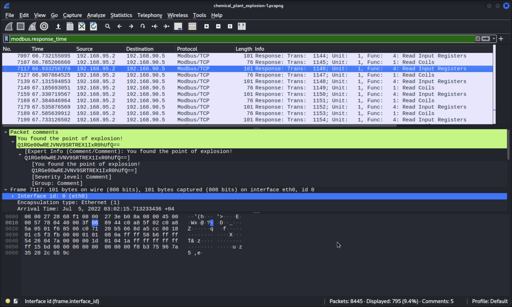
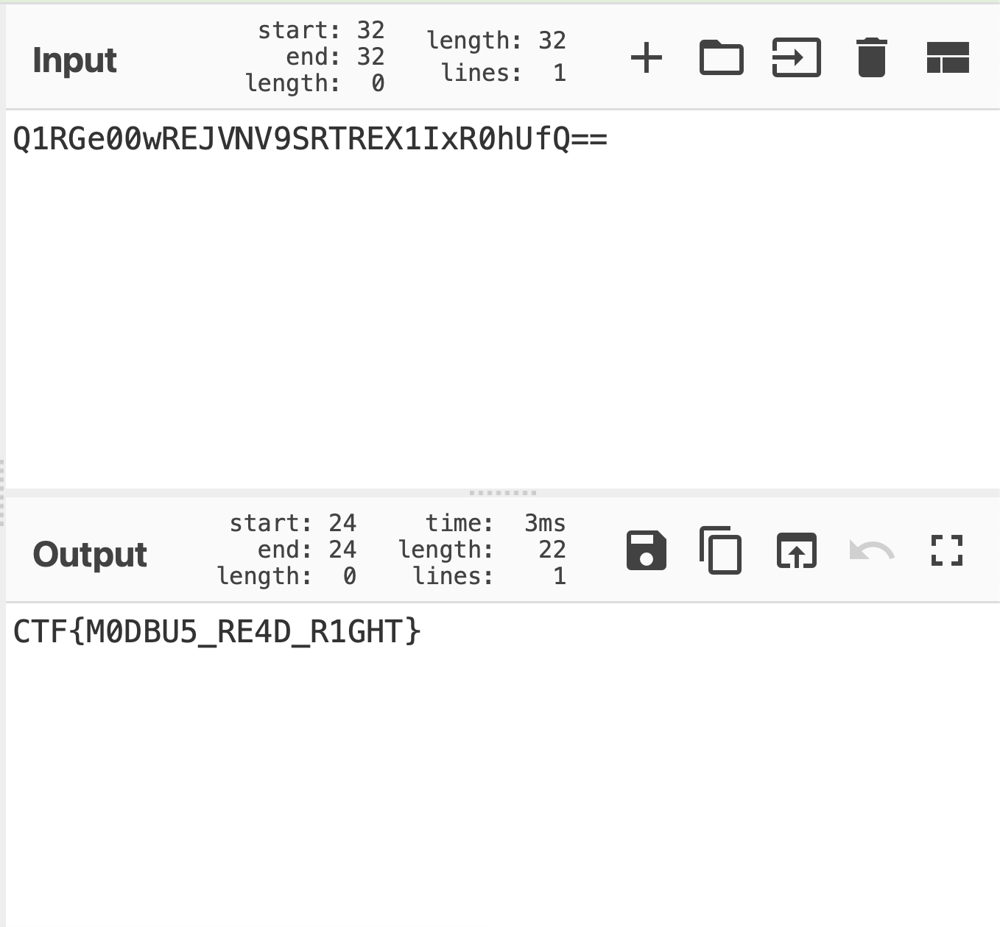
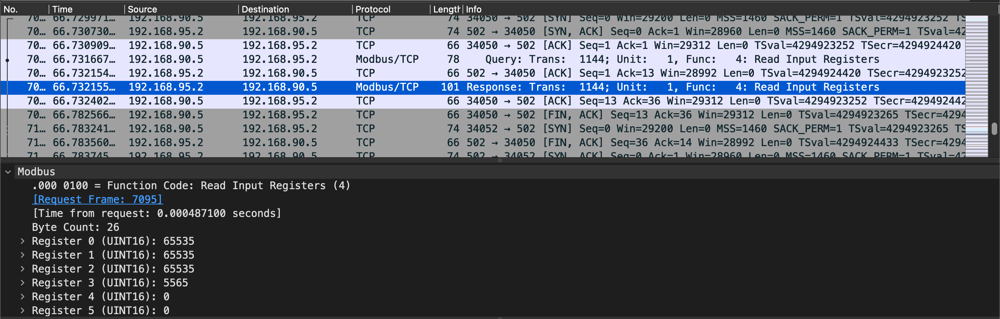

# Chemical Plant
easy | network, ics | 100 points

## Description
A chemical plant has exploded, can you help us investigate why this happened? 

## First Impressions
The challenge provided us with two files - `chemical_plant_explosion.pcapng` and `chemical_plant_explosion.mp4`. The mp4 file showed video footage before, during and after the explosion. 

The pcap file contained packets from a protocol called [Modbus](https://www.modbus.org/docs/PI_MBUS_300.pdf), which was new to me when solving this challenge. The packets showed changes in the different parts involved in the explosion.

## Solution

### [10 points] Find the Attack Point
Which component was altered in the plant? (Flag format: CTF{component})

The component that kept changing in the video was the pressure value. Once the value went past a certain limit, it led to the explosion.

Flag: `CTF{pressure}`

### [40 points] Record Everything
We have files showing what happened during the attack. Can we pinpoint the exact moment of the attack in the network?

In the video, the timestamp from the exact point of the explosion was `07-05-2022 01:02:15`. I checked for packets from around the same time in the pcap file. The pcap file showed the timings in my time zone, so I searched for packets with the same minute and second. I found some base64 decoded text as a comment in one of the packets.

Decoding the text gives us the flag:

Flag: `CTF{M0DBU5_RE4D_R1GHT}`

### [30 points] Know the Limit
Can you find the setpoint value of the attacked component? HINT: A setpoint value does not change under any circumstance. (Flag format: CTF{(value)})

While going through the packets, one value didn't seem to change in any of the `Read Input Registers` packets, 65535.

Flag: `CTF{65535}`

### [20 points] True or False
What type of data is stored in register coils? (Flag format: CTF{datatype})

This challenge took me waay longer than it should have. I tried CTF{bool}, CTF{boolean}, CTF{int} and many more answers, and none of them worked. I even reached the rate-limit for submitting answers multiple times. Finally, I found "binary" when trying to search for the datatypes, and decided to try it. And it worked.

Flag: `CTF{binary}`