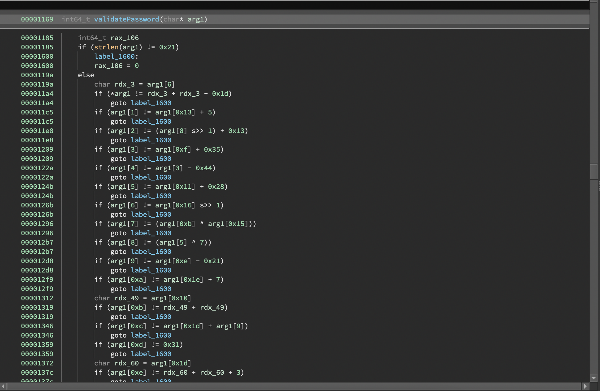
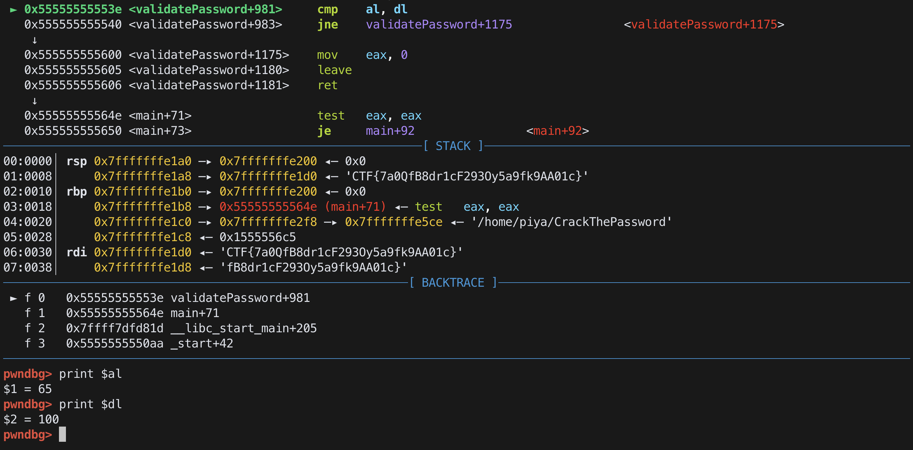
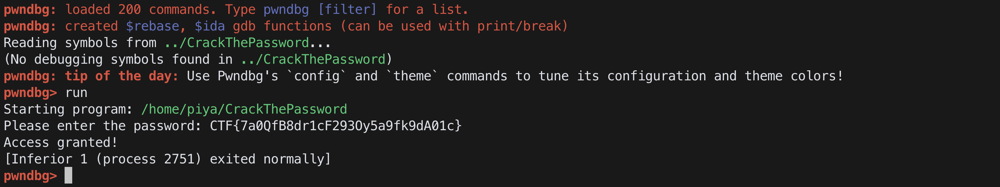

# Crack the Password
easy | reversing, linux | 100 points

## Description
The AI has taken control of the authentication system and we no longer have access to our important files! Can you help us find a way in by reversing the binary and cracking the password? 

## First Impressions
The challenge came with a binary file, `CrackThePassword`.

Sample output
```bash
$ file CrackThePassword
CrackThePassword: ELF 64-bit LSB pie executable, x86-64, version 1 (SYSV), dynamically linked, interpreter /lib64/ld-linux-x86-64.so.2, BuildID[sha1]=3c399715a96c1d7b67fb7b3bf35229e8e016f882, for GNU/Linux 3.2.0, not stripped
$ ./CrackThePassword
Please enter the password: a
Access denied!
```

## Solution

On opening the file in a reverse-engineering tool (Binary Ninja in my case), I find a `validatePassword()` function that contains a lot of code.



It looks like it's checking each character of the input, and when all characters are correct, the access is gained. From a quick glance, it is safe to say that these are the characters of the challenge flag.

We can also see that each character of the strings is dependent on other characters of the strings. There are automatic solving tools that help with this, but I preferred to make my own script and arranged the order of the statements such that we get the flag. Using the above code as a base, I made a Python script to get the flag.

**[ctp-sol.py](src/ctp-sol.py)**
```python
flag_length = 0x21
flag = [0] * flag_length

flag[0xd] = 0x31
flag[0x17] = 0x39
flag[0x1f] = (flag[0xd] * 2) + 1
flag[0x12] = flag[0x17] ^ 10          
flag[0x16] = (flag[0x1f] | 0x61) - 2
flag[0x10] = (flag[0x12] >> 1) * 2
flag[0x18] = flag[0x12] * 2
flag[6] = flag[0x16] >> 1
flag[0xb] = flag[0x10] * 2
flag[0x1e] = flag[0x1f] - flag[0x10]
flag[0] = (flag[6] * 0x2) - 0x1d
flag[0x1a] = ((flag[0xb] + (flag[0xb] >> 7)) >> 1) + 7
flag[10] = flag[0x1e] + 7
flag[0xf] = flag[0] ^ 5   
flag[0x19] = flag[0x10] + flag[0x1a]
flag[3] = flag[0xf] + 0x35
flag[0x15] = flag[0x19] >> 1
flag[4] = flag[3] - 0x44
flag[7] = flag[0xb] ^ flag[0x15]
flag[0x1b] = (flag[4] + 0x7b) * 2
flag[0x20] = flag[4] + flag[0xf]
flag[0x13] = flag[7] - 2
flag[0x1d] = flag[0x20] - 0x4d
flag[1] = flag[0x13] + 5
flag[0xe] = (flag[0x1d] * 2) + 3
flag[0x1c] = flag[1] - 0x13
flag[9] = flag[0xe] - 0x21
flag[0x14] = flag[10] ^ flag[0x1c]
flag[0xc] = flag[0x1d] + flag[9]
flag[0x11] = flag[0x14] ^ 0x40
flag[5] = flag[0x11] + 0x28
flag[8] = flag[5] ^ 7
flag[2] = (flag[8] >> 1) + 0x13

print("".join([chr(f) for f in flag]))
```

```bash
$ python3 ctp-sol.py
CTF{7a0QfB8dr1cF293Oy5a9fk9ŤA01c}
```

Looks correct...almost. This did not help gain access, most likely due to the `Ť` in the flag, which seems out of range of English ASCII characters. When I printed out the ASCII values, the value at that position was 356! So there's some issue.

To solve this, I restored to debugging the application using `pwndbg`, a gdb extension. I used the flag from the script as a starting point and checked the character that was incorrect. I kept getting weird values for other characters, and eventually came to the conclusion that the `Ť` character might be causing the issue.

So I changed that character to an `A` and debugged to that point. I found that the character in that position was actually `d`.



After replacing the character, I received the `Access granted` message, completing this challenge!



Flag: `CTF{7a0QfB8dr1cF293Oy5a9fk9dA01c}`