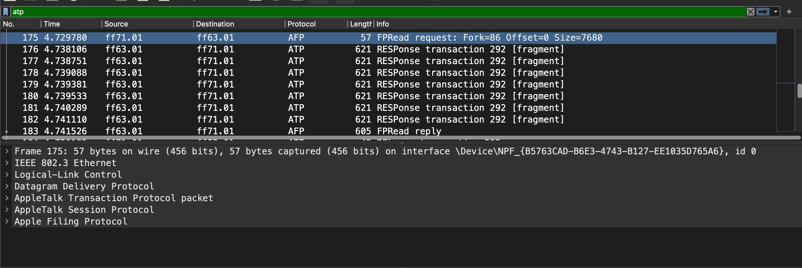
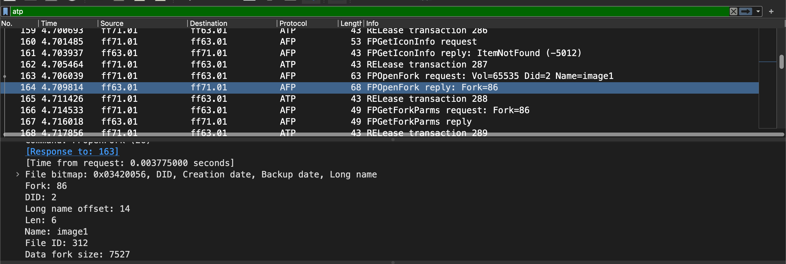
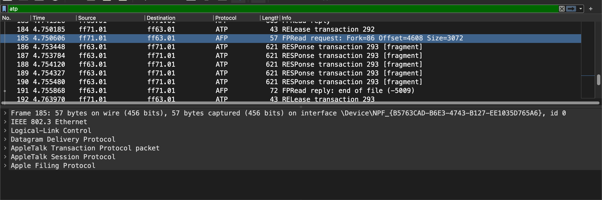
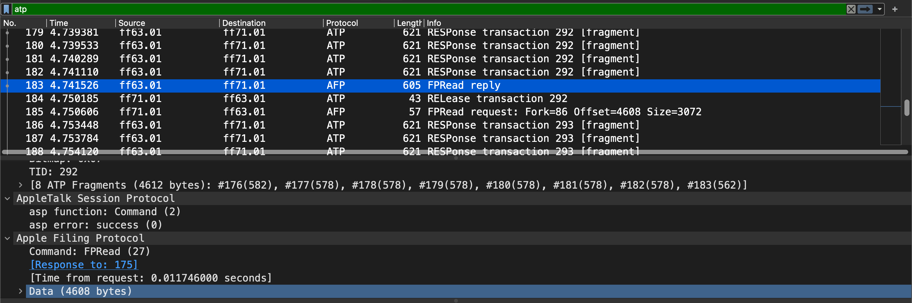
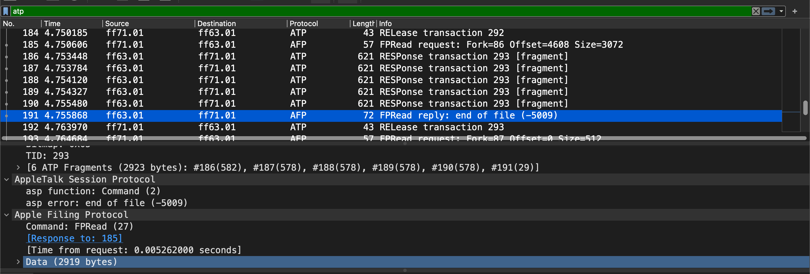
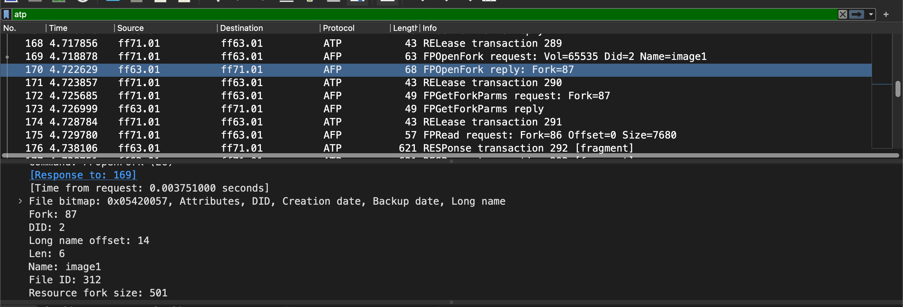
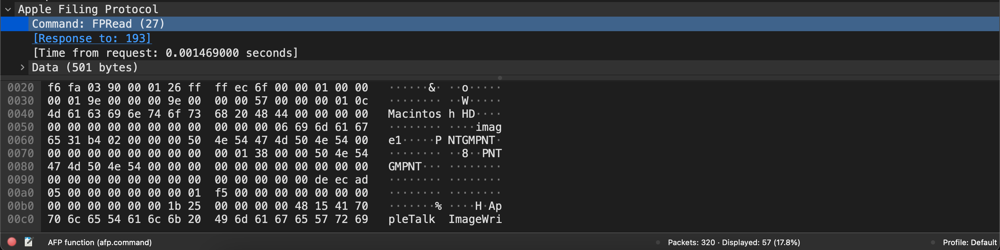
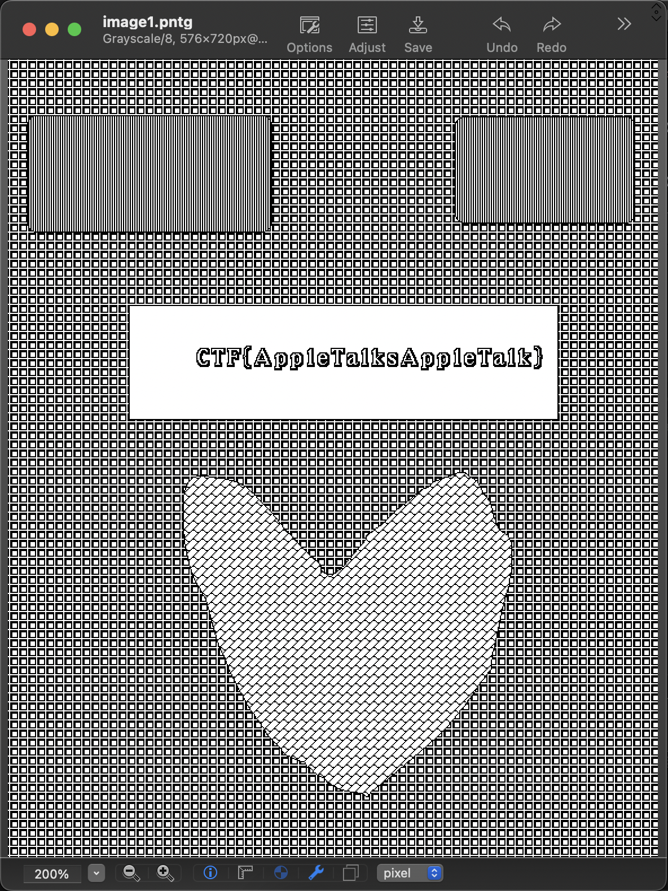

# Technical Debt
hard | network | 300 points

## Description
Some of the systems in our factory still stem from around 1984, and we noticed the AI was even infecting these systems. We have captured suspicious network traffic between these systems, however have not been able to identify what data was being transfered. Can you identify what data was going over the lines?

## First Impressions
The challenge came with a pcap file, `traffic.pcapng`. I had a quick glance at the packets, and found TCP, SSL and ATP/AFP packets. 

I thought this might require decrypting the SSL traffic and spent some time in that direction, but didn't get much. The TCP packets didn't provide any significant information either.

Then I had a closer look at the ATP/AFP packets, and that's where I figured how to solve this challenge.

## Solution
AFP or [Apple Filing Protocol](https://en.wikipedia.org/wiki/Apple_Filing_Protocol), formerly known as AppleTalk Filing Protocol was Apple's network protocol for file services, used in earlier OS versions.

The packets were requests and responses for a file named `image1`, most likely the file we're looking for. A section that stood out was the FPRead response packets.



Each file has two forks, a resource and data fork. A quick summary from [this article](https://developer.apple.com/library/archive/documentation/Networking/Conceptual/AFP/Concepts/Concepts.html#//apple_ref/doc/uid/TP40000854-CH3-52798), the resource fork contains data like icons and drivers for the file, while the data fork contains the bytes of, well, the actual data. 

The `Fork=86` comes from the following packet, a data fork with a size of 7527 bytes.



In that case, the subsequent `RESPonse transaction` packets contain the bytes of the image, split between the different packets. This means we can export the bytes and form the image! The image is 7527 bytes bytes in size, so the `Size=7680` should get us all the bytes of this image.

But wait, right after these set of packets, there's another FPRead request of the same fork. There's even an end of file error for this one.



The difference is in the offset and size fields of both the request packets. While the first packet requested 7680 bytes, but received only 4608 bytes for some reason. 



So the second request starts from byte 4608 and requests 3072 bytes more, making the total to the original 7680 bytes. It receives an end of file error because the image file is only 7527 bytes in size.



This is not much of an issue for us, as combining the bytes from both these requests should result in the final image! So I exported the data from the two FPRead reply packets, (they contained all the fragments together) and combined the exported files as one file.

```bash
$ cat fragment1.bin fragment2.bin > image1.bin
```

I tried checking the data type, or any strings in the file, but didn't find anything. The file type was still unknown to us. That's where the resource fork comes of help. There was another FPOpenFork request in the pcap file, for a resource fork of size 501 bytes.



There's an FPRead request for it as well. Since its a smaller file, all the data was sent in one packet.



A few things stood out, particularly the phrase `PTNGMPNT`. Looked something similar to a file header (similar to how PNG is part of the file header for a PNG image). Initial searches didn't get me anything of importance, but a refined search for Apple specific details got me to [this link](https://opensource.apple.com/source/file/file-62.200.2/file/magic/Magdir/apple.auto.html). Here's a snippet from the link:

```txt
# MacPaint image
65		string	PNTGMPNT	MacPaint image data
#0		belong	2		    MacPaint image data
```

[MacPaint](https://www.google.com/url?sa=t&rct=j&q=&esrc=s&source=web&cd=&cad=rja&uact=8&ved=2ahUKEwiz67ylzpn5AhUBP-wKHYYEBIYQmhN6BAhYEAI&url=https%3A%2F%2Fen.wikipedia.org%2Fwiki%2FMacPaint&usg=AOvVaw32pVrYWXTxEapkrD94cF-D)? A paint application released with the original Macintosh in 1984. Oh so THAT'S WHY 1984 IS MENTIONED IN THE DESCRIPTION!!!

MacPaint isn't being developed for years now, and so I need a way to be able to view this image. Preview (another Mac application in current macOS versions) wasn't able to display the image, so I used another tool called [Graphic Converter](https://www.lemkesoft.de/en/products/graphicconverter/) to view the image. After installing and selecting the image on Graphic Converter, I see this:



Flag found!

Flag: `CTF{AppleTalksAppleTalk}`


