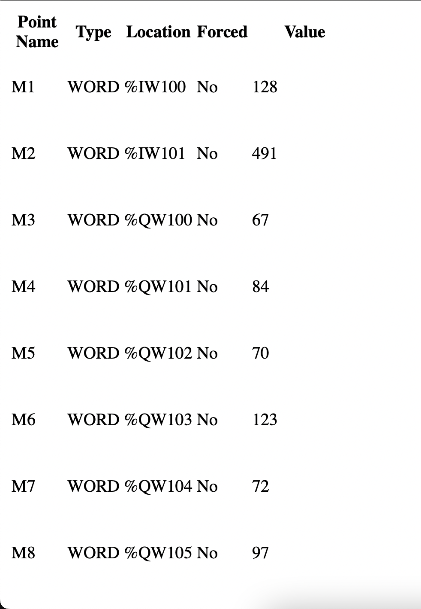
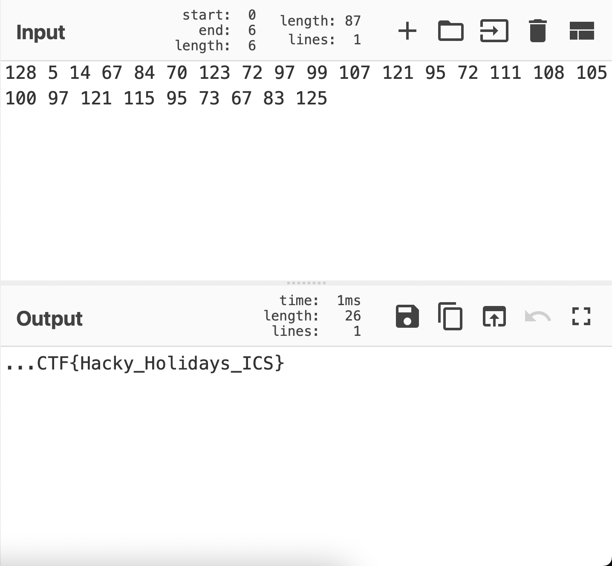
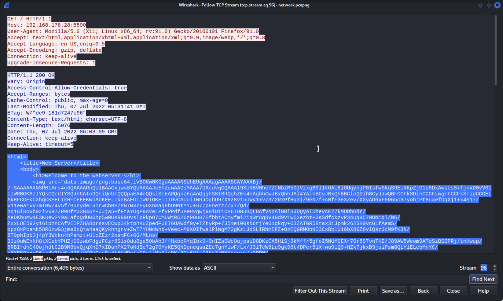
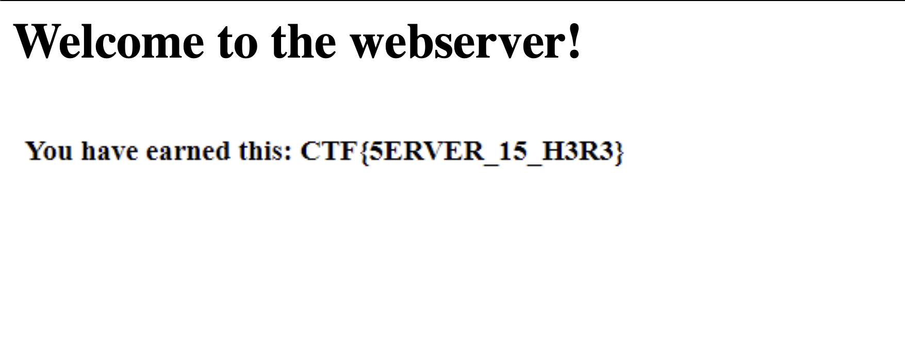
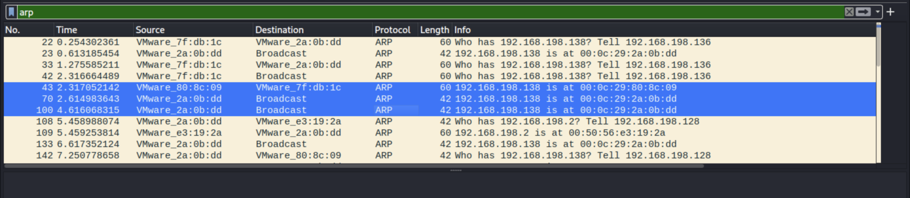
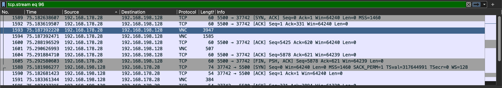

# You Can't See Me
easy | network, ics | 100 points

## Description
We have collected information from a small ICS network. Can you uncover all the data hidden in these files? 

## First Impressions

The challenge provided two pcap files, `modbus.pcapng` and `network.pcapng`. Each subtask required analysis of either of these files. 

I solved the challenges in an order different from how they were listed, hence the order of subtasks is different in this writeup.

## Solution

### [30 points] Parts make a Whole
The file shows communication between a PLC and an ICS workstation. Analyze the file to get the flag! (use modbus.pcapng)

The modbus.pcapng file had some HTML code in packet 7. 

The HTML code contained a table with values. One of the fields, the `value` field looked like they could be ASCII character values.

I entered the values in CyberChef, and on converting the ASCII values to string, I found the first flag!

Flag: `CTF{Hacky_Holidays_ICS}`

### [30 points] Follow me till the End
The rogue component is communicating with an external entity, which is a big red flag in ICS environments. Can you find the flag from the network data? (use network.pcapng)

Checking the TCP streams on network.pcapng, one of them had HTML code. 

The code contained an image containing the flag

Flag: `CTF{5ERVER_15_H3R3}`

### [20 points] man-in-the-middle
What is the protocol used in the Man-in-the-Middle attack performed by the rogue ICS component in this network? (use network.pcapng), Flag format CTF{protocol_in_capital_letters}

At the time, I hadn't gotten the answer to the `whoami` challenge yet, whose solution was supposed to help for this challenge. So I tried different protocol names and `CTF{ARP}` ended up being the correct answer.

Then I went and checked the packets again, and saw two IP addresses with the same MAC address, suggesting ARP poisoning.

Flag: `CTF{ARP}`

### [20 points] whoami
There seems to be some suspicious activity in the network. Can you identify the IP address of the rogue ICS component? (use network.pcapng)

In hindsight, the answer for this was super clear from the [Follow me till the End](https://github.com/piyagehi/CTF-Writeups/blob/main/2022-Unlock-The-City/you-cant-see-me.md#30-points-follow-me-till-the-end) subtask (the IP address is the source address in the packet containing the HTML code). 

However, since the flag format wasn't clearly mentioned, I spent quite a bit of time looking for a flag in the regular format `CTF{}`

Flag: `192.168.198.128`