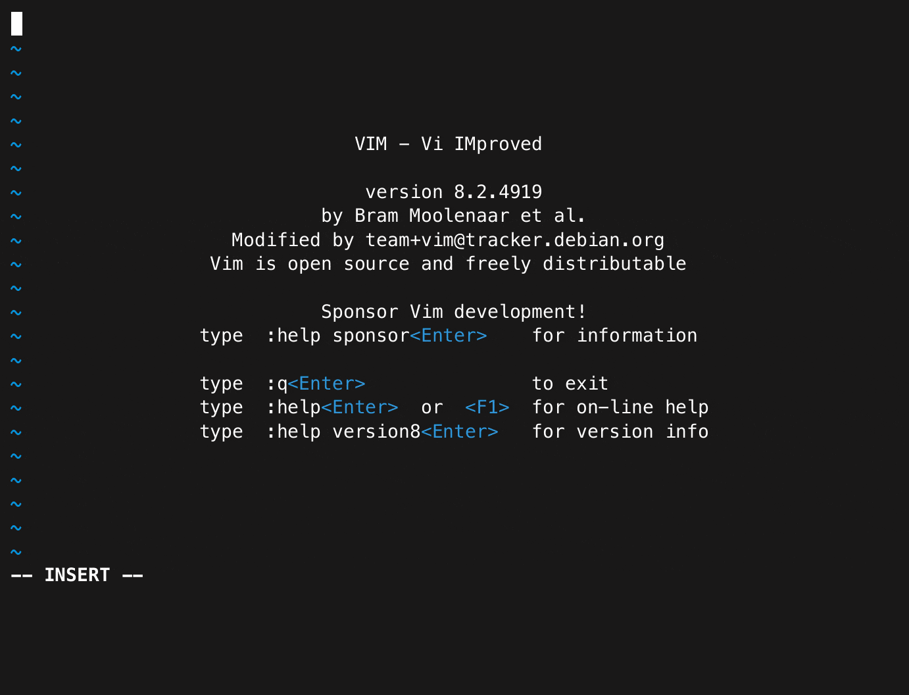
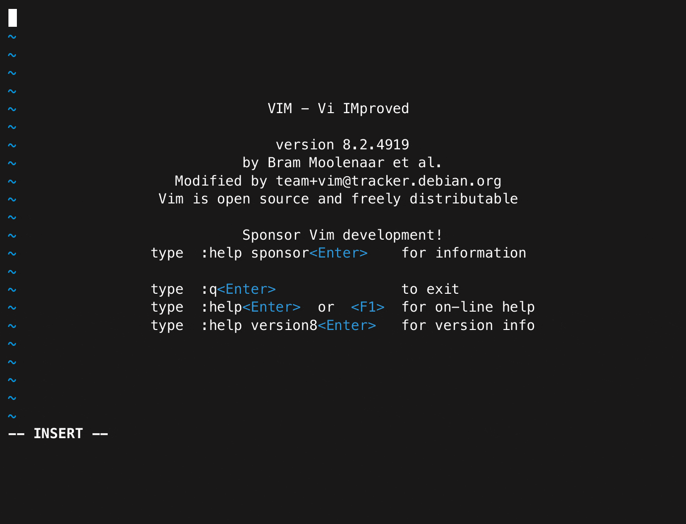
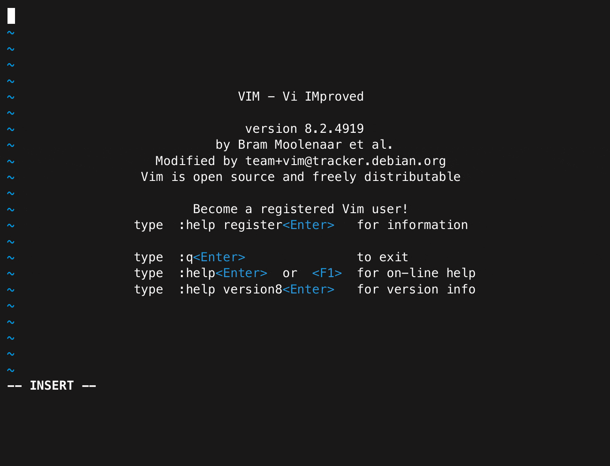

# vimjail
misc | medium | 248 points

## Introduction

As someone who mostly uses GUI text editing tools, the only knowledge I have about `vim` is how to insert text and how to exit. So these challenges, despite having lots of solves, were challenging for me, in a good way.

This writeup, covering all four challenges of the **vimjail** series, is structured in six sections.

I start with describing my [first impressions](#first-impressions) of the challenge and [analyzing the challenge files](#challenge-structure).

Then, I describe solutions for each of the four challenges:
- [vimjail1](#vimjail1) with its fixed version [vimjail1.5](#vimjail15) 
- [vimjail2](#vimjail2) with its fixed version [vimjail2.5](#vimjail25)

## First Impressions

On logging into the challenge instance, I was welcomed with a screen running `vim`, in Insert Mode. Knowing how to exit proved to be useless here, as the `Esc` key refused to work.

Pressing any other key returned the following:

```
E21: Cannot make changes, 'modifiable' is off`. 
```

`Ctrl-C`, `Ctrl-D` or `Ctrl-Z` weren't even suspending the challenge instance, nothing worked. 

I looked to the challenge files to figure what's going on.

## Challenge Structure

The challenges came with 4-5 files:
- **Dockerfile**
- **nsjail.cfg**
- **entry.sh**
- **vimrc**
- **viminfo** (vimjail2 and vimjail2.5)

**Dockerfile** and **nsjail.cfg** were files related to the underlying infrastructure used for these challenges, [**kCTF**](https://google.github.io/kctf/introduction.html). This stuff is very new to me, so the explanation might be vague and may miss some details.

Most of the **Dockerfile** seemed like the usual, except for `CMD` command:

```Dockerfile
CMD kctf_setup && \
    kctf_drop_privs \
    socat \
      TCP-LISTEN:1337,reuseaddr,fork \
      EXEC:"kctf_pow nsjail --config /home/user/nsjail.cfg -- /home/user/entry.sh",pty,sane
```

The container runs a TCP server using `socat` at port 1337. Each time a user attempts to access the challenge, `socat` starts a new connection that runs a `nsjail` sandbox with the provided config file and **entry.sh** as the command to run within the sandbox.

The sandbox ensures that users can't mess up the challenge for other users if they can, somehow, execute malicious commands or modify files.

The **entry.sh**, **vimrc** and **viminfo** files differ slightly across challenges, so they are mentioned in their respective sections.

## vimjail1

>**[50 points]** Connect with `socat file:$(tty),raw,echo=0 tcp:vimjail1.chal.uiuc.tf:1337`. You may need to install socat.

**entry.sh** runs `vim` with a few options:

```sh
#!/usr/bin/env sh

vim -R -M -Z -u /home/user/vimrc
```

- `-R`: readonly mode
- `-M`: modifications to text are not allowed
- `-Z`: restricted mode
- `-u`: uses the provided config file instead of the default

These settings explain why I couldn't add any text while still being in Insert Mode.

**vimrc** is the configuration file that determines the settings while working in `vim`. The first part contains the following commands:

```
set nocompatible
set insertmode
```

`vim` is set to use Insert Mode as the default mode. To know more about this mode, I looked at the [help text](https://vimhelp.org/options.txt.html#%27insertmode%27). It explained why the `Esc` key didn't work.

```
These items change when 'insertmode' is set:
- when starting to edit of a file, Vim goes to Insert mode.
- <Esc> in Insert mode is a no-op and beeps.
```

The other part of the **vimrc** file are the mapping commands:

```
inoremap <c-o> nope
inoremap <c-l> nope
inoremap <c-z> nope
inoremap <c-\><c-n> nope
```

[`inoremap`](https://vimhelp.org/map.txt.html#%3Ainoremap) maps one command to another in Insert Mode, while ignoring other mappings of the command on the right to avoid recursion.

>**Note:** `<c-{letter}>` is vim's syntax for writing commands starting with the `Ctrl` key. For example, `<c-o>` stands for `Ctrl-O`.

There are four commands that are mapped to the string `nope`, essentially disabling them as `vim` is running in read-only mode:
- [`Ctrl-O`](https://vimhelp.org/insert.txt.html?#i_CTRL-O) helps to execute one Normal mode command.
- [`Ctrl-L`](https://vimhelp.org/insert.txt.html?#i_CTRL-L) helps to execute a number of Normal mode commands.
- [`Ctrl-Z`](https://vimhelp.org/insert.txt.html?#i_CTRL-Z) suspends the Vim instance when Insert Mode is set.
- [`Ctrl-\` `Ctrl-N`](https://vimhelp.org/insert.txt.html?#i_CTRL-\_CTRL-N) can be used to go to Normal mode from any other mode.

So the only commands that could help me escape Insert Mode apart from `Esc` were disabled :/

Additionally, I couldn't suspend `vim` because `CTRL-Z` was disabled. I either had to close the terminal window or wait for the challenge to timeout, which happened after 10 minutes.

I tried the blocked commands for funsies...and while it didn't work sometimes, if I kept a sufficient gap between typing the two commands, `Ctrl-\` `Ctrl-N` worked.

After that, all I had to do was read the flag file, which I did using `:e /flag.txt`


I'm not sure why this happens. I tried testing it locally as well, sometimes the mapping works and sometimes it doesn't.

Flag: `uiuctf{n0_3sc4p3_f0r_y0u_8613a322d0eb0628}`

## vimjail1.5

>**[50 points]** Fixed unintended solve in vimjail1. Connect with `socat file:$(tty),raw,echo=0 tcp:vimjail1-5.chal.uiuc.tf:1337`. You may need to install socat.

The mapping issue was fixed in this challenge with a modified mapping:

```
inoremap <c-\> nope
```

I tried practically every keyboard command possible, and I stumbled across `CTRL-R`, which is the register command in `vim`. They're in-memory variables in `vim` that store some value.

There are many different types of registers, but the one this challenge focuses on is the **expression register**, which can be accessed by typing `CTRL-R` `=`.

This lets the user enter an expression, the result of which will be inserted to the file. It also allows entering keys and commands, as described by this example from the [help text](https://vimhelp.org/insert.txt.html?#i_CTRL-R_=):

```
E.g., you can use this to move the cursor up: CTRL-R ="\<Up>"
```

Using this format, I entered the following expression:

```
"\<Esc>:e /flag.txt"
```

It exits Insert Mode and then reads the flag, in the same way as in vimjail1.



Flag: `uiuctf{ctr1_r_1s_h4ndy_277d0fde079f49d2}`

---

## vimjail2

>**[57 points]** Connect with `socat file:$(tty),raw,echo=0 tcp:vimjail2.chal.uiuc.tf:1337`. You may need to install socat.

The **entry.sh** file is slightly different here from vimjail1:

```sh
#!/usr/bin/env sh

vim -R -M -Z -u /home/user/vimrc -i /home/user/viminfo

cat /flag.txt
```

Alongside the `vim` settings we saw before, there is an additional file called **viminfo** provided. This file is used to store any information a user may be working on in a previous session. Then, once `vim` is exited, the flag is printed to the terminal. 

So instead of reading the file, this challenge required exiting `vim`. Finally, my "how to exit vim" skills came to use!

The **vimrc** file is also different, however I go into more detail about this in the next section.

That's because this challenge is also prone to the same error as vimjail1, making the solution very easy - `CTRL-\` `CTRL-N` to exit Insert Mode, followed by `:q`. The flag is printed to the screen after exiting.



Flag: `uiuctf{<left><left><left><left>_c364201e0d86171b}`

## vimjail2.5

>**[91 points]** Fixed unintended solve in vimjail2. Connect with `socat file:$(tty),raw,echo=0 tcp:vimjail2-5.chal.uiuc.tf:1337`. You may need to install socat.

The mapping issue was fixed here in the same way as in vimjail1.5. Along with that, the **vimrc** file has a lot of commands in the following format:

```
cnoremap a _
cnoremap b _
cnoremap c _
cnoremap d _
...
```

[`cnoremap`](https://vimhelp.org/map.txt.html#%3Acnoremap), maps commands for the Command Mode, in the same non-recursive way as `inoremap` from earlier. 

All lowercase letters and symbols except for `:`, `q`, `'` and `"` are mapped to the underscore character.

Like in vimjail1.5, the expression register, `CTRL-R` `=` works here. However, thanks to the mappings, entering an expression would look like this:

```
"__E__:q"
```

It wouldn't work.

I started typing every possible command to see if something new would show up, and `CTRL-F` worked, showing a smaller window within `vim`.

Here, the `cnoremap` mappings didn't apply, and I could type expressions freely. So I was able to enter the following expression: 

```
"\<Esc>:q"
```

It first exits Insert Mode, followed by `:q` to exit `vim`, completing the challenge.



I couldn't find any exact documentation for what I did here, but [this Reddit comment](https://www.reddit.com/r/vim/comments/13ez8r/how_does_one_paste_the_expression_from_the/c73voo7/) seems the closest:

>Not sure if I understand, but have you tried hitting Ctrl-f from within the expression register commandline? You should get a normal-mode window with a history of recent expression register inputs.

Flag: `uiuctf{1_kn0w_h0w_7o_ex1t_v1m_7661892ec70e3550}`
